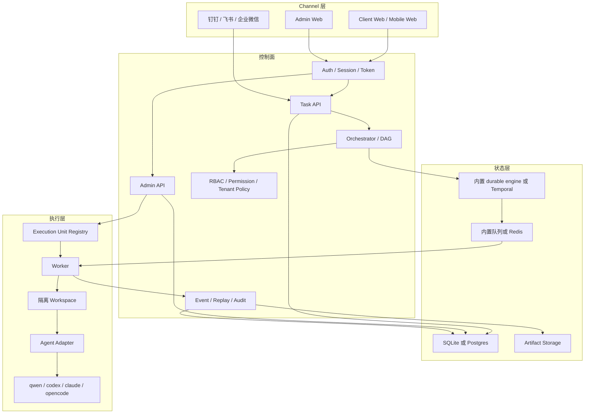
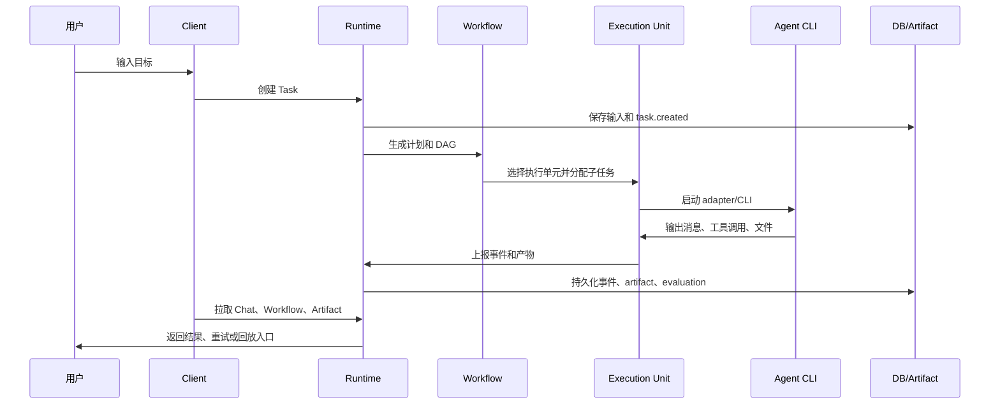

# 架构总览

AgentFlow 的架构目标是：用户端简单，后台端可控，执行层可替换，状态层可恢复，所有过程可审计。

## 1. 分层

## 2. Client/Admin 边界

| 端 | 面向对象 | 关注点 |
| --- | --- | --- |
| Client | 普通用户、移动端用户、任务发起者 | 创建 Task、查看 Agent Chat、处理权限、拿结果 |
| Admin | owner、operator、auditor、SRE | 执行单元、Channel、租户、RBAC、HA、审计、失败恢复 |

Client 不展示 executor PID、worker lease、队列内部状态。Admin 可以追踪这些细节，但所有危险操作都应该有权限校验和审计记录。

## 3. 任务生命周期

浏览器关闭不会中断后台任务。任务状态、事件和产物都由控制面持久化，用户重新登录后继续查看。

## 4. 编排模型

复杂任务由 orchestrator 生成计划：

| 对象 | 作用 |
| --- | --- |
| Plan | 总体目标、风险、执行策略 |
| DAG | 子任务节点、依赖、并行/串行关系 |
| Agent role | 子 Agent 的角色和上下文 |
| Artifact contract | 每个子任务必须交付什么 |
| Evaluation | 判断产物是否合格 |

内置 durable engine 适合单机和低并发。需要长时间任务、人工审批、多 worker 和强恢复时，使用 Temporal profile。

## 5. Adapter 协议

所有 Agent CLI 通过统一 adapter 协议接入：

- 输入：goal、上下文、workspace、权限策略、资源限制。
- 输出：message、tool call、artifact、exit status。
- 控制：cancel、timeout、retry、permission decision。
- 审计：原始日志、标准化事件、错误分类。
- 隔离：per-task workspace、secret 注入边界、资源限制。

这让 qwen-code、Codex CLI、Claude Code、OpenCode 可以被同一套调度、审计和 UI 投影管理。

## 6. 状态和 HA

| 层 | 单机 profile | HA profile |
| --- | --- | --- |
| Runtime | 单进程 | 多实例 + 反向代理 |
| DB | SQLite | Postgres |
| Queue | 内置队列 | Redis |
| Workflow | 内置 durable engine | Temporal |
| Artifact | 本地目录 | NAS、共享卷或对象存储 |
| Worker | 本机或一台远程 worker | 多 worker 水平扩展 |
| Backup | 文件备份 | DB dump、卷快照、artifact 备份 |

2C2G 机器适合低并发控制面、演示或单 worker；不适合承担完整 HA、前端构建、Playwright、真实 Agent 多并发和数据库压力。

## 7. 审计和回放

AgentFlow 的审计不是附加日志，而是任务事实源的一部分：

- 任务输入和 source。
- 编排计划和子 Agent 目标。
- Agent 消息、工具调用和权限请求。
- 执行单元、workspace、adapter 和 CLI 日志。
- artifact manifest。
- evaluation、retry、replay。

这套链路保证任务失败后可以定位，成功后可以复盘，争议时可以审计。
