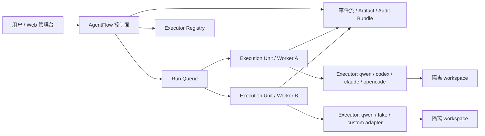

# AgentFlow 架构与术语

AgentFlow 是一个 Agent 编排系统。它把一次本地 CLI Agent 执行，提升为可排队、可观察、可审批、可恢复、可审计、可分布式执行的长期任务系统。

## 总体架构

控制面负责认证、任务创建、队列、权限决策、事件持久化、artifact 管理和审计包。Worker 负责实际执行。Executor 是 worker 为某个 run 启动或复用的真实 Agent runtime。

## 核心术语

| 术语 | 含义 | 用户在哪里看到 |
| --- | --- | --- |
| Run | 一次 Agent 执行，包含 prompt、状态、事件、产物和审计包 | Runs / Run Detail |
| Mission | 多步骤复杂任务，会拆成多个 task 和 run | Missions |
| Profile | 任务角色模板，描述 adapter、工具、审批、资源和 artifact 要求 | Profiles |
| Execution Unit | 管理台里看到的稳定执行单元，是 worker 的产品视图 | Units |
| Worker | 部署在本机、VPS、NAS 或云主机上的后台进程，主动心跳、认领 run、执行 adapter、上传事件和产物 | Units |
| Executor | Worker 为某个 run 创建或复用的真实运行实例，例如 qwen serve、per-run qwen 进程、容器 | Executors |
| Executor Registry | 控制面记录 executor 租约、PID、端口、workspace、状态和错误的注册表 | Executors |
| Artifact | run 或 mission 产生的文件，例如报告、diagnostics、events、日志 | Run Detail / Mission Detail |
| Audit Bundle | 面向复盘和审计的完整材料包 | Run Detail |
| Permission | Agent 高风险操作前的人工审批请求 | Run Detail |

## Execution Unit、Worker、Executor 的区别

Execution Unit 是产品概念，强调“这台机器或这个执行槽位能不能稳定接任务”。Worker 是它的进程实现，负责跟控制面通信。Executor 是 worker 为具体 run 拉起的运行实例。

一个 2C2G VPS 通常对应一个 worker，建议 `capacity=1`。这个 worker 可以执行多个 run，但同一时刻只认领一个。它可以使用 shared qwen serve，也可以为每个 run 启动独立 qwen 进程或容器。

## 为什么需要一次性令牌

注册远程 worker 时，控制面会创建一个只具备 `workers:*` 权限的 API token。这个 token 明文只显示一次：

- 避免把 owner 密码或 master token 暴露给 worker。
- 泄露后可以单独撤销，不影响浏览器账号。
- Worker 后续只访问 `/cloud-agents-worker/`，与人类管理台入口隔离。

如果部署命令丢失，重新生成一个 worker registration，并在 Access 中撤销旧 token。

## 为什么会一直排队

Run 进入 `queued` 后，需要有 active worker 认领。常见原因：

- 没有任何 active worker。
- worker 存在但 `active_count >= capacity`。
- worker 心跳失联，被控制面标记为 stale。
- worker 能力或标签与 run 要求不匹配。
- worker 轮询或网络异常，暂时没有拿到 lease。

Run Detail 会展示排队解释；Units 页面可查看 worker 心跳、容量和资源水位。

## 产物预览与下载

小型文本类 artifact 可以直接预览，包括 `.json`、`.jsonl`、`.md`、`.txt`、`.log`、`.csv`、`.yaml`。大型文件或二进制文件保留下载入口，避免浏览器卡死。

Run Detail 中“审计下载”是固定导出区，用于下载事件、诊断和审计包；“产物”区展示具体文件，可以预览或下载。
