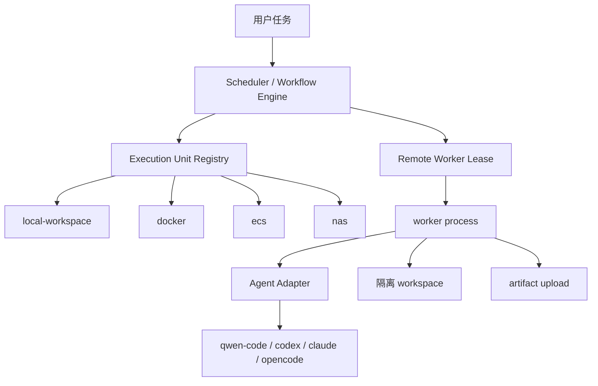

# 执行单元发现、注册与调度

执行单元是 aflow 对“哪里可以跑 Agent”的统一抽象。它可以是一台本机 workspace、一台 NAS、一台 ECS、一组 Docker 容器，或后续接入的 Kubernetes/云函数执行池。

## 1. 概念关系



aflow 有两层视图：

| 名称 | 作用 | 使用者 |
| --- | --- | --- |
| Execution Unit | 描述机器、容器、NAS、ECS 的能力和标签 | 编排器、Admin |
| Remote Worker | 真正运行在某台机器上的进程，主动心跳和认领任务 | 运维、调度器 |

Execution Unit 偏“能力注册”，Remote Worker 偏“实际执行进程”。生产环境通常两者都存在：先声明 `ecs-hk-2c2g` 的能力，再部署一个 `RUN_WORKER_ID=ecs-hk-2c2g` 的 worker 进程。

## 2. 支持的执行单元类型

| kind | 适用场景 | 说明 |
| --- | --- | --- |
| `local-workspace` | 控制面所在机器直接执行 | 开发和小规模自托管 |
| `docker` | 每个任务独立容器或共享容器池 | 隔离更强，资源可控 |
| `ecs` | 云主机 worker | 适合地域隔离和弹性扩容 |
| `nas` | NAS/工作站长期主控或 worker | 适合大存储、低成本、稳定运行 |

注册时可以带 labels、resources、adapters、features，调度器会用这些信息决定任务放在哪里。

## 3. 通过环境变量发现

在 runtime 环境变量中设置 `V2_EXECUTION_UNITS_JSON`：

```bash
V2_EXECUTION_UNITS_JSON='[
  {
    "unit_id": "local-dev",
    "kind": "local-workspace",
    "status": "active",
    "labels": {"env": "dev", "host": "macbook"},
    "resources": {"cpu": 4, "memory_mb": 8192},
    "adapters": ["fake", "qwen"],
    "features": ["workspace", "artifacts"]
  },
  {
    "unit_id": "docker-local",
    "kind": "docker",
    "status": "active",
    "labels": {"env": "prod", "isolation": "container"},
    "resources": {"cpu": 2, "memory_mb": 4096},
    "adapters": ["qwen", "codex", "opencode"],
    "features": ["workspace", "artifacts", "network-policy"]
  },
  {
    "unit_id": "ecs-hk-2c2g",
    "kind": "ecs",
    "status": "active",
    "labels": {"region": "hk", "size": "2c2g"},
    "resources": {"cpu": 2, "memory_mb": 2048},
    "adapters": ["fake", "qwen"],
    "features": ["remote-worker"]
  }
]'
```

`V2_EXECUTION_UNITS_JSON` 是实现兼容变量名。用户和管理员只需要理解它配置的是当前 Execution Unit Registry。

重启 runtime 后：

```bash
curl -X POST "$BASE_URL/v2/admin/execution-units/discover" \
  -H "Authorization: Bearer $RUN_MANAGER_TOKEN"
```

返回的 `discovered` 会写入 registry，后续可以在 Admin -> Execution Units 查看。

## 4. 通过 API 注册

```bash
curl -X POST "$BASE_URL/v2/admin/execution-units" \
  -H "Authorization: Bearer $RUN_MANAGER_TOKEN" \
  -H "Content-Type: application/json" \
  -d '{
    "unit_id": "nas-home",
    "kind": "nas",
    "status": "active",
    "labels": {"region": "home", "tier": "stable"},
    "resources": {"cpu": 8, "memory_mb": 16384},
    "adapters": ["fake", "qwen", "codex"],
    "features": ["workspace", "artifacts", "long-running"]
  }'
```

字段约定：

| 字段 | 必填 | 说明 |
| --- | --- | --- |
| `unit_id` | 推荐 | 稳定唯一 id，不填会自动生成 |
| `kind` | 否 | 默认 `local`，建议显式写 `local-workspace`、`docker`、`ecs`、`nas` |
| `status` | 否 | 默认 `active` |
| `labels` | 否 | 地域、环境、隔离级别、租户等 |
| `resources` | 否 | CPU、内存等声明容量 |
| `adapters` | 否 | 支持的 Agent CLI adapter |
| `features` | 否 | workspace、artifact、network-policy 等能力 |

## 5. 部署 Remote Worker

### 5.1 从 Admin UI 生成 registration

1. 打开 Admin -> Units。
2. 点击生成 worker registration。
3. 设置 worker id、capacity、metadata。
4. 复制部署命令。
5. 在目标机器执行。
6. 回到 Units 页面确认 heartbeat 正常。

registration 会创建一个只具备 worker 权限的 token。这个 token 明文只显示一次，泄漏后请在 Access 页面撤销并重新生成。

### 5.2 systemd worker 配置

`/etc/agentflow-worker.env`：

```bash
RUN_WORKER_CONTROL_URL=https://agentflow.example.com/cloud-agents-worker
RUN_WORKER_TOKEN=replace-with-worker-token
RUN_WORKER_ID=ecs-hk-2c2g
RUN_WORKER_CAPACITY=1
RUN_WORKER_LEASE_TTL_SECONDS=60
RUN_WORKER_POLL_INTERVAL_SECONDS=2
RUN_WORKER_HEARTBEAT_INTERVAL_SECONDS=10
RUN_WORKER_RUN_WAIT_TIMEOUT_SECONDS=300
RUN_WORKER_ARTIFACT_ROOT=/var/lib/cloud-agents-worker/artifacts
V2_WORKER_ADAPTERS=fake,qwen,codex,claude,opencode
V2_ENABLE_REAL_CLI_ADAPTERS=1
V2_CODEX_CLI_COMMAND=codex exec --skip-git-repo-check -
RUN_WORKER_METADATA_JSON={"region":"hk","labels":{"size":"2c2g","tier":"sandbox"}}
QWEN_SERVE_URL=http://127.0.0.1:4170
QWEN_SERVE_TOKEN=
```

`/etc/systemd/system/agentflow-worker.service`：

```ini
[Unit]
Description=aflow Remote Worker
After=network-online.target
Wants=network-online.target

[Service]
Type=simple
WorkingDirectory=/opt/agentflow
EnvironmentFile=/etc/agentflow-worker.env
Environment=PYTHONPATH=/opt/agentflow/runtime
ExecStart=/usr/bin/python3 -m cloud_agents_runtime.worker
Restart=always
RestartSec=5
NoNewPrivileges=true
LimitNOFILE=65535
CPUAccounting=true
CPUQuota=150%
MemoryAccounting=true
MemoryMax=1536M
TasksAccounting=true
TasksMax=1024

[Install]
WantedBy=multi-user.target
```

启动：

```bash
sudo systemctl daemon-reload
sudo systemctl enable --now agentflow-worker
sudo journalctl -u agentflow-worker -f
```

### 5.3 Docker/HA worker

HA compose 中 `worker` service 会读取：

```bash
RUN_WORKER_CONTROL_URL=http://runtime:8765
RUN_WORKER_TOKEN=replace-with-worker-token
RUN_WORKER_CAPACITY=1
V2_WORKER_REPLICAS=2
V2_WORKER_CONCURRENCY=2
```

扩容：

```bash
docker compose --env-file .env -f deploy/docker-compose.ha.yml up -d --scale worker=3
```

扩容前确认 Postgres、Redis、Temporal 和 artifact 存储不是单点瓶颈。

## 6. 接入真实 Agent CLI adapter

真实 adapter 建议先在 worker 机器上验证 CLI 本身可用：

```bash
qwen --version
codex --version
claude --version
opencode --version
```

HA profile 中可以设置：

```bash
V2_ENABLE_REAL_CLI_ADAPTERS=1
V2_QWEN_CODE_COMMAND=qwen
V2_CODEX_CLI_COMMAND=codex
V2_CLAUDE_CODE_COMMAND=claude
V2_OPENCODE_COMMAND=opencode
```

这些 `V2_` 环境变量名沿用当前后端实现，不代表存在两个产品版本。

调度建议：

| 场景 | adapter |
| --- | --- |
| smoke 和链路验证 | `fake` |
| 中文产品/研发任务 | `qwen` |
| Codex 代码任务 | `codex` |
| Claude Code 工作流 | `claude` |
| OpenCode 工作流 | `opencode` |

真实 CLI 的认证、配置文件和权限审批应放在 worker 机器上，不要把用户级 token 写入前端或公共仓库。

Worker 同时兼容旧 Run 协议和 V2 Agent Task 协议。V2 每次认领得到短期 lease token；心跳延长租约，输出逐行写入任务实时 Chat，完成或失败后由控制面原子收口 workflow step。Worker 失联时首次租约过期会重新排队，第二次失败会终止任务。

## 7. Workspace 隔离

| 隔离方式 | 优点 | 风险 |
| --- | --- | --- |
| 本地目录 per-run | 简单、快 | 依赖进程权限和清理策略 |
| Docker container | 隔离强、资源可控 | 镜像构建和网络策略复杂 |
| ECS worker | 和控制面隔离，适合长任务 | 云成本、网络和密钥管理 |
| NAS workspace | 存储大、易备份 | 需要注意并发和文件锁 |

每个任务至少应该有：

| 项 | 要求 |
| --- | --- |
| workspace | 独立目录或容器挂载 |
| artifact root | 可持久化并可备份 |
| event stream | 持久化到控制面 |
| audit bundle | 包含输入、事件、产物索引和错误 |
| cleanup | retention 到期后清理 workspace |

## 8. 调度和容量建议

| 机器 | 建议 capacity | 说明 |
| --- | --- | --- |
| 2C2G VPS | `1` | qwen 或构建任务必须串行 |
| 4C8G NAS/工作站 | `1` 到 `2` | 先观察内存水位 |
| 8C16G 以上 | `2` 到 `4` | 真实 CLI 仍需按模型和仓库大小压测 |
| Docker pool | 按容器资源限制 | 不要让总内存超过宿主机 70% |

任务长时间 queued 时，按顺序检查：

1. Admin -> Units 是否有 active worker。
2. worker 是否被 drain。
3. `active_count` 是否已经等于 `capacity`。
4. heartbeat 是否 stale。
5. task 要求的 adapter 是否在 unit `adapters` 中。
6. labels 或 tenant 约束是否匹配。
7. Worker 的 `V2_WORKER_ADAPTERS` 是否包含任务 adapter。
8. 真实 CLI 是否同时满足命令存在、认证有效和 `V2_ENABLE_REAL_CLI_ADAPTERS=1`。

## 9. 验收

注册执行单元后至少跑三类验证：

```bash
# 控制面 smoke
PYTHONPATH=runtime python3 scripts/smoke_v2_control_plane.py \
  --base-url "$BASE_URL" \
  --email "$RUN_MANAGER_BOOTSTRAP_EMAIL" \
  --password "$RUN_MANAGER_BOOTSTRAP_PASSWORD" \
  --timeout 10

# 查看 worker
curl "$BASE_URL/workers" \
  -H "Authorization: Bearer $RUN_MANAGER_TOKEN"

# 查看 execution units
curl "$BASE_URL/v2/admin/execution-units" \
  -H "Authorization: Bearer $RUN_MANAGER_TOKEN"
```

UI 验收：

| 页面 | 通过标准 |
| --- | --- |
| Admin -> Execution Units | 能看到注册的 unit、kind、adapter、resources |
| Admin -> Units | 能看到 worker heartbeat 和 capacity |
| Client task detail | 能看到 Chat、DAG、事件和 artifact |
| Run/Task detail | 能下载 audit bundle |
