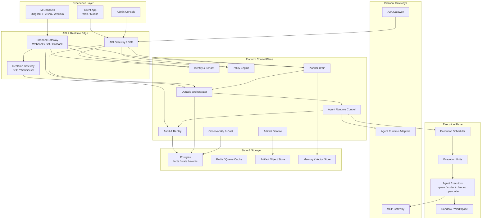
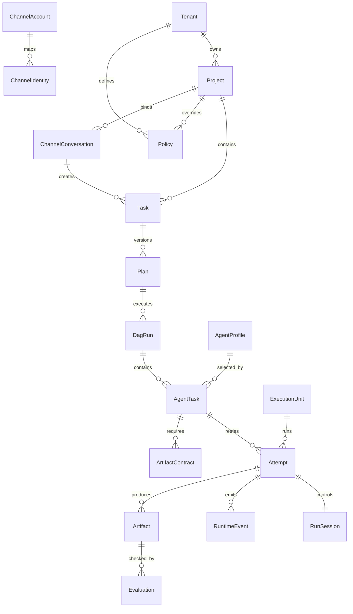
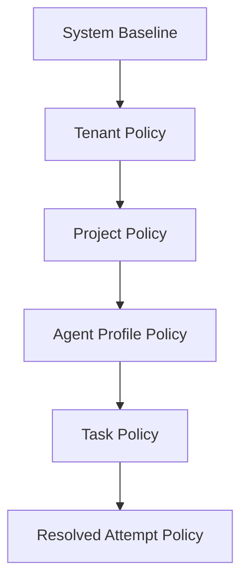

# AgentFlow V2 绿色地架构方案

> 日期：2026-07-15  
> 状态：V2 目标架构设计稿  
> 设计立场：V2 是一个新的生产级 Agent 平台设计，v1 只是可借鉴资产池，不是实现约束。必要时可以推翻 v1 的接口、模块和数据模型。  
> 参考材料：本仓库 v1 现状、本地 DeerFlow 仓库、`/Users/chigao/Downloads/final-report.md` 中的 AI Agent 技术全景调研。

## 0. 重新定调

上一版方案的问题是从 v1 出发，问“现有 Run/Mission/Worker 怎么演进”。这不是 V2 应该回答的问题。

V2 应先回答：

```text
如果今天从零设计一个面向用户、企业治理、多 Agent 编排、长任务执行、可审计可恢复的 Agent 平台，它应该是什么样？
```

因此本文采用绿色地设计：

- 先定义目标产品和系统能力。
- 再定义分层架构、领域模型、协议边界和数据事实源。
- 最后才评估 v1 哪些实现可以搬迁、哪些应该废弃、哪些只作为验证材料。

## 1. V2 一句话定义

AgentFlow V2 是一个面向个人和组织的长任务 Agent 操作系统：

```text
Client 端让用户用自然语言、文件、仓库或 IM 入口提交目标；
Planner Brain 自动判断任务复杂度，生成计划、角色、DAG、权限和产物契约；
Orchestrator 可靠调度多个 Agent，在隔离执行单元中运行 qwen-code、Codex CLI、Claude Code、OpenCode 或其他 Agent runtime；
Admin 端负责租户、用户、策略、执行单元、审计、成本、评估和运维；
系统用持久事件、产物、检查点和回放保证客户端崩溃、worker 重启或任务失败时仍可恢复。
```

## 2. 设计目标

### 2.1 必须实现的目标

| 目标 | V2 要求 |
| --- | --- |
| Client/Admin 分离 | Client 面向普通用户和移动端；Admin 面向 owner/operator/auditor |
| 登录和认证 | 所有用户入口默认登录，服务端注入身份，不信任客户端 user/project metadata |
| 快速分发任务 | 用户不需要理解 run/worker/executor；只选择目标、上下文和期望质量 |
| 自动分派 | Brain 自动决定 simple、workflow、multi-agent、human-gated 等执行形态 |
| 多 Agent 编排 | 支持 prompt chaining、routing、parallelization、orchestrator-workers、evaluator-optimizer |
| 任意 Agent CLI | qwen-code、Codex CLI、Claude Code、OpenCode 等通过统一 Agent Runtime Adapter 接入 |
| 实时可见 | 单 Agent 像本地 chat/webshell；整体任务能看 DAG、节点状态、产物和阻塞原因 |
| 安全继承 | tenant/project/profile/task/run 层层继承策略，deny 优先，子层默认不能放宽 |
| 过程留痕 | 所有 plan、事件、工具调用、权限、产物、评估、重试都可审计 |
| 可回放和重试 | 支持 UI replay、state replay、audit replay、失败自动重试和人工恢复 |
| 产物系统 | 子 Agent 必须有目标、输入、产出物 contract 和评估规则 |
| 持久化 | 后台任务不依赖浏览器生命周期，进程重启后可恢复 |
| 执行单元发现 | docker、ECS/VPS、本机 workspace、Kubernetes pod 都可注册和被调度 |
| 测试门禁 | 后端、前端、集成、E2E 关键路径覆盖率 90%+ |

### 2.2 不以 v1 为边界

V2 不承诺保留：

- v1 的 HTTP route 形状。
- v1 的 `Run`/`Mission` 命名作为产品主模型。
- v1 的单体 `server.py`。
- v1 的 SQLite-only 存储模型。
- v1 的单 React app 巨文件结构。
- v1 的内存态调度和轻量 mission DAG 实现。

硬约束：

- v1 不能决定 V2 的 control plane 分层。
- v1 不能决定 V2 的 data model。
- v1 不能决定 V2 的 API contract。
- v1 不能决定 V2 的权限、租户、Channel 或执行单元模型。
- v1 只能以独立进程、独立 adapter、离线 fixture 或迁移脚本形式存在。

V2 可以继承：

- 事件溯源和 JSONL artifact 思路。
- qwen daemon compatible UI projection 的经验。
- worker heartbeat/claim 的调度验证。
- permission/audit/review gate 的领域经验。
- 当前测试里已经覆盖的边缘场景 fixture。

## 3. 调研输入到设计原则

`final-report.md` 把 Agent 系统拆成四个概念域：多 Agent 编排、复杂 Agent、企业级 Agent、长任务 Agent。V2 的架构必须同时覆盖四者。

| 调研结论 | V2 设计原则 |
| --- | --- |
| 多 Agent 编排关注协调、通信、任务分解 | 编排层必须显式建模 Plan、DAG、AgentTask、Dependency、Handoff |
| 复杂 Agent 关注推理、规划、反思、记忆 | Brain 层独立于执行层，支持规划、重规划、评估、长期记忆 |
| 企业级 Agent 关注安全、治理、可观测性、合规 | Identity、Policy、Audit、Cost、Observability 是一等模块 |
| 长任务 Agent 需要持久状态、容错和恢复 | 所有长任务必须 durable execution，不依赖进程内状态 |
| Anthropic 收敛出 5 种编排模式 | Orchestration DSL 必须覆盖 chaining/routing/parallel/evaluator/orchestrator-workers |
| MCP + A2A 成为双层协议标准 | MCP 用于 Agent-to-Tool，A2A 用于 Agent-to-Agent 和外部互操作 |
| HITL 是长期架构特征，不是过渡态 | 权限、人类审批和人工覆写必须是核心状态机 |
| OWASP LLM 风险突出，尤其提示注入和过度授权 | 所有工具、网络、文件、secret、部署操作必须受 policy gate 管控 |
| 图工作流、事件驱动、handoff 成为主流 | V2 的核心运行时采用事件驱动 DAG/Flow，而不是隐式聊天链 |

## 4. 总体架构

### 4.1 逻辑分层



### 4.2 物理部署形态

V2 不应是一个进程解决一切。推荐拆成三类服务：

| 服务 | 职责 | 推荐技术 |
| --- | --- | --- |
| Control Plane API | 身份、租户、任务、策略、Admin API、Client BFF | Python FastAPI 或等价 ASGI |
| Orchestrator Worker | Durable workflow、DAG 调度、重试、补偿、HITL signal | Temporal Python SDK 起步，或内置 durable engine 后续替换 |
| Execution Worker | 认领 AgentTask，启动 executor，上传事件和产物 | Python daemon + container/process sandbox |

辅助服务：

| 服务 | 职责 |
| --- | --- |
| Realtime Gateway | SSE/WebSocket，支持 Last-Event-ID 和移动端重连 |
| Artifact Service | 产物上传、下载、预览、hash、权限校验 |
| Channel Gateway | 移动端 push、钉钉、飞书、企业微信 bot/webhook/callback |
| Protocol Gateway | A2A/MCP/Agent adapter northbound/southbound |
| Observability Service | tracing、metrics、成本、LLM-as-judge 分数、告警 |

## 5. 产品架构

### 5.1 Client 端

Client 是默认入口。它不展示 worker、executor、lease、raw event、runtime id。

| 页面 | 目的 | 桌面端 | 移动端 |
| --- | --- | --- | --- |
| Home | 快速提交任务 | 输入框 + 文件/仓库 + 模式选择 + 最近任务 | 单输入框 + 快速 chips + 活跃任务 |
| Tasks | 任务收件箱 | 表格/列表 + 筛选 | 卡片流 |
| Task Detail | 跟踪执行 | Chat/WebShell + DAG + artifacts 三栏或双栏 | Chat / Progress / Result 三 tab |
| Approvals | 等待我处理 | 权限卡、风险摘要、批量处理 | 固定顶部/底部待处理入口 |
| Results | 消费结果 | 报告、patch、文件、评估、下载 | 摘要优先，产物折叠 |
| Project | 项目上下文 | 文件、仓库、历史、成员 | 简化设置 |

Client 端交互原则：

- 用户只说目标，系统自动选择 simple/workflow/multi-agent。
- 所有权限请求必须出现在 Chat 主线和待审批入口。
- DAG 是解释层，不要求用户理解 runtime。
- 复杂任务给“当前谁在做什么、还差什么、为什么卡住”。
- 移动端以读进度、补充消息、审批为主，不承担复杂配置。

### 5.2 Channel 与 IM 端

V2 必须把外部通信渠道作为一等入口，而不是把钉钉、飞书、企业微信机器人做成后续脚本。Channel Gateway 负责把 IM、移动 push 和 webhook 统一映射为 Task、Message、Approval 和 Notification。

支持渠道：

| 渠道 | 能力 |
| --- | --- |
| Web Client | 完整任务创建、Chat、DAG、审批、结果 |
| Mobile Web / App | 快速创建、进度查看、补充消息、权限审批、结果阅读 |
| 钉钉机器人 | 群/单聊发起任务、任务进度通知、审批卡片、结果摘要 |
| 飞书机器人 | 群/单聊发起任务、交互卡片审批、文件/图片上传、结果回传 |
| 企业微信机器人 | 群/单聊发起任务、审批链接/卡片、结果通知 |
| Generic Webhook | 第三方系统创建任务、状态回调、artifact URL 回传 |

Channel Gateway 核心职责：

| 职责 | 说明 |
| --- | --- |
| 身份映射 | 将外部 user/open_id/union_id 映射到 V2 User 和 Project membership |
| 会话映射 | 将群聊、单聊、thread、message id 映射到 Task source 和 conversation |
| 消息规范化 | 文本、文件、图片、链接、语音转写都转换为统一 `ChannelMessage` |
| 任务创建 | 用户在 IM 里 @bot 或命令式消息可创建 Task |
| 追加输入 | IM 回复、引用、thread reply 可追加到已有 Task |
| 审批回调 | 交互卡片、按钮、链接回调统一写入 `permission.resolved` |
| 通知分发 | task started、blocked、approval_needed、completed、failed 等事件推送 |
| 文件桥接 | IM 文件下载、病毒/大小/类型检查、上传到 Artifact Service |
| 安全校验 | 验签、timestamp 防重放、IP/tenant allowlist、rate limit |

Channel 领域模型：

```text
ChannelAccount
ChannelIdentity
ChannelConversation
ChannelMessage
ChannelAttachment
ChannelNotification
ChannelCallback
```

`Task.source` 应支持：

```json
{
  "type": "im",
  "channel": "feishu",
  "conversation_id": "oc_...",
  "message_id": "om_...",
  "external_user_id": "ou_...",
  "reply_url": "channel://feishu/..."
}
```

Channel 安全原则：

- IM 平台签名必须在 Channel Gateway 校验，业务服务不接收未验签 payload。
- 外部身份不能自动获得内部权限；必须通过绑定、邀请或管理员映射到 V2 用户。
- 群聊默认创建 project-visible task 前必须检查群与 project 的绑定关系。
- 审批按钮只携带短期 signed action token；服务端重新校验用户、任务、权限和过期时间。
- IM 文件默认视为不可信输入，带 taint label，不能提升工具权限。
- 所有 Channel 入站和出站消息都写 audit event，但敏感原文按租户策略脱敏。

Channel 与 Client 的体验关系：

- IM 适合快速发起、补充上下文、接收通知和处理审批。
- Web/Mobile Client 是完整任务详情和结果消费入口。
- 每条 IM 任务通知必须带深链到 `/app/tasks/:taskId`。
- 复杂审批在 IM 里展示摘要和风险，完整 diff/log/artifact 在 Client 打开。

### 5.3 Admin 端

Admin 是治理和运维入口。

| 页面 | 目的 |
| --- | --- |
| Overview | 租户健康、任务吞吐、失败率、成本、队列、告警 |
| Users & Tenants | 用户、项目、角色、成员、邀请、禁用、session |
| Channels | 钉钉、飞书、企业微信、移动 push、webhook 配置和绑定 |
| Policy Center | 工具、网络、文件、secret、模型、预算、审批策略 |
| Agent Catalog | Agent runtime 类型、profile、skills、capabilities、版本 |
| Orchestration | DAG 模板、Brain 策略、评估器、重试和 gate |
| Execution Units | docker/ECS/local/k8s 注册、容量、水位、drain/resume |
| Runs & Attempts | 底层执行详情、日志、重试、worker/executor 诊断 |
| Audit & Replay | 事件检索、权限审计、artifact lineage、回放 |
| Cost & Quality | token/cost 归因、LLM-as-judge、任务完成率 |
| Ops | backup、restore、drill、deployment revision、monitor |

## 6. 核心领域模型

V2 的产品主模型不是 v1 的 `run`，而是 `Task`。



### 6.1 Task

用户可见任务。

```json
{
  "task_id": "task_...",
  "tenant_id": "tenant_...",
  "project_id": "project_...",
  "created_by": "user_...",
  "goal": "帮我完成一个复杂研发任务",
  "mode": "auto",
  "status": "running",
  "priority": "normal",
  "visibility": "project",
  "source": {"type": "web", "thread_id": "client_thread_..."}
}
```

### 6.2 Plan

Brain 输出的版本化计划。Plan 是 V2 的关键事实，不是临时提示词。

```json
{
  "plan_id": "plan_...",
  "task_id": "task_...",
  "version": 1,
  "strategy": "orchestrator_workers",
  "summary": "调研、设计、实现、测试、审计并产出报告",
  "nodes": [
    {
      "id": "research",
      "agent_profile": "researcher",
      "goal": "调研现有方案并产出 evidence.md",
      "inputs": [],
      "outputs": ["evidence.md"],
      "policy": {"network": "ask", "write_workspace": "deny"}
    },
    {
      "id": "implementation",
      "agent_profile": "coder",
      "depends_on": ["research"],
      "outputs": ["diff.patch", "implementation-notes.md"]
    },
    {
      "id": "review",
      "agent_profile": "reviewer",
      "depends_on": ["implementation"],
      "outputs": ["review.json"]
    }
  ],
  "edges": [
    {"from": "research", "to": "implementation"},
    {"from": "implementation", "to": "review"}
  ],
  "gates": [
    {"after": "review", "type": "human_approval", "when": "critical_findings"}
  ]
}
```

### 6.3 DagRun / AgentTask / Attempt

| 模型 | 含义 |
| --- | --- |
| `DagRun` | 某个 Plan 的一次执行 |
| `AgentTask` | DAG 节点运行态，绑定 profile、上下文、artifact contract |
| `Attempt` | AgentTask 的一次尝试；重试不会覆盖旧 attempt |
| `RunSession` | 具体 Agent runtime 会话，例如 qwen/codex/claude/opencode |

### 6.4 ArtifactContract

每个子 Agent 必须带 contract。

```json
{
  "agent_task_id": "node_implementation",
  "required": [
    {"name": "diff.patch", "type": "patch", "required": true},
    {"name": "implementation-notes.md", "type": "markdown", "required": true}
  ],
  "evaluation": {
    "checks": ["exists", "schema", "tests_passed", "review_gate"],
    "min_score": 0.8
  }
}
```

## 7. Brain 与编排设计

### 7.1 Brain 不是普通 worker

Brain 是 V2 的任务理解和编排控制层，负责选择执行模式、生成 Plan、重规划和汇总结果。

Brain 的输入：

- 用户目标。
- 项目上下文。
- 上传文件和仓库信息。
- 租户/项目 policy。
- 可用 AgentProfile。
- 可用 ExecutionUnit 能力。
- 历史任务和 memory。

Brain 的输出：

- Plan vN。
- DAG。
- 每个 AgentTask 的目标、上下文、profile、工具、产物 contract。
- 重试、评估和 human gate 策略。

### 7.2 五种编排模式

V2 必须原生支持调研报告提到的五种收敛模式。

| 模式 | V2 表达 | 适用 |
| --- | --- | --- |
| Prompt Chaining | DAG 线性链 | 文档、代码生成、固定流程 |
| Routing | Brain route node | 客服、分类、不同工具链 |
| Parallelization | 多个并行 AgentTask + reduce node | 多视角调研、多模块审查 |
| Orchestrator-Workers | Brain 动态生成 worker nodes | 复杂研发、多文件改造 |
| Evaluator-Optimizer | generator/evaluator loop | 测试修复、审查修复、报告优化 |

### 7.3 自动任务分级

```text
Level 1: single-agent
  一个 AgentTask，一个 RunSession。

Level 2: workflow
  固定模板 DAG，例如 research -> write -> review。

Level 3: orchestrated
  Brain 动态拆分、并行、评估、重试。

Level 4: autonomous with HITL
  Agent 可长时间自主推进，但高风险操作必须审批。
```

V2 不追求 Level 5 自改进 Agent 作为默认能力。自改进工具创建必须在 Admin 显式开启并隔离。

### 7.4 Durable Orchestrator

调度层必须是 durable execution。

推荐：

- 第一生产版直接采用 Temporal，或实现接口兼容的轻量 durable engine。
- 不把长期 DAG 状态放在进程内。
- 所有外部等待都建模为 signal：permission decision、worker heartbeat、artifact uploaded、evaluation completed。

关键能力：

| 能力 | 要求 |
| --- | --- |
| crash recovery | 控制面或 worker 崩溃后恢复 DagRun |
| retry policy | per-node retry、backoff、最大尝试次数 |
| compensation | 下游失败时执行补偿或标记人工处理 |
| pause/resume | 权限、人类 gate、预算 gate |
| query | Client/Admin 查询 DAG 当前状态 |
| signal | 人工审批、取消、追加输入、外部 webhook |

## 8. Agent Runtime 与协议

### 8.1 协议边界

调研报告认为 MCP + A2A 正成为双层标准，并提到 ACP 向 A2A 过渡。V2 的设计应避免押注单一私有协议。

| 关系 | 协议 | V2 用法 |
| --- | --- | --- |
| Client/Admin -> Platform | HTTPS REST + SSE/WebSocket | 自有 BFF，不暴露 executor token |
| Platform -> Agent Runtime | Agent Runtime Adapter | 统一生命周期，不要求所有 CLI 原生同协议 |
| Agent -> Tool/Data | MCP | 工具、资源、prompt、数据库、SaaS |
| Platform/Agent -> External Agent | A2A | 外部 Agent 发现、任务委派、artifact 交换 |
| qwen/codex/claude/opencode CLI | Native/ACP wrapper/A2A bridge | 适配到统一 Agent Runtime Contract |

内部不要把 ACP、A2A、qwen daemon event、OpenCode event 当事实源。事实源是 V2 canonical event。

### 8.2 Agent Runtime Contract

任意 Agent CLI 只要能被包装成下面能力，就能接入：

```text
prepare(workspace, resolved_policy, agent_profile)
start_session(prompt, context_refs) -> session_id
stream_events(session_id, cursor) -> native events
send_input(session_id, input)
request_cancel(session_id)
resolve_permission(session_id, permission_id, decision)
collect_artifacts(session_id)
shutdown(session_id)
```

Adapter 必须输出：

- canonical runtime events。
- raw native events artifact。
- diagnostics。
- artifact refs。
- capability declaration。

### 8.3 Runtime 支持矩阵

| Runtime | 接入策略 | 备注 |
| --- | --- | --- |
| qwen-code | qwen serve / daemon event / future protocol bridge | Chat/WebShell golden path |
| Codex CLI | wrapper + structured transcript parser | 统一 permission 和 artifact contract |
| Claude Code | wrapper + OAuth/credential isolation | 不暴露原始 credential 到 worker 外 |
| OpenCode | native event adapter | 可借鉴其强类型 session events |
| External A2A Agent | A2A gateway -> AgentTask | 作为黑盒 Agent，有较弱 workspace 控制 |
| Custom Agent | SDK 实现 Agent Runtime Contract | 最干净的长期接口 |

## 9. Client Chat 与 DAG 可视化

### 9.1 单 Agent 视图

Client 任务详情里，每个 AgentTask 可以展开为本地 Agent chat 风格：

- user prompt。
- assistant streaming。
- reasoning status，不泄露敏感 chain-of-thought。
- tool call。
- shell output。
- permission request。
- artifact created。
- terminal state。

qwen-code WebShell 可以作为 Chat 渲染组件参考或直接依赖，但它不是内部事实源。

```text
Native event -> Canonical RuntimeEvent -> UI Event Projection -> WebShell transcript
```

### 9.2 整体 DAG 视图

DAG 视图展示：

- 节点名称、角色、状态。
- 当前执行节点。
- 阻塞原因。
- 产物完成度。
- 重试次数。
- 评估结论。
- 人工 gate。

移动端降级为 timeline：

```text
已完成 调研 -> 运行中 实现 -> 等待 审查 -> 待审批 发布
```

## 10. 安全与治理

### 10.1 身份和租户

V2 从第一天建模：

```text
Tenant
Project
User
Membership
RoleBinding
Policy
Session
ApiToken
WorkerToken
```

原则：

- 默认所有 API 需要身份。
- 服务端注入 `tenant_id/project_id/actor_id`。
- 客户端传来的 owner/user/project metadata 一律剥离或校验。
- API token 和 worker token 必须 scoped、可过期、可撤销。
- 普通用户访问其他人的 task 返回 404，避免资源存在性泄漏。

### 10.2 Policy 继承



规则：

- deny 优先。
- 资源限制取最严格值。
- 子层不能放宽父层要求，除非有显式 owner override event。
- 所有 resolved policy 写入 attempt artifact 和 DB。

### 10.3 高风险域

| 域 | 默认 |
| --- | --- |
| shell | ask |
| network egress | ask/deny，支持 allowlist |
| write workspace | ask/allow，按 profile |
| secret read | deny，通过 secret broker |
| git push | ask + owner/operator |
| deploy | ask + owner/operator + environment policy |
| external MCP tool | ask/deny，按 trust level |
| browser automation | ask，高风险站点 deny |

### 10.4 Prompt Injection 防线

V2 不假设可以完全解决间接提示注入，必须做分层缓解：

- 不可信文档进入 tainted context。
- tainted context 不能提升权限。
- tool call 必须经过 policy gate。
- secret 永不进入普通 prompt；只通过 scoped broker。
- network egress 和 file write 按任务/域隔离。
- artifact 进入结果前做敏感信息扫描。
- 高风险工具调用展示原始输入来源和风险摘要。

## 11. 持久化、审计和回放

### 11.1 数据存储

推荐 V2 默认生产存储：

| 存储 | 用途 |
| --- | --- |
| Postgres | 任务、计划、DAG、事件索引、权限、审计、配置 |
| Object Store | artifact、raw logs、workspace snapshots、reports |
| Redis | 短期 cache、rate limit、realtime fanout，不做事实源 |
| Vector Store | 长期 memory、项目知识、历史经验检索 |

SQLite 可以保留为本地开发/单用户模式，但不是 V2 架构中心。

### 11.2 Canonical Events

事件是事实源。所有状态可由事件重建。

事件类别：

| 类别 | 示例 |
| --- | --- |
| task | `task.created`、`task.cancelled` |
| plan | `plan.proposed`、`plan.approved`、`plan.revised` |
| dag | `dag.started`、`node.ready`、`node.blocked` |
| runtime | `attempt.started`、`agent.message.delta`、`tool.started` |
| channel | `channel.message.received`、`channel.notification.sent`、`channel.callback.received` |
| permission | `permission.requested`、`permission.resolved`、`permission.applied` |
| artifact | `artifact.created`、`artifact.validated` |
| evaluation | `evaluation.completed`、`gate.blocked` |
| worker | `unit.heartbeat`、`lease.claimed`、`lease.expired` |
| cost | `budget.quoted`、`budget.exceeded` |

### 11.3 回放

| 回放 | 用途 |
| --- | --- |
| UI replay | 重放用户看到的 Chat 和 DAG timeline |
| State replay | 从事件重建 Task/DagRun/Attempt 状态 |
| Audit replay | 权限、工具、产物、策略、成本审计 |
| Tool replay | 用录制 tool I/O 做回归，不重新执行工具 |
| Planner replay | 固定输入比较 Plan 差异，评估 Brain 漂移 |

## 12. 执行平面

### 12.1 Execution Unit

执行单元是资源和隔离边界，不等同于 Agent。

| 类型 | 例子 | 特性 |
| --- | --- | --- |
| local workspace | 本机隔离 worktree | 开发体验好 |
| process sandbox | per-run process | 快，隔离弱 |
| docker container | per-run container | 默认生产最小隔离 |
| ECS/VPS worker | 远程机器 | 成本可控 |
| Kubernetes pod | 动态弹性 | 企业/规模化 |

### 12.2 Worker 注册

Execution Unit 注册时声明：

```json
{
  "unit_id": "hk-ecs-a",
  "tenant_scope": ["tenant_default"],
  "project_scope": ["project_default"],
  "labels": {"region": "hk", "tier": "sandbox"},
  "resources": {"cpu": 4, "memory_mb": 8192, "disk_mb": 100000},
  "adapters": ["qwen", "codex", "claude", "opencode"],
  "sandbox": ["docker", "process"],
  "features": ["permissions", "artifacts", "workspace_snapshot", "mcp"]
}
```

Scheduler 按以下条件 placement：

- tenant/project scope。
- adapter support。
- profile requirement。
- resource limit。
- data residency。
- current load。
- trust tier。

## 13. 记忆与上下文

V2 的 memory 分层：

| 类型 | 作用 | 存储 |
| --- | --- | --- |
| working memory | 单次 AgentTask prompt/context | run context |
| short-term memory | 一个 Task/DagRun 内共享摘要 | Postgres + artifact |
| long-term memory | 用户/项目偏好、经验 | Vector Store + structured facts |
| episodic memory | 历史任务经验和反思 | event summary + vector |
| procedural memory | skills、SOP、DAG 模板 | Agent Catalog |

上下文原则：

- 子 Agent 默认只拿与目标相关的最小上下文。
- Brain 负责 context packing。
- 大型仓库和文档走 RAG/GraphRAG，而不是全量塞 prompt。
- 任何来自外部文档的上下文都带 taint label。

## 14. 评估与质量

每个 AgentTask 产物必须评估：

| 评估类型 | 示例 |
| --- | --- |
| contract | required artifacts 是否存在、schema 是否通过 |
| execution | 测试命令、lint、构建 |
| review | reviewer agent 或 LLM-as-judge |
| policy | 是否违反权限、secret、网络策略 |
| human | 人工 gate |

全局指标：

- task completion rate。
- first-pass success。
- retry rate。
- human intervention rate。
- cost per task。
- latency p50/p95。
- artifact acceptance rate。
- security block rate。

## 15. 后端技术选择

### 15.1 推荐栈

V2 推荐 Python-first，但不是因为 v1 是 Python，而是因为目标域适合：

| 层 | 推荐 |
| --- | --- |
| API | FastAPI / ASGI |
| Durable workflow | Temporal Python SDK 或兼容抽象 |
| DB | Postgres + Alembic |
| Queue/cache | Redis |
| Artifact | S3-compatible object store + local filesystem dev mode |
| Worker | Python daemon，负责 process/container/CLI control |
| Frontend | React + Tailwind + shadcn 风格 |
| Channel Gateway | FastAPI routers + platform-specific adapters，支持钉钉/飞书/企业微信验签和回调 |
| Realtime | SSE 起步，WebSocket 可选 |

Node.js 适合作为：

- 前端构建和 UI。
- 某些 Agent CLI wrapper。
- npm-based ACP/A2A/MCP adapter。

Node.js 不建议作为主控制面，因为 V2 重点是 durable workflow、Python Agent 生态、CLI/sandbox 控制、评估与数据处理。

### 15.2 可替换性

架构必须避免框架锁死：

- Brain 可以是规则、LLM、LangGraph、CrewAI Flow 或自研 planner。
- Orchestrator 可以是 Temporal 或内置 engine。
- Agent adapter 可以接 qwen/codex/claude/opencode/custom。
- Artifact store 可以本地或 S3。
- Vector store 可以 pgvector、Qdrant、Milvus。

## 16. v1 资产处置

v1 是资产池，不是底座。V2 的实现不能 import v1 的单体 server 作为核心控制面，也不能让 v1 的 route、SQLite schema 或 React 页面结构反向约束 V2。

| v1 资产 | V2 决策 |
| --- | --- |
| `ui_projection.py` | 可迁移为 UI Projection Service 的初版 |
| qwen adapter | 可作为 qwen runtime adapter 参考，不保留原 route 约束 |
| worker heartbeat/claim | 可作为 Execution Unit protocol seed |
| permission/review gate | 领域模型可复用，数据模型重建 |
| SQLite store | 本地 dev mode 可参考，生产事实源改 Postgres |
| `server.py` 单体 HTTP | 不迁移，改 API/Service/Repository 分层 |
| React `app.tsx` | 不继续扩张，拆 Client/Admin/features |
| `/runs` `/missions` | Admin/debug 可兼容，Client 不暴露 |
| tests fixtures | 高价值，迁移成 V2 conformance tests |

迁移原则：

- `legacy-v1-adapter` 只能通过 V2 Agent Runtime Contract 暴露能力。
- V2 数据库不复用 v1 SQLite schema；只提供一次性迁移或导入工具。
- V2 Client/Admin 不嵌入 v1 页面；只允许链接到只读 legacy audit 页面作为临时排障工具。
- 一旦 V2 的 qwen adapter、worker registration 和 audit replay 通过 conformance，legacy adapter 必须可以删除。

## 17. V2 实施路线

### Phase 0：Architecture Baseline

- 冻结本设计。
- 定义 ADR：V2 greenfield、Task-first、durable workflow、Postgres-first。
- 定义 OpenAPI/JSON schema：Task、Plan、DagRun、AgentTask、Attempt、Policy、Artifact。

### Phase 1：New Skeleton

- 新建 `control_plane` 分层应用，不在 v1 `server.py` 上继续堆。
- 建立 FastAPI、Postgres migration、repository、service、domain 分层。
- 建立 React `/app` 和 `/admin` 双入口骨架。
- 预留 Channel Gateway 模块、Channel 数据模型和 signed action token。
- 可选提供 `legacy-v1-adapter` 做对照验证，但它不能被 control plane、schema 或 API 依赖。

### Phase 2：Identity/Tenant/Policy

- tenant/project/user/membership/session/api token。
- CSRF、登录限速、token_version。
- policy inheritance engine。
- channel account、identity binding、conversation/project binding。
- Admin 用户和策略管理。

### Phase 3：Task/Plan/DagRun

- Client 创建 Task。
- Brain deterministic MVP 生成 Plan。
- Durable Orchestrator 执行 DagRun。
- 支持 chaining/routing/parallel/evaluator/orchestrator-workers 的 schema。

### Phase 4：Agent Runtime Adapter

- qwen-code golden adapter。
- fake adapter for tests。
- codex/claude/opencode adapter conformance。
- canonical event schema。
- WebShell-compatible UI projection。

### Phase 5：Artifact/Evaluation/HITL

- ArtifactContract。
- Evaluation pipeline。
- Permission gate。
- Human approval and override。
- retry/repair loop。

### Phase 6：Execution Units

- worker registration。
- placement scheduler。
- docker/process/local workspace。
- resource and data residency policy。

### Phase 7：Audit/Replay/Observability

- audit query。
- UI/state/audit replay。
- tracing、metrics、cost attribution。
- backup/restore。

### Phase 8：Production Hardening

- HA deployment。
- object store。
- worker autoscaling。
- security scanning。
- load tests。
- full E2E and coverage gates。

## 18. 测试策略

覆盖率目标：后端、前端全局 90%+，核心路径必须有集成和 E2E。

### 18.1 后端

| 层 | 测试 |
| --- | --- |
| domain | policy merge、DAG validation、Plan schema、ArtifactContract |
| service | create task、plan、start dag、retry、gate、cancel |
| adapter | qwen/codex/claude/opencode conformance |
| persistence | migration、transaction、event replay、tenant isolation |
| security | CSRF、RBAC、token scope、prompt injection taint |
| channel | IM 验签、身份映射、审批回调、文件入站、通知幂等 |
| workflow | crash recovery、signal、timeout、retry、compensation |

### 18.2 前端

| 层 | 测试 |
| --- | --- |
| unit | route guard、task state projection、DAG rendering |
| component | Chat/WebShell adapter、approval card、artifact viewer |
| desktop E2E | login、create task、complex DAG、approval、result |
| mobile E2E | create task、watch progress、approve、view result |
| channel E2E | mock DingTalk/Feishu/WeCom inbound message、approval callback、notification |
| admin E2E | user/policy/unit/audit workflows |

### 18.3 Conformance

所有 Agent adapter 必须通过：

```text
native events -> canonical events
canonical events -> UI projection
canonical events -> state replay
canonical events -> audit bundle
permission request -> decision -> applied
artifact contract -> evaluation -> gate
cancel -> terminal state
```

## 19. 架构审计

### 19.1 产品审计

| 风险 | 处理 |
| --- | --- |
| 用户被运维概念淹没 | Client 只暴露 Task/Chat/Progress/Result |
| 移动端不可用 | 移动端 timeline + tabs，不展示复杂 Admin graph |
| IM 入口变成残缺旁路 | Channel Gateway 写入同一 Task/Message/Permission 事实源 |
| 简单任务路径太重 | Brain 允许 single-agent fast path |
| 复杂任务黑盒 | DAG + Chat + artifact + blocked reason |

### 19.2 架构审计

| 风险 | 处理 |
| --- | --- |
| 过度依赖 v1 | V2 新骨架，v1 只作为 legacy adapter |
| 过早自研 workflow engine | 推荐 Temporal 或可替换 durable engine 抽象 |
| 协议锁死 | 内部用 canonical event 和 Runtime Contract，协议只是 adapter |
| 所有 Agent 都当黑盒 | 黑盒 A2A Agent 可接入，但内部 AgentTask 优先用可审计 runtime |

### 19.3 安全审计

| 风险 | 处理 |
| --- | --- |
| 间接提示注入 | tainted context + policy gate + least privilege |
| 过度授权 | deny 优先、resolved policy、HITL |
| secret 泄漏 | secret broker、artifact scanning、prompt 禁入 |
| worker token 泄漏 | scoped、可撤销、短期、只显示一次 |
| 浏览器直连 executor | 禁止，必须走 BFF |
| IM 回调伪造或重放 | 平台验签、timestamp、nonce、短期 signed action token |

### 19.4 可实施性审计

| 风险 | 处理 |
| --- | --- |
| 范围过大 | 按 Phase 0-8 分层交付 |
| 从零重写失控 | Phase 0 先冻结 schema/ADR/conformance，再实现最小 V2 骨架；v1 只做外部对照 |
| Temporal 引入成本 | Orchestrator 抽象，允许先内置轻量 engine |
| Adapter 难统一 | conformance tests 先行 |
| 90% 覆盖拖慢迭代 | domain/service/adapter fixture 测试优先，E2E 覆盖关键路径 |

### 19.5 审计结论

本设计已经完成设计层审计，可以进入 Phase 0 工程化准备，但不应直接跳到大规模编码。

审计结论：

| 维度 | 结论 |
| --- | --- |
| 产品 | Client/Admin/Channel 三入口清晰，普通用户不会暴露 runtime 细节 |
| 架构 | Experience、Edge、Control Plane、Protocol、Execution、Data 分层明确 |
| 领域模型 | Task、Plan、DagRun、AgentTask、Attempt、ArtifactContract 覆盖目标任务链路 |
| 编排 | 覆盖五类主流编排模式，并保留 Brain 重规划和 HITL gate |
| 安全 | 身份、租户、policy 继承、tainted context、Channel 验签、secret broker 都有位置 |
| 持久化 | Postgres/Object Store/Vector Store 分工明确，事件事实源支持 replay |
| 协议 | MCP/A2A/Agent Runtime Contract 边界清楚，不被 qwen 或 v1 私有事件锁死 |
| 可观测 | Audit、Replay、Observability、Cost、Evaluation 是一等模块 |
| 测试 | 已定义 domain/service/adapter/channel/workflow/frontend/E2E/conformance 覆盖策略 |

进入实现前必须补齐的 Phase 0 交付物：

1. ADR：确认 V2 greenfield、Task-first、Postgres-first、durable orchestration、Channel-first。
2. JSON Schema/OpenAPI：Task、Plan、DagRun、AgentTask、Attempt、Policy、Channel、Artifact、RuntimeEvent。
3. Conformance fixture：qwen/codex/claude/opencode fake native events、Channel callback、permission、artifact、replay。
4. Architecture spikes：Temporal vs lightweight durable engine、qwen WebShell dependency boundary、Channel signed action token。
5. Test gates：后端和前端覆盖率阈值、E2E viewport、Channel mock server、adapter conformance runner。

可实施性判定：**可实施，但必须按 Phase 0-8 分阶段推进。** 当前文档已经足以指导 Phase 0 和 Phase 1；Phase 2 之后需要在 schema 和 ADR 完成后再拆具体任务。

### 19.6 外部成熟方案对标与 build-vs-buy 审计

专业性判断：当前 V2 架构方向是专业的，但不能理解成“全部自研”。更准确的定位是：AgentFlow V2 是企业级 Agent 产品控制面、治理层、体验层和执行单元管理层；底层 durable execution、Agent graph、tool protocol、sandbox runtime、observability 等能力应优先采用成熟方案。

| 能力域 | 成熟方案 | V2 决策 |
| --- | --- | --- |
| Durable workflow | Temporal | 生产首选；不自研核心可靠调度、replay、retry、signal。只保留接口抽象，允许 dev/local lightweight runner |
| Agent graph / Brain | LangGraph、Microsoft Agent Framework、CrewAI Flow | 优先作为 Brain/Planner spike 候选；不要把 Brain 硬编码成自研 prompt chain |
| Agent-to-tool | MCP | 直接作为工具和外部数据连接标准，不重复定义 tool discovery/invocation 协议 |
| Agent-to-agent | A2A | 外部黑盒 Agent 互操作采用 A2A；内部仍以 canonical event 和 AgentTask 为事实源 |
| Coding agent client protocol | ACP | 适合作为 coding agent/editor/webshell 的适配层候选，不作为平台唯一核心协议 |
| Sandbox runtime | OpenHands runtime、Runloop、Daytona、Docker/Kubernetes | 优先复用隔离运行时模式和镜像约束；不要手写不成熟的容器安全层 |
| Event-driven building blocks | Dapr pub/sub、Dapr Workflow、actors | 可作为 Channel Gateway、worker event bus、边缘服务解耦候选；不强制进入 MVP |
| Low-code agent platform | Flowise、Dify 类产品 | 不作为 V2 内核；可借鉴 visual builder、tool marketplace、evaluation/HITL 产品形态 |
| Multi-agent research framework | AutoGen、CrewAI | 可用于 prototype 和 Brain 策略验证；不能替代企业控制面、审计和执行单元治理 |

Build-vs-buy 原则：

1. 不自研 durable workflow engine，除非 Phase 0 spike 证明 Temporal 在本项目约束下不可接受。
2. 不自研 MCP/A2A/ACP 等已有互操作协议，只做 adapter、gateway 和 canonical event mapping。
3. 不自研容器隔离安全模型，只定义 Execution Unit contract，并复用 Docker/Kubernetes/OpenHands 类成熟 runtime 模式。
4. 不把 LangGraph/CrewAI/AutoGen 直接当整个平台；它们解决的是 agent 编排或 agent 开发，不解决完整的租户、权限、Channel、审计、产物、执行单元注册和企业运维。
5. V2 自研的合理边界是产品控制面：Client/Admin/Channel 体验、租户与权限、Task/Plan/Artifact 领域模型、adapter conformance、audit/replay projection、执行单元 registry/scheduler、企业级测试门禁。

因此，V2 的专业路径不是“从零写一个 Agent 框架”，而是“站在成熟 Agent/Workflow/Protocol/Runtime 之上，做一个可治理、可审计、可多入口分发、可接入多种 CLI Agent 的平台控制面”。

### 19.7 系统复杂度、鲁棒性与高可用审计

复杂度判断：当前目标架构完整但偏复杂，复杂度主要来自 Client/Admin/Channel 三入口、多 Agent 编排、多 CLI adapter、执行单元发现、权限审计和 replay 同时成立。这个复杂度不是不合理，而是不能在 MVP 阶段一次性展开成大量微服务。

系统设计结论：

| 维度 | 审计结论 | 必须约束 |
| --- | --- | --- |
| 架构复杂度 | 高，但来自真实需求 | Phase 1-3 采用 modular monolith control plane，不提前拆十几个服务 |
| 状态复杂度 | 高，任务、事件、产物、审批都有状态 | Postgres + Temporal history + Object Store 作为事实源，Redis 只做 cache/fanout |
| 协议复杂度 | 中高，多 CLI 和外部协议并存 | 外部协议全部落到 canonical event，不让 UI 或 DB 绑定任一 native protocol |
| 运行时复杂度 | 高，Agent CLI、workspace、容器、远程机器都可能失败 | Execution Unit contract + heartbeat + lease + idempotent event upload |
| Channel 复杂度 | 中高，不同 IM 平台回调语义不同 | 统一 ChannelMessage/Callback/Notification，并强制验签、去重、幂等 |
| 可观测复杂度 | 高，用户要看 chat，管理员要看 audit | raw log、canonical event、UI projection 分层，不把 debug log 当状态源 |

MVP 降复杂度原则：

1. 第一阶段只部署 4 个核心进程：Control Plane API、Temporal Worker、Execution Worker、Frontend。
2. Realtime、Channel、Artifact 可以先作为 Control Plane 内部模块，等吞吐或团队边界明确后再拆服务。
3. 第一条 golden path 只要求 Web Client + qwen adapter + local/docker execution + Postgres + object store dev mode。
4. IM Channel 先选一个平台做完整闭环，再用 conformance fixture 扩展钉钉、飞书、企业微信。
5. Brain 首版使用 deterministic planner 或 LangGraph/CrewAI spike 结果，不一开始做复杂自学习 planner。
6. Dapr、Vector Store、Kubernetes autoscaling、A2A external agent marketplace 不进入 Phase 1-3 的硬依赖。

鲁棒性设计要求：

| 故障场景 | 预期行为 |
| --- | --- |
| 浏览器或移动端崩溃 | 后台 DagRun 继续执行，客户端按 event cursor 恢复 timeline |
| API 进程重启 | 无内存事实状态丢失，请求可通过 idempotency key 重放 |
| Temporal Worker 重启 | workflow 从 history 恢复，activity 按 retry policy 继续 |
| Execution Worker 死亡 | lease 超时，AgentTask 进入 retry/reclaim，workspace snapshot 用于恢复或诊断 |
| Agent CLI 卡死 | per-attempt timeout、heartbeat missing、kill process/container、记录 terminal event |
| Redis 丢失 | 只影响短期 fanout/cache，客户端可从 Postgres event cursor 补齐 |
| Object Store 上传失败 | artifact 进入 pending/failed，task 可重试上传或标记产物缺失 |
| IM 平台重复回调 | ChannelCallback 按 platform/message/action id 去重，审批 action token 单次消费 |
| Brain 生成坏计划 | DAG validation 拦截，必要时 fallback 到 single-agent 或 human review |
| Policy 服务异常 | fail closed，高风险工具和外部发布操作默认阻断 |

高可用设计要求：

| 层 | HA 策略 |
| --- | --- |
| API/BFF | stateless，多副本，所有写请求带 idempotency key |
| Realtime | SSE/WebSocket 可断线重连，使用 Last-Event-ID 或 event cursor 追平 |
| Postgres | 生产使用托管 HA 或主备；事件、任务、权限、配置不落本地磁盘事实源 |
| Temporal | 生产使用高可用部署或托管服务；workflow/activity timeout 和 retry policy 必须显式配置 |
| Object Store | 使用 S3-compatible durable store，artifact hash、size、mime、scan status 入库 |
| Worker | 多 worker pool，heartbeat、drain/resume、capacity label、tenant/project scope |
| Channel | webhook 幂等、出站通知 outbox、失败重试、死信队列、人工重放 |
| Audit | append-only event + immutable artifact lineage，审计查询不影响任务写入路径 |

生产前必须补齐：

1. 明确 SLO：任务提交成功率、任务恢复时间、通知延迟、审计查询延迟、AgentTask retry 上限。
2. 明确 RPO/RTO：Postgres、Temporal、Object Store、worker workspace snapshot 的恢复目标。
3. 增加 outbox/inbox 表：保证 Channel 通知、artifact event、worker event 上传可重试且不重复生效。
4. 增加 chaos tests：API restart、worker kill、CLI timeout、Redis flush、IM duplicate callback、object store transient failure。
5. 增加 runbook：worker drain、任务人工恢复、artifact 修复、policy lockout、tenant 级暂停。

最终审计结论：**当前架构可做到鲁棒和高可用，但必须收敛 MVP 复杂度，并把 Postgres、Temporal、Object Store、idempotency/outbox、worker lease 作为可靠性主轴。** 如果 Phase 1 就拆成过多微服务，鲁棒性会下降；如果 Phase 1 先做 modular monolith + durable workflow + fake/qwen conformance，落地风险可控。

## 20. 最终验收标准

V2 不是“v1 页面改漂亮”。V2 完成时应满足：

| 领域 | 验收 |
| --- | --- |
| Client | 用户在桌面和移动端登录后能提交目标、查看 Chat/DAG/结果、处理权限 |
| Channel | 钉钉、飞书、企业微信可发起任务、追加消息、接收通知并完成权限审批 |
| Admin | 管理员能管理用户、租户、策略、Agent、执行单元、审计和成本 |
| Brain | 能自动选择 single/workflow/multi-agent，并产出版本化 Plan |
| Orchestration | DAG 可持久执行，支持重试、暂停、恢复、人工 gate |
| Runtime | qwen/codex/claude/opencode 通过统一 contract 接入 |
| Security | 最小权限、policy 继承、CSRF/RBAC、secret 隔离和 prompt injection 防线有测试 |
| Audit | 任意任务能导出完整事件、权限、工具、产物、评估和回放材料 |
| Persistence | 浏览器关闭、worker 重启、控制面重启不丢任务事实 |
| Quality | 测试覆盖率 90%+，关键 Client/Admin/mobile/workflow/adapter E2E 通过 |
