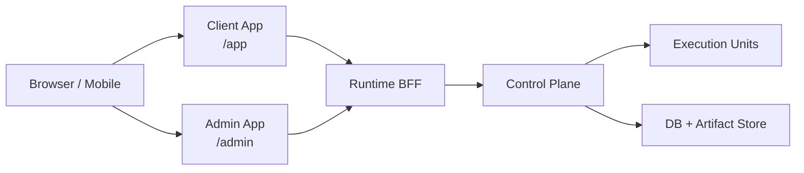
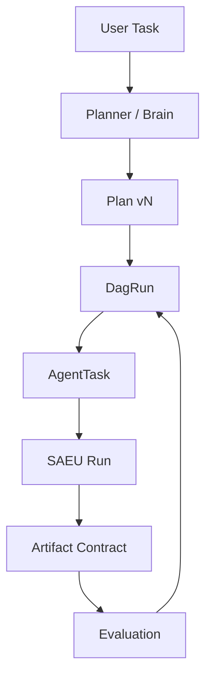
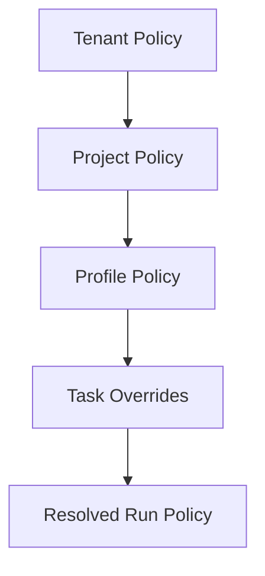

# Client/Admin 分离与多 Agent 平台化方案

> 日期：2026-07-15  
> 状态：设计方案与实施审计稿  
> 范围：Client 用户端、Admin 管理端、自动 Agent 分派、DAG 编排、统一 Agent 协议、安全权限、审计回放、执行单元注册、数据库持久化、测试策略。  
> 目标：在现有 AgentFlow runtime 能力上，把产品升级为“用户直接发起任务，后台稳定调度多 Agent 并可审计治理”的平台。

## 0. 结论

本项目不建议重写成一个全新的 Node.js 后端。推荐路线是：

```text
后端控制面：继续以 Python 为主，逐步从当前 stdlib HTTP runtime 演进到可选 FastAPI ASGI 层。
前端：继续 React + Tailwind + shadcn 风格，拆成 Client App 与 Admin App 两个清晰入口。
执行协议：内部 ACP-first，A2A 作为外部 Agent-to-Agent gateway，MCP 作为 Agent-to-Tool gateway。
编排模型：mission -> plan -> dag_run -> agent_task -> run，所有子 Agent 都是可审计 SAEU run。
持久化：SQLite 继续支撑本地/单机，生产目标迁移到 Postgres + artifact object store。
UI Chat：Client 端任务详情采用 qwen-code WebShell compatible transcript，通过现有 `/session/*` BFF 消费 `DaemonEvent` projection。
```

这条路线最少推翻现有成果。AgentFlow 已有 Run/Mission/Profile/Worker/Executor/Permission/Artifact/Audit/Task BFF/Admin pages；缺的是更清晰的产品分离、真正的自动 planner/supervisor、更多 Agent CLI adapter、可版本化 workflow DAG、生产级持久化和完整测试门禁。

## 1. 当前基线

### 1.1 已有能力

当前仓库已经落地：

| 能力 | 现状 | 可复用程度 |
| --- | --- | --- |
| Run Manager | `POST /runs`、SSE events、cancel、input、permission | 高 |
| Mission | sequential/fanout/custom task DAG，profile snapshot，review gate | 高 |
| Task Workspace BFF | `/tasks` 将 run/mission 投影成用户任务 | 高 |
| Worker/Execution Unit | heartbeat、claim、drain/resume/retry、capacity | 高 |
| Executor Registry | shared/per-run/container qwen executor lease | 高 |
| 权限与审计 | permission events、notifications、audit bundle | 高 |
| UI Projection | RuntimeEvent -> qwen daemon compatible `DaemonEvent` | 高 |
| 用户与访问 | owner/operator/auditor/member、session cookie、API token foundation | 中 |
| Web Console | 用户工作台 + Admin 页面在同一个 React app | 中 |
| 持久化 | SQLite + JSONL artifacts | 中 |

### 1.2 主要缺口

| 缺口 | 影响 | 优先级 |
| --- | --- | --- |
| Client/Admin 仍在同一 app 文件和同一导航体系中 | 用户端体验和后台治理边界不够硬 | P0 |
| 复杂任务仍依赖人工选择 single/mission，缺少自动 planner/supervisor | 无法“快速分发简单或复杂任务” | P0 |
| Profile 还不是完整的安全继承和 adapter 选择策略 | 难以统一 qwen/codex/claude/opencode | P0 |
| Mission DAG 缺少显式版本化 `plan`、`dag_run`、retry policy、evaluation policy | 复杂任务可恢复性不足 | P0 |
| 用户认证仍缺完整账号生命周期、CSRF、tenant/project 成员模型 | 多用户部署风险 | P0 |
| 前端未真正接入 qwen-code WebShell 组件包 | Chat 渲染仍是自研近似层 | P1 |
| SQLite schema 缺少生产迁移路径和索引/查询模型 | 审计查询、租户隔离、并发扩展受限 | P1 |
| E2E 还未覆盖真实 Client/Admin 分端、移动端和失败重试 | 回归风险 | P1 |

## 2. 外部调研要点

### 2.1 DeerFlow

本地 DeerFlow 仓库：`/Users/chigao/Documents/codebase/github/deer-flow`。

可借鉴点：

- 默认产品心智是 super agent harness，而不是运维控制台。
- 前端入口围绕 Chat、Workspace、Uploads、Artifacts。
- 后端使用 LangGraph-compatible API、SSE streaming、thread state、sandbox、skills、memory。
- lead agent 可以动态拉起 sub-agents；sub-agent 有独立上下文、工具、超时和结构化结果。
- `config.example.yaml` 中有 `subagents`、`custom_agents`、`acp_agents`、skills、MCP server 等配置边界。
- 认证设计强调 fail-closed AuthMiddleware、CSRF、用户路径隔离、memory/agent per-user isolation。

不直接照搬点：

- DeerFlow 的 sub-agent 是单 harness 内部能力；AgentFlow 需要跨 worker、跨 executor、跨 workspace、可审计、可恢复。
- DeerFlow 当前更像“一个 super agent runtime”；AgentFlow 应保留 control-plane/worker/executor 的分布式边界。

### 2.2 LangGraph / LangSmith Agent Server

LangGraph 文档强调 persistence 对长期 agent 的价值：checkpointer 负责 thread-scoped state，store 负责跨 thread 的长期记忆；生产要避免内存 saver，使用 SQLite/Postgres 等持久化后端。Streaming API 支持多种 stream mode，并支持断线后用 last event id 恢复。参考：[LangGraph Persistence](https://docs.langchain.com/oss/python/langgraph/persistence)、[LangGraph Streaming API](https://docs.langchain.com/langsmith/streaming)。

对 AgentFlow 的启发：

- 不要只依赖 JSONL 文件；需要 DB 中可查询的 canonical event store。
- UI streaming 必须支持 resumable reconnect。
- workflow state 和长期 memory 要分开。

### 2.3 CrewAI Flows

CrewAI Flows 将多步骤 AI workflow 建模为 event-driven flow，支持 state management、conditional/loop/branching 和 persistence。参考：[CrewAI Flows](https://docs.crewai.com/en/concepts/flows)。

对 AgentFlow 的启发：

- planner/supervisor 的输出应是显式 flow/DAG，不只是自然语言计划。
- 任务 state 需要结构化 schema，避免复杂 mission 只靠事件推断。

### 2.4 Airflow

Airflow 的 Dag 把 workflow 所需信息封装起来：tasks、dependencies、schedule、callbacks、retry、timeout。Airflow 文档明确 Dag 不关心 task 内部做什么，只关心执行顺序、重试、超时等编排规则。参考：[Airflow Dags](https://airflow.apache.org/docs/apache-airflow/stable/core-concepts/dags.html)。

对 AgentFlow 的启发：

- AgentFlow 不需要直接引入完整 Airflow，但应借鉴 Dag/DagRun/TaskInstance 的概念。
- Agent 内部细节通过 run events 暴露；编排层只管理依赖、重试、状态、artifact contract。

### 2.5 ACP / A2A / MCP

- ACP 适合 Client-to-Agent 控制，尤其是 coding agent session、prompt、streaming、permission。参考：[Agent Client Protocol](https://agentclientprotocol.com/get-started/introduction)。
- A2A 适合外部 Agent-to-Agent 互操作，Agent Card、task status、artifact exchange。参考：[A2A specification](https://github.com/a2aproject/A2A/blob/main/docs/specification.md)。
- MCP 适合 Agent-to-Tool，把工具、资源、prompt 暴露给 Agent。参考：[Model Context Protocol specification](https://modelcontextprotocol.io/specification/2025-06-18)。

对 AgentFlow 的决策：

```text
内部执行器控制：ACP-first。
外部系统互操作：A2A gateway。
工具与数据连接：MCP gateway。
UI 渲染：qwen daemon compatible event projection，不污染内部 canonical events。
```

## 3. 产品分端设计

### 3.1 双端边界



| 端 | 用户 | 核心任务 | 默认暴露内容 |
| --- | --- | --- | --- |
| Client | member、业务用户、开发者 | 发任务、聊天、看进度、处理权限、取结果 | Task、Chat、DAG 总览、Artifacts、Approvals |
| Admin | owner、operator、auditor | 运维、审计、配置、用户、租户、worker、成本 | Runs、Missions、Workers、Executors、Audit、Access、Ops |

### 3.2 Client 信息架构

| 页面 | 路由 | 设计要求 |
| --- | --- | --- |
| 首页/工作台 | `/app` | 一个主输入框，快速模式、复杂模式、文件/仓库入口、最近任务 |
| 任务列表 | `/app/tasks` | 进行中、等待我处理、已完成、失败，移动端优先卡片 |
| 任务详情 | `/app/tasks/:taskId` | 左侧 qwen WebShell Chat，右侧/下方 DAG、Artifacts、权限卡 |
| DAG 总览 | 任务详情内 tab 或 sheet | 简化 DAG：节点角色、状态、进度、产物，不展示 worker/executor id |
| 结果中心 | `/app/tasks/:taskId/result` | final answer、报告、diff、文件、评估结果 |
| 项目空间 | `/app/projects/:projectId` | 项目上下文、默认策略、成员可见任务 |
| 个人设置 | `/app/settings` | 通知、语言、会话、个人 token、IM 绑定 |

移动端原则：

- 首屏只放任务输入、活跃任务、待审批。
- 任务详情采用 bottom sheet/tabs：Chat、Progress、Result。
- 权限审批卡必须固定在 Chat composer 上方。
- DAG 图在移动端退化为垂直 timeline，不强行展示复杂 graph。

### 3.3 Admin 信息架构

| 页面 | 路由 | 设计要求 |
| --- | --- | --- |
| Overview | `/admin` | 健康、队列、失败率、预算、告警 |
| Tenants/Projects | `/admin/projects` | 租户内项目、成员、默认 policy |
| Users | `/admin/users` | 邀请、禁用、角色、重置密码、会话 |
| Policies | `/admin/policies` | 安全、审批、网络、工具、模型、资源 |
| Agent Profiles | `/admin/profiles` | 内置/团队/个人 profile，版本化 |
| Orchestration | `/admin/orchestration` | planner policy、DAG 模板、retry/eval policy |
| Runs/Missions | `/admin/runs`、`/admin/missions` | 事实源运行详情和排障 |
| Workers/Executors | `/admin/units`、`/admin/executors` | 注册、drain/resume、资源、水位、lease |
| Audit | `/admin/audit` | 事件查询、权限决策、artifact、replay |
| Ops | `/admin/operations` | backup、drills、monitor、deployment revision |

### 3.4 前端落地方式

当前 `web/src/app.tsx` 已经很大，建议分三步拆：

```text
web/src/apps/client/*
web/src/apps/admin/*
web/src/features/task-chat/*
web/src/features/orchestration/*
web/src/features/access/*
web/src/features/ops/*
web/src/lib/api/*
```

短期仍可共用一个 Vite app 和一个 router，但 route tree、layout、query hooks、页面组件必须拆分。中期可以做两个 entry chunk：

```text
/app/*    -> Client shell
/admin/*  -> Admin shell
```

## 4. 自动 Agent 分派与编排

### 4.1 核心对象



新增或强化模型：

| 模型 | 说明 |
| --- | --- |
| `Task` | 用户可见任务，承载 owner/project/tenant |
| `Plan` | planner 输出的版本化计划，包含 DAG、角色、上下文和验收标准 |
| `DagRun` | 某个 plan 的一次执行实例 |
| `AgentTask` | DAG 节点，绑定 profile、adapter strategy、artifact contract、eval policy |
| `Run` | 实际执行单元，当前已有 |
| `ArtifactContract` | 子 Agent 必须产出的文件、schema、质量要求 |
| `Evaluation` | 自动或人工评估产出物是否满足 contract |

### 4.2 Planner / Brain 职责

Planner 是“复杂任务的大脑”，可以先规则化，后 Agent 化。

职责：

- 判断任务复杂度：simple、assisted、orchestrated。
- 将复杂目标拆成 DAG。
- 为每个 AgentTask 指定 profile、目标、上下文、输入 artifact、输出 contract。
- 选择并行、串行、fanout/fanin、review gate、human gate。
- 生成 retry/eval/timeout 策略。
- 在执行中根据事件和评估结果调整 plan，形成 `plan v2`。

不允许：

- 绕过权限系统直接给子 Agent 高权限。
- 让多个 coder 写同一个 workspace。
- 只输出自然语言计划而不写结构化 DAG。
- 修改历史 plan；只能创建新版本。

### 4.3 自动分派策略

```text
simple:
  一个 agent_task，默认 coder/researcher profile。

assisted:
  planner 生成简短 plan，但仍以一个主 run 执行；必要时附加 reviewer/tester。

orchestrated:
  planner 生成完整 DAG，多个 agent_task 进入队列，按依赖调度。
```

复杂度判断信号：

- prompt 长度和目标数量。
- 是否涉及代码仓库、文件上传、外部系统。
- 是否要求“调研 + 实现 + 测试 + 审查 + 发布”多阶段。
- 用户选择快速/标准/深度。
- 项目 policy 要求必须 review/test。

### 4.4 DAG 调度 MVP

第一版不引入完整 Airflow 服务；在 `MissionManager` 基础上实现轻量 DAG engine：

| 能力 | MVP | 后续 |
| --- | --- | --- |
| DAG schema | JSON plan，nodes/edges | DSL + visual editor |
| 调度 | ready nodes 入队 | priority queue |
| 重试 | per-node max_attempts/backoff | retry class + dead letter |
| 超时 | per-node timeout | heartbeat-aware timeout |
| fanout/fanin | 支持 | 支持 map/reduce |
| 条件分支 | 简单 condition | 表达式/LLM router |
| pause/resume | human gate | durable workflow signals |
| 可视化 | Task detail DAG projection | Admin orchestration debugger |

当流程需要定时、长期等待外部信号、海量任务 backfill 时，再评估引入 Temporal 或 Airflow-like service。当前更适合先做内置 lightweight DagRun，因为 AgentFlow 的任务是用户即时触发、强审计、强权限、强 artifact contract，不是传统 ETL 调度。

## 5. Agent Runtime 与统一协议

### 5.1 适配层

所有 Agent CLI 都通过统一 SAEU Adapter 接入：

```text
qwen-code     -> qwen serve REST/SSE 起步，ACP endpoint 优先
codex cli     -> ACP wrapper 或 native adapter
claude code   -> ACP wrapper
opencode      -> native event adapter 或 ACP wrapper
custom agent  -> 实现 ACP server 或 RuntimeAdapter
```

Adapter contract：

```text
create_session(run_spec, workspace, policy) -> adapter_run_id
send_input(adapter_run_id, prompt)
stream_events(adapter_run_id) -> native events
resolve_permission(adapter_run_id, permission_id, decision)
cancel(adapter_run_id)
collect_artifacts(adapter_run_id)
```

Adapter 输出必须转换为 canonical `RuntimeEvent`，再由 `ui_projection.py` 转成 qwen WebShell compatible `DaemonEvent`。

### 5.2 实时可观测性

用户端需要两层实时视图：

| 视图 | 数据源 | 目的 |
| --- | --- | --- |
| 单 Agent Chat | `/session/{run_id}/events` | 像本地单 Agent chat 一样看消息、工具、权限 |
| 整体 DAG | `/tasks/{task_id}/graph/events` 或 task events | 看节点状态、依赖、进度、产物、失败原因 |

Admin 端再展示第三层：

| 视图 | 数据源 | 目的 |
| --- | --- | --- |
| Audit/Debug | canonical events、raw events、executor logs | 排障、审计、回放 |

### 5.3 WebShell 组件策略

短期：

- 继续使用现有 `DaemonEvent` projection 和自研 transcript rendering。
- 补齐 qwen WebShell fixture conformance test。

中期：

- vendor 或 npm 引入 qwen-code WebUI 的稳定组件边界。
- 建立 `web/src/features/task-chat/qwen-webshell-adapter.tsx`。
- 前端只处理 layout、permission action slot、artifact side panel；transcript block 交给 WebShell。

硬约束：

- 浏览器不能直接连 qwen serve。
- WebShell 只消费 BFF 的 `/session/*`。
- WebShell projection 是 UI cache，不是审计事实源。

## 6. 安全、权限与继承

### 6.1 租户模型

建议数据层统一：

```text
tenant
project
membership
auth_user
role_binding
policy
task
run
agent_profile
worker_registration
api_token
```

单租户部署时也创建默认 tenant，避免未来迁移痛苦。

### 6.2 Policy 继承



继承规则：

- deny 优先于 allow。
- resource limit 取更严格值。
- approval requirement 只能收紧，不能由子层放宽，除非 owner 显式授权。
- network、filesystem、secrets、deploy、git push 属于高风险域，默认 ask/deny。
- 每个 run 保存 `resolved_policy.json`，历史审计不受后续 policy 修改影响。

### 6.3 权限类型

| 权限 | 默认 | 说明 |
| --- | --- | --- |
| read workspace | allow | 受 project scope 限制 |
| write workspace | ask/allow | 取决于 profile |
| shell | ask | 命令风险分级 |
| network | ask/deny | 可配置 egress allowlist |
| secrets | deny | 通过 scoped secret broker 注入 |
| git push / deploy | ask + owner/operator | 高风险 |
| external MCP | ask/deny | 取决于 tool trust |
| cost over budget | block | 需要 owner override |

### 6.4 认证和账户生命周期

需要补齐：

- HttpOnly session cookie。
- CSRF double-submit。
- 登录限速。
- owner 首次 setup。
- 用户邀请/禁用/重置密码。
- token_version，改密码废弃旧 session。
- session/device 列表。
- API token scope 和过期时间。
- Project membership。

DeerFlow 的认证设计可以作为直接参考：fail-closed AuthMiddleware、ContextVar 注入真实用户、服务端剥离客户端传来的 owner/user metadata。

## 7. 审计、回放、重试与产物系统

### 7.1 事实源

```text
Postgres tables:
  tasks
  plans
  dag_runs
  agent_tasks
  runs
  run_events
  permission_requests
  permission_decisions
  artifacts
  evaluations
  worker_events

Artifact store:
  raw_events.jsonl
  ui_daemon_events.jsonl
  diagnostics.json
  workspace_snapshot_ref
  diff.patch
  final_report.md
  evaluation.json
```

原则：

- `run_events` 是事实源。
- raw native events 是排障证据。
- UI daemon events 是可重建缓存。
- artifact 大对象不塞 DB，只在 DB 记录 hash、size、content_type、storage_uri。

### 7.2 子 Agent 产物 contract

每个 AgentTask 必须有：

```json
{
  "goal": "Implement the API endpoint",
  "inputs": ["artifact://plan.md"],
  "required_artifacts": [
    {"name": "diff.patch", "type": "patch", "required": true},
    {"name": "implementation-notes.md", "type": "markdown", "required": true}
  ],
  "evaluation": {
    "checks": ["artifact_exists", "tests_passed", "review_gate"],
    "min_score": 0.8
  }
}
```

Supervisor 只在 artifact contract 满足后才推进 downstream。

### 7.3 失败重试

重试分层：

| 失败 | 策略 |
| --- | --- |
| worker lease expired | reclaim queued run |
| transient adapter/network | retry same AgentTask |
| permission denied | mark blocked/cancel downstream |
| artifact contract missing | retry with explicit repair prompt |
| review high risk | block and require human override |
| test failed | spawn fix task or retry coder |
| budget exceeded | block owner approval |

每次重试都产生新的 run attempt，不能覆盖旧 run。

### 7.4 回放模式

| 模式 | 目的 |
| --- | --- |
| UI replay | 复现用户看到的 Chat/DAG 流 |
| State replay | 从 canonical events 重建 task/run/mission 状态 |
| Audit replay | 输出权限、工具、artifact、policy 时间线 |
| Tool replay | 用录制的 tool I/O fixture 做回归 |
| Planner replay | 固定 planner input，比较 plan DAG 差异 |

## 8. 执行单元发现与注册

### 8.1 Execution Unit 类型

| 类型 | 示例 | 注册方式 |
| --- | --- | --- |
| local workspace | 本机隔离 worktree | local worker heartbeat |
| Docker instance | per-run container | worker metadata declares container strategy |
| ECS/VPS | remote worker daemon | one-time registration token |
| NAS | persistent low-cost worker | labels + resource policy |
| Kubernetes pod | dynamic executor | future provisioner |

### 8.2 注册协议

Worker registration 应包含：

```json
{
  "worker_id": "hk-2c2g-a",
  "tenant_id": "tenant_default",
  "project_ids": ["default"],
  "labels": {"region": "hk", "tier": "sandbox"},
  "resources": {"cpu": 2, "memory_mb": 2048, "disk_mb": 40000},
  "adapters": ["qwen", "codex", "claude", "opencode"],
  "features": ["artifacts", "permissions", "workspace_git", "container"],
  "sandbox": {"type": "docker", "network": "egress-proxy"},
  "executor": {"strategies": ["shared", "per_run_process", "container"]}
}
```

控制面根据 worker metadata、project policy、profile requirement 做 placement。

## 9. 后端技术路线

### 9.1 推荐：Python 控制面

选择 Python 的原因：

- 当前 AgentFlow runtime 已是 Python，迁移成本最低。
- LangGraph、CrewAI、Airflow/Temporal Python SDK、agent eval 生态更成熟。
- SQLite/Postgres、SSE、worker daemon、CLI process control 都适合 Python。
- qwen/codex/claude/opencode CLI 适配主要是进程和流式事件处理，不需要 Node 后端。

Node.js 保留在前端和必要的 ACP wrapper/npm tool 安装层，不作为主控制面。

### 9.2 演进方式

| 阶段 | 后端形态 | 说明 |
| --- | --- | --- |
| 当前 | stdlib ThreadingHTTPServer | POC 小而可审计 |
| P1 | 保持 stdlib，先拆 domain/service/store | 降低风险 |
| P2 | 引入 DB migration abstraction | SQLite/Postgres 双后端 |
| P3 | 可选 FastAPI ASGI gateway | 登录、CSRF、OpenAPI、WebSocket 更自然 |
| P4 | worker/control plane 分进程 | HA 和横向扩展 |

不要在 Client/Admin 分离的第一步同时重写后端框架。先稳定模型、路由、测试，再替换 transport。

## 10. 实施路线

### Phase 0：方案冻结与 schema tests

- 新增本方案文档和 ADR。
- 定义 `Task/Plan/DagRun/AgentTask/ArtifactContract/Evaluation` dataclass。
- 增加 JSON schema fixtures。
- 测试：schema validation、policy merge、plan DAG validation。

### Phase 1：Client/Admin 硬分离

- route 从 `/`、`/admin/*` 收敛为 `/app/*`、`/admin/*`，根路径按 session role redirect。
- 拆 `web/src/app.tsx` 为 client/admin/features。
- 普通 member 不加载 Admin nav；直接访问 admin 返回 403/redirect。
- 移动端 task detail 改为 Chat/Progress/Result tabs。
- 测试：React unit + Playwright desktop/mobile。

### Phase 2：认证与租户 foundation

- tenant/project/membership 表。
- owner setup、user invite、disable、reset password、token_version、CSRF。
- task/run/mission 统一写 `tenant_id/project_id/created_by`。
- 测试：越权访问 404/403、CSRF、session invalidation、project filtering。

### Phase 3：Planner / Brain MVP

- `POST /tasks` 默认进入 planner decision。
- simple 任务走单 run。
- complex 任务生成 plan v1 + DagRun。
- Planner 可先规则化：基于 goal/mode/project policy 产出 DAG。
- Admin 可查看 plan JSON 和 DAG。
- 测试：simple/complex 分派、fanout/fanin、invalid DAG、plan versioning。

### Phase 4：Artifact contract + evaluation gate

- AgentTask 必须声明 required artifacts。
- run 完成后检查 artifact contract。
- reviewer/tester/release gate 作为 evaluation。
- 缺 artifact 自动 repair retry。
- 测试：artifact missing、schema invalid、review block、human override。

### Phase 5：多 Agent CLI adapter

- 抽象 ACP adapter interface。
- Codex/Claude/OpenCode 至少先实现 fake/native fixture adapter。
- qwen adapter 作为 golden conformance。
- UI projection 对非 qwen agent 生成一致 WebShell transcript。
- 测试：adapter conformance、permission mapping、cancel、reconnect、raw/canonical replay。

### Phase 6：Postgres + artifact store

- 引入 repository abstraction 和 migration。
- SQLite 保留本地模式；Postgres 作为生产推荐。
- artifact store 支持 filesystem 起步，预留 S3-compatible URI。
- 测试：migration、index query、event replay、backup/restore。

### Phase 7：执行单元注册与调度增强

- worker registration UI 完整化。
- placement policy：adapter、labels、resources、tenant/project scope。
- worker capability conformance。
- 测试：claim matching、drain/resume/retry、stale worker、capacity、resource rejection。

### Phase 8：可选 durable workflow backend

- 如果 lightweight DagRun 已经出现长等待、外部 signal、复杂补偿，再引入 Temporal。
- Airflow 更适合定时/批处理，不建议作为第一默认后端。

## 11. 测试与质量门禁

目标：全局覆盖率 > 90%，并且关键风险用集成/E2E 覆盖，不只追求行覆盖。

### 11.1 后端

| 层 | 测试 |
| --- | --- |
| unit | policy merge、DAG validation、artifact contract、adapter event mapping |
| integration | task -> plan -> DagRun -> runs -> artifacts -> final result |
| HTTP | auth/session、CSRF、project filtering、admin RBAC、SSE reconnect |
| worker | heartbeat、claim、cancel、permission apply、artifact upload |
| replay | events -> state、events -> UI transcript、audit bundle |
| failure | timeout、lease expired、worker stale、adapter failed、budget exceeded |

### 11.2 前端

| 层 | 测试 |
| --- | --- |
| unit | Client/Admin route guard、task projections、DAG status、permission card |
| component | WebShell adapter fixtures、mobile tabs、artifact preview |
| E2E | login、create simple task、create complex task、approval、admin audit |
| mobile E2E | iPhone viewport：发任务、看 Chat、审批、查看结果 |
| accessibility | keyboard navigation、focus、aria labels、contrast |

### 11.3 Conformance

必须建立固定 fixtures：

- qwen daemon events。
- codex canonical events。
- claude canonical events。
- opencode canonical events。
- permission requested/resolved/applied。
- shell stdout/stderr。
- artifact created。
- failed/retry/resume。

每个 adapter 必须通过：

```text
native events -> canonical events -> DaemonEvent -> transcript blocks
canonical events -> state replay
canonical events -> audit bundle
```

## 12. 多轮审计

### 12.1 产品审计

| 风险 | 判断 | 处理 |
| --- | --- | --- |
| 用户端仍像后台控制台 | 高风险 | `/app` 只保留 task/chat/result，worker/executor 全部移到 `/admin` |
| 移动端 DAG 太复杂 | 高风险 | 移动端用 timeline，不强行展示 graph |
| 简单任务被复杂配置吓退 | 高风险 | 默认 auto，用户只选“快速/标准/深度” |
| 权限审批被藏起来 | 高风险 | 权限卡固定在 composer 上方，并在任务列表标记“等待我处理” |

### 12.2 架构审计

| 风险 | 判断 | 处理 |
| --- | --- | --- |
| 一次性重写后端框架 | 高风险 | 先拆模型和服务，后续再可选 FastAPI |
| 直接引入 Airflow 过重 | 中高风险 | 先内置 lightweight DagRun，保留 Temporal/Airflow adapter 口 |
| 子 Agent 作为 runtime 内部 subagent 不可审计 | 高风险 | 平台 DAG 中的每个 AgentTask 都映射为 SAEU run |
| Qwen WebShell schema 反向污染内部事件 | 高风险 | canonical RuntimeEvent 是事实源，DaemonEvent 只是 projection |

### 12.3 安全审计

| 风险 | 判断 | 处理 |
| --- | --- | --- |
| 客户端伪造 user/project metadata | 高风险 | 服务端注入身份，剥离客户端 owner/user 字段 |
| policy override 放宽权限 | 高风险 | deny 优先，子层只能收紧 |
| worker token 泄漏 | 高风险 | scoped token、过期、可撤销、只显示一次 |
| 浏览器直连 qwen daemon | 高风险 | 禁止，必须走 BFF |
| secrets 被 artifact 泄漏 | 高风险 | secret broker + artifact redaction + audit scanner |

### 12.4 协议审计

| 风险 | 判断 | 处理 |
| --- | --- | --- |
| ACP/A2A/MCP 边界混乱 | 中高风险 | ACP 控制 Agent，A2A 对外互操作，MCP 接工具 |
| Agent CLI 事件能力不一致 | 高风险 | adapter conformance + canonical event schema |
| permission option 不统一 | 中风险 | Runtime decision 固定 approve/deny/cancel，原 option_id 进 metadata |
| SSE 断线丢事件 | 高风险 | Last-Event-ID + replay from canonical events |

### 12.5 可实施性审计

| 风险 | 判断 | 处理 |
| --- | --- | --- |
| 目标太大导致长期不可交付 | 高风险 | Phase 1 只做分端，Phase 3 才做 planner |
| 测试成本过高 | 中风险 | fixture conformance + 关键 E2E，覆盖率门禁不降 |
| Postgres 迁移影响本地体验 | 中风险 | SQLite/Postgres 双后端，先 repository abstraction |
| WebShell 包不稳定 | 中风险 | 先 projection fixture，vendor 版本 pin，保留 fallback renderer |

## 13. 第一批可执行任务

建议第一批 PR 不超过以下范围：

1. 新增 `Task/Plan/DagRun/AgentTask` 设计 schema 和验证测试。
2. 前端 route/layout 拆分为 `/app` 与 `/admin`，不重写业务逻辑。
3. 普通 member 访问 `/admin` 的 guard 和 E2E。
4. 移动端 Client task detail tabs。
5. Planner MVP 只做 deterministic rules，不接 LLM。

这样可以快速验证产品边界，同时不碰最危险的 adapter 和 DB migration。

## 14. 最终验收标准

| 领域 | 验收 |
| --- | --- |
| Client | 用户登录后能在移动/桌面端发起简单或复杂任务，看 Chat、DAG、权限、结果 |
| Admin | owner/operator/auditor 能分别管理用户、policy、worker、audit、ops |
| Orchestration | 复杂任务自动生成 DAG，子 Agent 有目标、上下文、产物、评估 |
| Protocol | qwen/codex/claude/opencode 至少通过统一 adapter conformance |
| Security | policy 继承、RBAC、CSRF、token scope、worker scope 有测试 |
| Audit | 任意 task 可导出完整 audit bundle，并可 UI/state replay |
| Persistence | 后台任务不依赖客户端，进程重启后可恢复状态 |
| Tests | 后端和前端全局覆盖率均保持 90%+，关键 E2E 覆盖桌面和移动端 |

