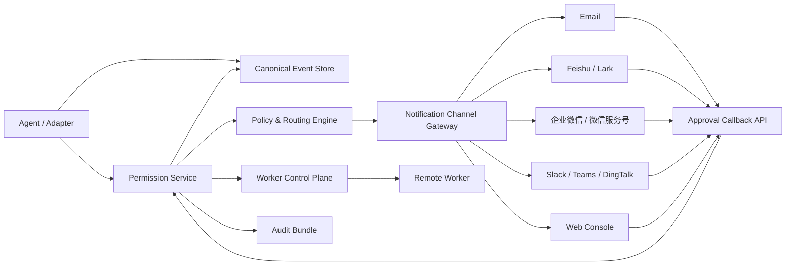

# 人类介入、权限确认与通知 Channel 架构

> 结论：权限确认必须是中心化的 Permission Service 能力，而不是某个 Agent、某个 IM 机器人或某个 worker 的私有逻辑。邮件、飞书、企业微信、微信服务号、Slack、Teams、钉钉都应该作为 Notification Channel Adapter 接入同一条审批事件流。

## 当前实现状态

AgentFlow 现在已经具备基础的人类介入闭环：

1. Agent adapter 产生 `permission.requested`。
2. Run Detail 中的 `PermissionPanel` 解析 pending request。
3. 人类在 Web 控制台点击 approve、deny 或 cancel。
4. Web 调用 `POST /runs/{run_id}/permissions/{permission_id}`。
5. Runtime 写入：
   - 本地 run：直接调用 adapter `resolve_permission`，最终产生 `permission.resolved`。
   - 远程 worker run：先写 `permission.resolve_requested`，worker 轮询 `/workers/{worker_id}/control` 后在本机调用 adapter `resolve_permission`，再回传 `permission.resolved`。
6. 若超过 `RUN_MANAGER_PERMISSION_STALL_SECONDS` 未处理，会产生 `permission.stalled`；根据 `RUN_MANAGER_PERMISSION_STALL_ACTION` 可以只审计、自动 deny 或 cancel。

当前缺口：

- 没有外部通知 channel。
- 没有审批人路由策略。
- 没有 mobile-first approval 页面。
- 没有多审批人、升级、值班和 quorum。
- 没有通知投递状态和失败重试。
- Web 里审批按钮还没有展示完整风险摘要。

## 目标架构



核心原则：

- Agent 只发请求，不决定谁来批。
- Channel 只负责通知和收集人的选择，不直接操作 runner。
- 所有审批结果必须回写中心 Runtime API。
- 所有通知、点击、失败、超时和自动处理都进入审计事件。

## Permission 生命周期

建议把权限请求建模为显式生命周期：

| 状态 | 触发 | 说明 |
| --- | --- | --- |
| `requested` | adapter 发出 | 已记录 canonical event |
| `routed` | policy engine 匹配 | 选出审批人、审批组和 channel |
| `notified` | channel 发送成功 | 记录 channel、message_id、target |
| `delivery_failed` | channel 发送失败 | 进入重试或升级 |
| `viewed` | 人打开审批页或卡片 | 可选审计 |
| `resolved` | approve/deny/cancel | 决策写入中心事件流 |
| `applied` | worker/adapter 确认执行 | 远程 worker 场景尤其重要 |
| `stalled` | 超时未处理 | 触发升级、deny 或 cancel |
| `expired` | 请求已过期 | 按策略拒绝后续点击 |

当前代码已有 `requested`、`resolved`、`resolve_requested`、`stalled`；下一步需要补 `routed`、`notified`、`delivery_failed`、`applied`。

## 权限请求标准 Schema

建议把不同 Agent 的原生权限请求统一成以下内部对象：

```json
{
  "permission_id": "perm_123",
  "run_id": "run_123",
  "scope": "tool.shell",
  "risk_level": "medium",
  "title": "Allow shell command?",
  "summary": "Run npm test in workspace",
  "tool": "shell",
  "command": "npm test",
  "cwd": "/workspace/run_123",
  "diff_refs": ["artifact://diff.patch"],
  "artifact_refs": ["artifact://permission.raw.json"],
  "options": [
    {"id": "approve", "label": "Approve once"},
    {"id": "deny", "label": "Deny"},
    {"id": "cancel", "label": "Cancel run"}
  ],
  "requested_by": {
    "agent": "qwen",
    "profile": "coder",
    "worker_id": "hk-2c2g-a"
  },
  "routing": {
    "project_id": "default",
    "owners": ["user:alice"],
    "groups": ["group:oncall"]
  },
  "expires_at": "2026-07-03T12:00:00Z"
}
```

## Channel Gateway

Channel Gateway 负责把同一个 permission request 发到不同渠道，并接收回调。

### Channel Adapter 接口

```python
class NotificationChannel:
    name: str

    def send_permission_request(self, request, targets, action_url) -> DeliveryResult:
        ...

    def verify_callback(self, headers, body) -> CallbackPrincipal:
        ...

    def parse_decision(self, body) -> PermissionDecision:
        ...
```

### 投递事件

每次投递都应写事件：

- `permission.notification.queued`
- `permission.notification.sent`
- `permission.notification.failed`
- `permission.notification.clicked`
- `permission.notification.callback_rejected`

这样可以回答“有没有通知到人、谁点了、为什么没生效”。

## 各渠道建议

| Channel | 适合场景 | 建议形态 | 注意点 |
| --- | --- | --- | --- |
| Web Console | 默认主审批面 | Run Detail + permission action bubble | 当前已有基础能力 |
| Email | 低频、跨组织审批 | 邮件摘要 + 登录链接 | 高风险操作不建议直接邮件一键通过 |
| 飞书/Lark | 企业内部协作 | 机器人交互卡片 + callback | 需要验签、tenant/app 配置、用户映射 |
| 企业微信/WeCom | 国内企业 IM | 应用消息/群机器人 + Web 审批链接 | 群机器人通常更适合通知，强审批建议跳回 Web |
| 微信服务号 | 外部或轻量移动提醒 | 模板消息/订阅消息 + H5 审批页 | 个人微信自动化不可作为可靠企业审批通道 |
| Slack/Teams | 海外团队 | Block/Adaptive card + callback | 同样需要签名校验和用户映射 |
| SMS/电话 | 高优先级升级 | 只通知，不直接审批 | 适合值班兜底 |

原则：IM 卡片可以承载 approve/deny/cancel，但高风险操作应跳转到 AgentFlow 的审批详情页，展示完整 command、cwd、diff、artifact、权限范围和 run 上下文。

## 人类管控策略

### 风险分级

| 风险 | 例子 | 默认策略 |
| --- | --- | --- |
| `low` | 只读 grep、读取当前 workspace 文件 | 可按 profile 自动通过或静默记录 |
| `medium` | 运行测试、读写临时文件 | 通知 owner，一人审批 |
| `high` | 写仓库、修改 CI、安装依赖、访问外网 | Web 详情页审批，必要时二次确认 |
| `critical` | git push、部署、删除文件、生产凭据、云资源变更 | 多人审批或默认拒绝 |

### 路由规则

审批人不应该只按“谁发起任务”决定，还要看：

- `project_id`
- `repo`
- `profile_id`
- `tool`
- `risk_level`
- `worker_region`
- `mission_id`
- 是否命中 release gate

示例策略：

```yaml
permission_routes:
  - match:
      risk_level: critical
    require:
      quorum: 2
      roles: ["owner", "release-manager"]
      channels: ["web", "feishu"]
      timeout_seconds: 900
      timeout_action: cancel

  - match:
      tool: shell
      risk_level: medium
    require:
      quorum: 1
      roles: ["operator"]
      channels: ["web", "feishu"]
      timeout_seconds: 600
      timeout_action: deny
```

### 决策冲突

多渠道必须避免重复审批造成冲突：

- 每个 request 有 `version` 或 `state_hash`。
- 决策 API 必须幂等。
- 第一个有效决策锁定状态。
- 后续点击返回“已由某人处理”。
- 多人审批模式下，单个 decision 只是 vote，quorum 达成后才产生 `permission.resolved`。

## API 设计建议

当前已有：

```http
POST /runs/{run_id}/permissions/{permission_id}
```

建议新增：

```http
GET /permissions
GET /permissions/{permission_id}
POST /permissions/{permission_id}/decisions
POST /permissions/{permission_id}/notifications/retry
POST /notification-callbacks/{channel}
```

`POST /permissions/{id}/decisions` 示例：

```json
{
  "decision": "approve",
  "option_id": "approve",
  "reason": "Test command is safe",
  "decided_by": "user:alice",
  "channel": "feishu",
  "callback_message_id": "msg_123",
  "state_token": "short-lived-signed-token"
}
```

## 安全边界

1. 不把 master token 放进邮件或 IM 消息。
2. IM callback 必须验签。
3. 邮件按钮只使用短期签名 token，且高风险必须登录。
4. 每个 decision 记录 principal、channel、IP、user-agent、message_id。
5. 不在 IM 中暴露 secret、完整 env、private key、长 stdout。
6. 权限摘要中敏感字段先脱敏，完整 payload 只在 Web 登录后可见。
7. channel token 独立存储，可撤销、可轮换。
8. 所有外部 callback 走 allowlist route，不共享 worker token。

## 与现有 remote worker 的关系

外部 channel 不直接连 worker。正确链路是：

```text
IM/Email/Web -> Runtime Permission API -> canonical event
             -> /workers/{id}/control -> worker adapter.resolve_permission
             -> permission.resolved / permission.resolve_failed
```

这样 worker 离线时，人的决策仍然先进入中心事件流；worker 恢复后再应用。

## MVP 实施路线

### P1：通知但不直接审批

- 新增 `PermissionNotification` 记录和事件。
- 发送邮件/飞书/企业微信群通知。
- 消息内只放“打开 AgentFlow 审批页”的链接。
- Web 审批仍是唯一决策入口。

收益：低风险，最快解决“没人知道卡在权限”的问题。

### P2：移动审批页

- 新增 `/permissions/{id}` 独立审批页。
- 手机端展示风险摘要、命令、cwd、run、artifact 链接。
- 支持 approve/deny/cancel。

收益：邮件和 IM 都跳这里，交互一致。

### P3：IM 交互卡片回调

- Feishu/Lark interactive card。
- 企业微信应用消息或可回调卡片能力。
- Slack/Teams/DingTalk adapter。
- callback 验签、用户映射、幂等决策。

收益：常规 medium 风险可以在 IM 内完成。

### P4：策略、升级和多人审批

- `permission_routes` policy。
- 值班路由和 channel preference。
- quorum / m-of-n。
- 超时升级：Feishu -> Email -> SMS/电话。
- critical 操作强制 Web + 二次确认。

## 产品形态建议

管理台新增 `Approvals` 页面：

- Pending approvals。
- Stalled approvals。
- My approvals。
- Approval history。
- Channel delivery status。
- Retry notification。
- Audit export。

Run Detail 中：

- Permission action bubble 直接嵌入 Agent Chat。
- 右侧保留 pending approval 卡片。
- 展示“已通知 Alice / Feishu message sent / 8m 后自动 deny”。

Operations 中：

- Channel health check。
- 最近通知失败。
- token 即将过期提醒。

## 结论

当前 AgentFlow 已经有 Web 控制台人工审批和 remote worker 权限下发闭环。下一步不应该先把飞书或微信写死进 runner，而应该新增中心化 Permission Notification Gateway：

- Web 继续作为权威审批面。
- 邮件/IM 先做通知和跳转。
- 再逐步开放带验签的交互卡片审批。
- 所有决策回到同一个 Permission API 和 canonical event store。
