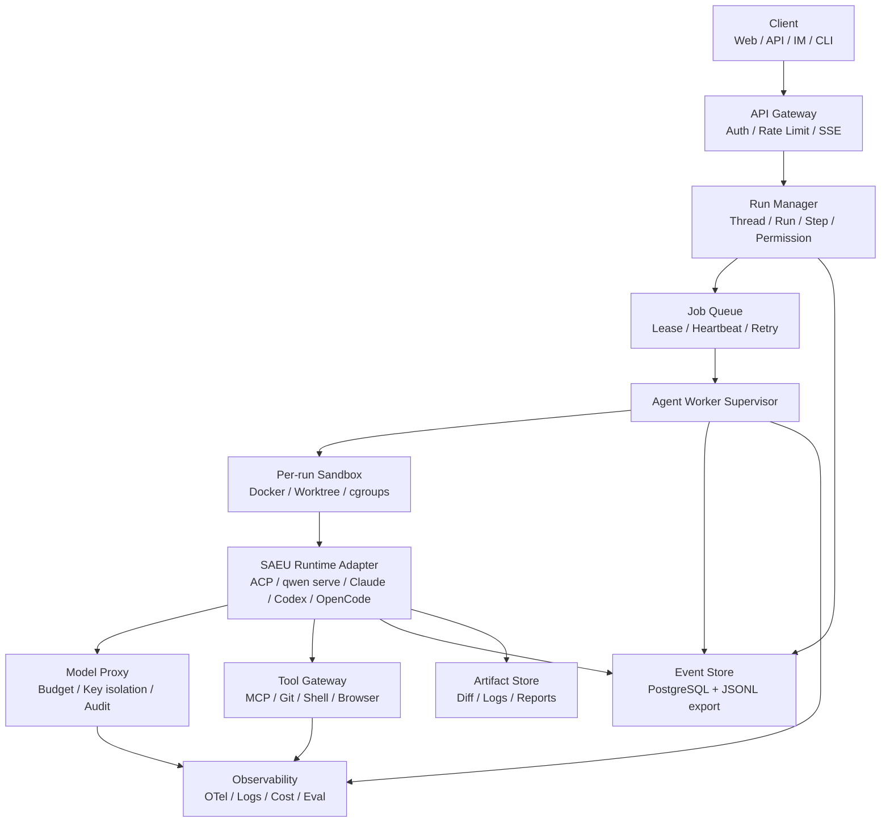

# 可云端长期运行的多 Agent 系统落地方案

> 日期：2026-06-30  
> 目标：在 1-2 台资源有限的 VPS 上，先构建一个可靠的云端单 Agent 运行时，再逐步演进为可编排、可审计、可恢复的多 Agent 系统。  
> 调研依据：本仓库 Cloud Agents 与多 Agent 文档、本地 Qwen Code / Claude Code / Gemini CLI / OpenCode 源码和文档，以及 Temporal、Docker、ACP、A2A 官方资料。

## 结论摘要

最终可编排的多 Agent 系统，确实依赖单个云端 Agent 的可靠性和稳定性，但两者不是同一层问题。

- 单 Agent 是执行地基：上下文管理、工具调度、权限审批、沙箱、循环检测、日志、恢复能力必须先稳定。
- 多 Agent 是控制平面：负责拆分任务、分派执行器、协调状态、处理失败、做人机协同和审计。
- 云端长期运行是运行时问题：必须有 run/thread/session 建模、事件日志、心跳、租约、队列、重试、取消、恢复、artifact 管理和部署治理。

建议的落地路线是：**先把 Qwen Code `qwen serve` 作为第一版稳定 Agent 执行单元实现，在外层自建 Cloud Agent Runtime；但系统接口按 ACP-compatible Agent runtime 设计，不绑定 qwen。** 多 Agent 编排只调度稳定执行单元；等控制面稳定后，再按需接入 Claude Code、Codex、OpenCode、Gemini CLI 或自研 worker。不要从头实现完整 coding agent。

稳定 Agent 执行单元是后续调度、编排和协议互操作的基础原子。它对外提供统一的启动、输入、事件、权限、取消、恢复、artifact 和 diagnostics 接口；对内可以由 qwen serve、Claude Code、Codex、OpenCode、Gemini CLI 或其他 worker 实现。对开源项目而言，最重要的是保持执行器可替换：只要符合 ACP stdio 或 ACP Streamable HTTP / WebSocket 这类确定通信协议，就可以接入。

## 文档归类

本方案拆成以下专题，便于后续持续补充：

- [稳定单 Agent 执行单元](stable-agent-execution-unit.md)：定义外部编排和调度的基础原子，并说明 `qwen serve` 与 SAEU 的关系。
- [基于 qwen-code serve 的云端单 Agent 单元方案](qwen-serve-single-agent-cloud-unit.md)：完整设计单 Agent 云端部署、审计、重放、恢复和排障。
- [沙箱与隔离方案](sandbox-isolation.md)：回答 Docker、多 VPS、资源限制、网络和密钥隔离。
- [ACP、A2A 与 MCP 协议选型](protocol-acp-a2a.md)：回答 ACP-first 执行器接入、A2A 外部互操作、MCP 工具接入三类边界。
- [Temporal 调研与适配方案](temporal-evaluation.md)：解释 Temporal 的核心概念、适用边界和低资源部署策略。
- [事件溯源、JSONL 与回放](event-sourcing-and-replay.md)：回答 JSONL 是否可复现 qwen-code 场景，以及完整回放还缺什么。
- [单 Agent 基座选型](single-agent-strategy.md)：比较直接部署、fork、抽取核心和从头实现。
- [从单 Agent 执行单元到多 Agent 编排](single-to-multi-agent-implementation-plan.md)：给出可实施的多 Agent 演进路线。
- [外部方案对比与多方向审计](alternative-solutions-comparative-audit.md)：对比托管运行时、SDK、编排框架、云沙箱和当前 SAEU 方案。
- [方案审计与 Review 记录](review-and-audit-record.md)：记录多轮审计结论、风险和 Go/No-Go。
- [实施 Roadmap](implementation-roadmap.md)：跟踪阶段、状态、验收标准和替代方案评估节点。

## 目标形态

这套系统的目标不是做一个“远程 CLI”，而是做一个可长期运行的 Agent 后端：

- 可以从 Web、API、IM、CLI、任务板等入口创建任务。
- 每个任务都有独立 run、workspace、sandbox、事件日志、artifact 和审计记录。
- Agent 可以运行数分钟到数小时，客户端断开不影响后台执行。
- 支持人类审批高风险工具调用。
- 支持任务取消、恢复、重试、超时、失败诊断和历史回放。
- 支持多个 Agent 并行运行，并由上层 supervisor 或任务控制面编排；执行器可以是 Qwen Code，也可以是任何 ACP-compatible Agent。
- 在资源有限的 VPS 上优先稳态运行，而不是追求复杂平台化。

## 总体架构



### 核心分层

| 层 | 职责 | MVP 选型 |
| --- | --- | --- |
| Client/API | 创建任务、订阅事件、审批工具、查看 artifact | FastAPI/Node API + SSE |
| Run Manager | 管理 thread、run、step、permission、artifact、状态机 | 自研轻量服务 |
| Queue/Lease | 后台任务调度、worker 租约、心跳、重试 | Postgres 表或 Redis，后期可换 Temporal |
| Worker Supervisor | 拉起容器、绑定 workspace、采集事件、处理退出码 | 自研进程 |
| Agent Worker | 真正执行 coding agent loop | 先用 Qwen Code，接口按 ACP-compatible runtime 设计 |
| Sandbox | 文件系统、进程、网络、资源限制 | Docker/rootless Docker + Git worktree |
| Event Store | 事件溯源、审计、调试、导出 JSONL | Postgres append-only events |
| Artifact Store | 保存 diff、日志、报告、checkpoint、压缩上下文 | 本地磁盘起步，后期 S3/MinIO |
| Model Proxy | 统一模型密钥、预算、限流、审计 | 简单 HTTP proxy 起步 |

## 为什么先做单 Agent 可靠性

多 Agent 系统不是把多个不稳定 Agent 并行起来就会变强。它会放大这些问题：

- 一个 Agent 的工具调用不幂等，会导致 supervisor 重试时破坏 workspace。
- 一个 Agent 的 JSONL 不完整，会导致恢复和回放无法可信。
- 一个 Agent 的权限边界不清楚，多 Agent 并行时会互相污染状态。
- 一个 Agent 没有心跳和终止原因，上层编排无法判断它是卡住、等待审批，还是已经失败。
- 一个 Agent 不能隔离文件系统和网络，多 Agent 并行会直接变成共享宿主机风险。

因此架构顺序应当是：

1. 单 Agent worker 稳定可运行，且通过稳定协议接入。
2. 单 run 可审计、可取消、可恢复。
3. 多 run 可并发、可限流、可隔离。
4. supervisor 能拆任务、合并结果、处理失败。
5. 再开放 A2A 或更复杂的多 Agent 协议互操作。

## 数据模型

最小数据模型建议如下：

| 实体 | 含义 | 关键字段 |
| --- | --- | --- |
| tenant | 租户或个人空间 | id、plan、quota |
| user | 用户 | id、tenant_id、role |
| thread | 用户可见的长期对话或任务线 | id、tenant_id、title、status |
| run | 一次后台执行 | id、thread_id、agent_type、status、sandbox_id、started_at、ended_at |
| step | Agent loop 中的阶段 | id、run_id、type、status、idempotency_key |
| tool_call | 一次工具调用 | id、run_id、step_id、tool_name、input_ref、output_ref、approval_status |
| permission | 待审批动作 | id、run_id、tool_call_id、policy、decision、decider |
| artifact | 执行产物 | id、run_id、kind、uri、checksum |
| event | append-only 事件 | id、run_id、seq、type、payload、created_at |
| checkpoint | 可恢复点 | id、run_id、kind、artifact_ref、event_seq |

状态机应当简单但强约束：

```text
queued -> starting -> running -> waiting_approval -> running
running -> cancelling -> cancelled
running -> succeeded
running -> failed
running -> timed_out
failed  -> retrying -> running
```

## 低资源部署拓扑

### 单 VPS 起步

适合 POC 和早期 MVP：

```text
VPS-1
  nginx/caddy
  app-api
  postgres
  worker-supervisor
  model-proxy
  docker/rootless-docker
  /srv/agent/workspaces
  /srv/agent/artifacts
```

建议约束：

- 并发 Agent 数：1-2。
- 单容器内存：512 MB 到 1.5 GB，视模型调用和工具链而定。
- 单任务默认超时：30-90 分钟。
- workspace 定期清理，artifact 和 JSONL 独立保存。
- 不在宿主机暴露 Docker socket 给 Agent 容器。

### 双 VPS 演进

当开始运行不可信代码、公开仓库测试或更高风险工具时，把 sandbox worker 拆到第二台机器：

```text
VPS-1: control plane
  api / postgres / event store / model proxy

VPS-2: sandbox worker
  worker-supervisor / docker / workspaces
  仅通过 WireGuard 或 Tailscale 访问 VPS-1
```

这样即使容器逃逸，爆炸半径也主要限制在 worker 节点。对于 1-2 台小 VPS，这是比 Kubernetes 更现实的安全收益。

## MVP 实施路线

### Phase 0：验证 qwen serve SAEU

- 用 `qwen serve` 作为第一个稳定 Agent 执行单元实现，跑真实代码任务。
- 记录 token、耗时、失败类型、权限请求和 JSONL。
- 明确哪些工具必须禁用，哪些工具需要人工审批。
- 同时定义 ACP-compatible adapter contract，避免后续被 qwen 私有 REST/SSE 绑定。

验收标准：

- 能在容器或受限 workspace 内完成一个小型 issue。
- 客户端断开后任务仍可继续。
- 至少能保存 transcript、diff、命令日志和最终报告。

### Phase 1：Run Manager + Docker sandbox

- 新增 run 表、event 表、artifact 表。
- 每个 run 分配独立 workspace 和容器。
- worker supervisor 负责启动、心跳、超时、取消和清理。
- qwen-code 事件流转成内部事件；adapter 层保留替换为 Claude/Codex/OpenCode 的空间。

验收标准：

- 任意 run 都能从事件日志看到完整生命周期。
- 容器资源限制生效。
- 任务失败后能定位是模型、工具、权限、沙箱还是系统错误。

### Phase 2：权限与工具网关

- 高风险 shell、文件写入、外部网络、git push、密钥读取进入审批。
- 模型 API key 只给 model proxy，不直接放进 Agent 容器。
- MCP server 统一登记，按 run 注入最小权限。

验收标准：

- Agent 无法直接读取宿主机密钥。
- 所有危险动作都有 permission event 和决策记录。
- 审批超时、拒绝、取消都有清晰状态。

### Phase 3：事件溯源与恢复

- Postgres 事件表作为 canonical event store。
- 每个 run 可导出 JSONL，便于离线分析和复现。
- 保存 workspace 快照引用、git commit、容器镜像 digest、agent 配置、模型配置。

验收标准：

- 能从事件表重建 run 状态。
- 能基于 transcript 恢复一个中断任务。
- 能构造 mock model/tool output 做回归测试。

### Phase 4：多 Agent supervisor

- supervisor 将目标拆成 plan、research、code、review、test 等子任务。
- 每个子任务是独立 run，有自己的 workspace 或 worktree。
- 合并阶段只通过 artifact、diff、summary 和事件引用通信。

验收标准：

- 2-3 个 Agent 可以并行执行互不污染。
- 失败子任务可以单独重试。
- 主任务能解释每个子任务的输入、输出和决策。

### Phase 5：引入 Temporal 或替代 durable workflow

当出现跨小时、跨天、审批等待、多 worker、多重试补偿等需求，再评估 Temporal。早期可以用 Postgres queue + lease，避免小 VPS 被基础设施压垮。

## 技术决策

| 问题 | 决策 |
| --- | --- |
| 是否一开始多 ECS/K8s | 不需要。1-2 台 VPS 用 Docker 隔离和低并发更现实。 |
| Docker 是否足够 | 对普通 coding 任务足够起步；对恶意代码不够，需要独立 worker VPS 或 microVM。 |
| ACP 能否替代 A2A | 内部 worker 控制采用 ACP-first / SAEU contract；开放式 agent-to-agent 互操作仍建议 A2A Gateway。 |
| 是否立即上 Temporal | 不建议。先用 Postgres queue + event store；长流程复杂后再引入。 |
| JSONL 是否就是事件溯源 | JSONL 是格式，事件溯源是建模方法。qwen-code JSONL 可用于恢复和部分复现，但不是完整确定性回放。 |
| 单 Agent 用什么 | 先直接部署 `qwen serve` SAEU，外围做云端 runtime；但接口面向任意 ACP-compatible Agent，不以 fork qwen 为默认路线。 |

## 参考资料

本仓库：

- [企业级 Cloud Agents 框架与运行时技术调研报告](../cloud-agents/index.md)
- [生产级多 Agent 系统编排与运行屏障工程](../multi-agent/research-on-multi-agent-orchestration-frameworks.md)
- [Qwen Code Core 与 SDK Agent 架构分析](../other-agents/qwen-code-core-sdk-agent-architecture.md)

本地源码：

- `/Users/chigao/Documents/codebase/github/qwen-code`
- `/Users/chigao/Documents/codebase/github/gemini-cli`
- `/Users/chigao/Documents/codebase/github/opencode`

官方资料：

- [Temporal Workflows](https://docs.temporal.io/workflows)
- [Temporal Task Queues](https://docs.temporal.io/task-queue)
- [Temporal Signals, Queries, Updates](https://docs.temporal.io/handling-messages)
- [Docker resource constraints](https://docs.docker.com/engine/containers/resource_constraints/)
- [Docker rootless mode](https://docs.docker.com/engine/security/rootless/)
- [Docker seccomp](https://docs.docker.com/engine/security/seccomp/)
- [Agent Client Protocol](https://agentclientprotocol.com/get-started/introduction)
- [A2A Protocol specification](https://github.com/a2aproject/A2A/blob/main/docs/specification.md)
