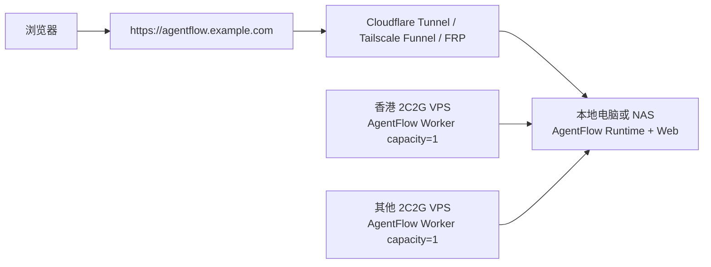
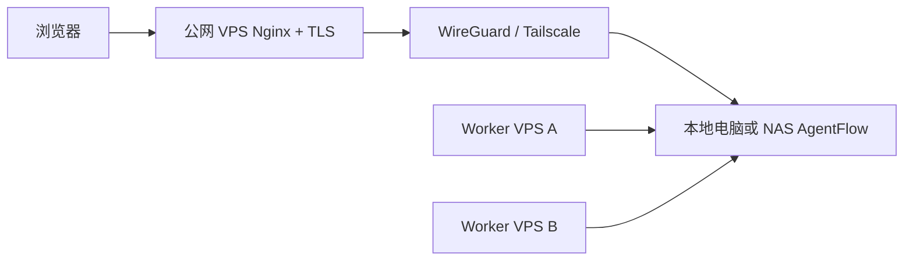

# 本地电脑或 NAS 作为 AgentFlow 主控的部署教程

> 目标：把 AgentFlow 控制面放到资源更稳定的本地电脑、工作站或 NAS 上，把 2C2G VPS 作为公网入口或远程 worker。这样可以降低小 VPS 被 qwen、构建和长任务打满导致的白屏、SSH 断连和任务卡住风险。

## 1. 推荐拓扑

### 拓扑 A：NAS/本地电脑做主控，VPS 做 worker



适合你当前诉求：主 Agent 和管理台在更稳定的机器上长期运行，VPS 作为独立稳定执行单元，主动连回控制面领任务。

### 拓扑 B：VPS 做公网边缘，NAS/本地电脑做主控



适合已经有固定域名和公网 VPS 的情况。VPS 只做 TLS、Basic Auth、反代和监控入口，不跑真实 Agent。

## 2. 机器规格建议

| 角色 | 最低 | 推荐 | 说明 |
| --- | --- | --- | --- |
| 控制面，只跑 fake/light worker | 2C4G | 4C8G | Web、runtime、SQLite、artifact、monitor |
| 控制面 + qwen shared executor | 4C8G | 8C16G | qwen serve、长任务和构建会有峰值 |
| 远程 worker VPS | 2C2G | 2C4G | `capacity=1`，只跑单个执行单元 |
| 公网边缘 VPS | 1C1G | 2C2G | 只做 Nginx/TLS/Tunnel，不能同时跑 qwen |

2C2G 不建议作为“控制面 + qwen + 构建 + 多 worker”混合节点。

### 2C2G 结论

当前 V2 可用切片在 2C2G 上可以跑 control plane + fake smoke，但余量很小。推荐只把 2C2G 用作：

- 公网入口。
- `capacity=1` 的远程 worker。
- 临时 demo control plane。

不推荐把以下工作放到 2C2G：

- `npm ci && npm run build && npm run test:e2e`。
- Playwright browser install。
- qwen executor 多并发。
- Docker image build。
- 长任务 workspace + qwen + Web 控制台同时运行。

如果只有 2C2G，使用 `deploy/runtime.2c2g.env.example`，并保持 `RUN_MANAGER_WORKER_CAPACITY=1`、`RUNTIME_MEMORY_LIMIT=768m`、`QWEN_CONTAINER_MEMORY_MB=768`。如果有本机/NAS，优先把 V2 control plane 放在本机/NAS，2C2G 只做 worker 或边缘。

## 3. 控制面部署

以下以 Linux NAS/Ubuntu 工作站为例。macOS 也可以运行，但建议用 `launchd` 或 Docker 管理后台进程。

### 安装依赖

```bash
sudo apt-get update
sudo apt-get install -y git python3 python3-venv python3-pip nodejs npm nginx
```

如果需要 qwen：

```bash
npm install -g @qwen-code/qwen-code
qwen --version
```

### 拉取代码

```bash
sudo mkdir -p /opt/agentflow
sudo chown "$USER":"$USER" /opt/agentflow
git clone https://github.com/chiga0/agent-research.git /opt/agentflow
cd /opt/agentflow
```

### 构建前端

```bash
cd /opt/agentflow/web
npm ci
npm run build
cd /opt/agentflow
```

### 创建运行目录和环境变量

```bash
sudo mkdir -p /var/lib/agentflow-runtime
sudo chown "$USER":"$USER" /var/lib/agentflow-runtime

python3 - <<'PY'
import secrets
print("RUN_MANAGER_TOKEN=" + secrets.token_urlsafe(32))
print("RUN_MANAGER_BOOTSTRAP_PASSWORD=" + secrets.token_urlsafe(18))
PY
```

把输出写入 `/etc/agentflow-runtime.env`：

```bash
sudo tee /etc/agentflow-runtime.env >/dev/null <<'EOF'
RUN_MANAGER_HOST=127.0.0.1
RUN_MANAGER_PORT=8765
RUN_MANAGER_ARTIFACT_ROOT=/var/lib/agentflow-runtime
RUN_MANAGER_TOKEN=replace-with-generated-token
RUN_MANAGER_BOOTSTRAP_EMAIL=owner@example.com
RUN_MANAGER_BOOTSTRAP_PASSWORD=replace-with-generated-password
RUN_MANAGER_BOOTSTRAP_NAME=Owner
RUN_MANAGER_WORKER_CAPACITY=0
RUN_MANAGER_REMOTE_WORKERS_ENABLED=true
QWEN_COMMAND=qwen
EOF
```

说明：

- `RUN_MANAGER_WORKER_CAPACITY=0` 表示控制面默认不抢执行任务，只调度远程 worker。
- 如果本地机器也要执行任务，可以改成 `1`，但建议先从 0 开始验证控制链路。

### 创建 systemd 服务

```bash
sudo tee /etc/systemd/system/agentflow-runtime.service >/dev/null <<'EOF'
[Unit]
Description=AgentFlow Runtime
After=network-online.target
Wants=network-online.target

[Service]
Type=simple
WorkingDirectory=/opt/agentflow
EnvironmentFile=/etc/agentflow-runtime.env
Environment=PYTHONPATH=/opt/agentflow/runtime
ExecStart=/usr/bin/python3 -m cloud_agents_runtime --host 127.0.0.1 --port 8765 --artifact-root /var/lib/agentflow-runtime --protect-health
Restart=always
RestartSec=5
NoNewPrivileges=true
LimitNOFILE=65535
CPUAccounting=true
CPUQuota=150%
MemoryAccounting=true
MemoryMax=1536M
TasksAccounting=true
TasksMax=1024

[Install]
WantedBy=multi-user.target
EOF

sudo systemctl daemon-reload
sudo systemctl enable --now agentflow-runtime
sudo systemctl status agentflow-runtime --no-pager
```

### 本机验证

```bash
curl -s http://127.0.0.1:8765/health
curl -s http://127.0.0.1:8765/capabilities \
  -H "Authorization: Bearer $(awk -F= '$1=="RUN_MANAGER_TOKEN"{print $2}' /etc/agentflow-runtime.env)"
```

浏览器打开：

```text
http://127.0.0.1:8765/
```

使用 `RUN_MANAGER_BOOTSTRAP_EMAIL` 和 `RUN_MANAGER_BOOTSTRAP_PASSWORD` 登录。

### V2 smoke 验证

服务启动后先验证 V2 的任务、计划、事件和结果闭环：

```bash
cd /opt/agentflow
RUN_MANAGER_BOOTSTRAP_EMAIL="$(
  awk -F= '$1=="RUN_MANAGER_BOOTSTRAP_EMAIL"{print $2}' /etc/agentflow-runtime.env
)"
RUN_MANAGER_BOOTSTRAP_PASSWORD="$(
  awk -F= '$1=="RUN_MANAGER_BOOTSTRAP_PASSWORD"{print $2}' /etc/agentflow-runtime.env
)"
PYTHONPATH=runtime python3 scripts/smoke_v2_control_plane.py \
  --base-url http://127.0.0.1:8765 \
  --email "$RUN_MANAGER_BOOTSTRAP_EMAIL" \
  --password "$RUN_MANAGER_BOOTSTRAP_PASSWORD" \
  --timeout 10
```

成功时会输出类似：

```json
{"event_count": 12, "mode": "http", "status": "completed", "strategy": "orchestrator-workers", "task_id": "task_xxx"}
```

浏览器入口：

```text
http://127.0.0.1:8765/#/v2
http://127.0.0.1:8765/#/v2/admin
```

### Docker Compose 部署

不使用 systemd 直接跑 Python 时，可以用 compose：

```bash
cp deploy/runtime.local-nas.env.example .env
python3 - <<'PY' >> .env
import secrets
print("RUN_MANAGER_TOKEN=" + secrets.token_urlsafe(32))
print("RUNTIME_BOOTSTRAP_PASSWORD=" + secrets.token_urlsafe(18))
print("RUN_MANAGER_SESSION_SECRET=" + secrets.token_urlsafe(32))
PY
docker compose -f deploy/docker-compose.runtime.yml up -d --build
```

2C2G VPS 使用：

```bash
cp deploy/runtime.2c2g.env.example .env
# 填入 RUN_MANAGER_TOKEN/RUNTIME_BOOTSTRAP_PASSWORD/RUN_MANAGER_SESSION_SECRET
docker compose -f deploy/docker-compose.runtime.yml up -d --build
```

## 4. 公网访问

### 方案 1：Cloudflare Tunnel

适合本地/NAS 没有公网 IP 的场景。

```bash
cloudflared tunnel login
cloudflared tunnel create agentflow
```

创建 `/etc/cloudflared/config.yml`：

```yaml
tunnel: agentflow
credentials-file: /root/.cloudflared/<tunnel-id>.json

ingress:
  - hostname: agentflow.example.com
    service: http://127.0.0.1:8765
  - service: http_status:404
```

启动：

```bash
sudo cloudflared service install
sudo systemctl restart cloudflared
```

推荐使用独立子域名 `agentflow.example.com`，直接映射 runtime 根路径。路径前缀模式也可以做，但需要额外 Nginx rewrite。

### 方案 2：Tailscale 或 WireGuard + VPS Nginx

1. 本地/NAS 和公网 VPS 加入同一 Tailscale 或 WireGuard 网络。
2. 记下本地/NAS 的 VPN IP，例如 `100.64.1.10`。
3. 在公网 VPS 上配置 Nginx：

```nginx
server {
  listen 443 ssl http2;
  server_name agentflow.example.com;

  location / {
    proxy_pass http://100.64.1.10:8765;
    proxy_set_header Host $host;
    proxy_set_header X-Forwarded-Proto https;
    proxy_set_header X-Forwarded-For $proxy_add_x_forwarded_for;
    proxy_buffering off;
  }
}
```

`proxy_buffering off` 对 SSE 很重要，否则实时模型输出可能被代理缓存成批量返回。

## 5. 注册 2C2G VPS Worker

在 Web 管理台进入 `Units`：

1. 填写 `Unit ID`，例如 `hk-2c2g-a`。
2. `Worker control URL` 填公网控制面 API，例如 `https://agentflow.example.com`。
3. `Capacity` 填 `1`。
4. `CPUs` 填 `2`，`Memory GB` 填 `2`。
5. 生成部署命令。

在 worker VPS 上执行生成的部署命令。手动形态大致如下：

```bash
RUN_WORKER_ID=hk-2c2g-a \
RUN_WORKER_CONTROL_URL=https://agentflow.example.com \
RUN_WORKER_TOKEN=replace-with-worker-token \
RUN_WORKER_CAPACITY=1 \
RUN_WORKER_LABELS=region=hk,tier=2c2g \
bash scripts/deploy_worker_vps.sh root@<worker-ip> /path/to/key.pem
```

worker 注册成功后：

- `Units` 页面应看到 heartbeat。
- 创建 fake run，验证 worker 能认领任务。
- 再创建 qwen run，验证真实执行链路。

## 6. 2C2G Worker 稳定性配置

建议每台 2C2G worker 都做：

```bash
sudo fallocate -l 4G /swapfile
sudo chmod 600 /swapfile
sudo mkswap /swapfile
sudo swapon /swapfile
echo '/swapfile none swap sw 0 0' | sudo tee -a /etc/fstab
```

systemd 资源建议：

```ini
CPUQuota=150%
MemoryHigh=1500M
MemoryMax=1800M
TasksMax=512
Restart=always
RestartSec=5
```

运行策略：

- `capacity=1` 起步。
- qwen 任务和构建任务不要和部署脚本同时跑。
- worker stale 或异常时先 `Drain`，再 `Retry`，最后重启 worker。
- 长任务 artifact 必须定期下载或备份。

## 7. 验收流程

### 控制面验收

```bash
curl -fsS https://agentflow.example.com/health
curl -fsS https://agentflow.example.com/capabilities \
  -H "Authorization: Bearer <RUN_MANAGER_TOKEN>"
```

Web 验收：

1. 登录管理台。
2. 打开 Overview，确认 health 和 queue 正常。
3. 打开 Units，确认 worker heartbeat active。
4. 创建 fake run，进入 Run Detail，确认 Agent Chat 有实时输出。
5. 在 Agent Chat 继续输入，确认出现新的 `input.accepted` 和模型输出。
6. 下载 audit bundle 和 events.jsonl。

### Worker 验收

1. `Units` 执行 Drain，确认状态变为 draining。
2. 执行 Resume，确认重新 active。
3. 创建 run，让该 worker 认领。
4. 执行 Cancel，确认远程 worker 收到取消。
5. 对异常 run 执行 Retry，确认回到队列。

## 8. 监控建议

控制面需要外部监控，不要只依赖本机服务自检：

- 每 1 分钟访问 `/health`。
- 每 5 分钟访问 `/capabilities` 和 `/metrics.json`。
- 每 15 分钟创建 fake smoke run，校验 SSE 能输出 `run.completed`。
- 告警条件：HTTP 超时、worker stale、queue 长时间堆积、pending permission 超时、磁盘使用率超过 80%。

2C2G VPS 上建议安装 node exporter 或轻量脚本，上报：

- load average。
- memory available。
- swap used。
- disk used。
- qwen/node/python 进程 RSS。
- systemd service restart count。

## 9. 回滚与恢复

控制面恢复顺序：

1. `systemctl status agentflow-runtime`。
2. `journalctl -u agentflow-runtime -n 200 --no-pager`。
3. 检查 `/var/lib/agentflow-runtime/runtime.db` 和 artifact 目录。
4. 从 `Operations` 创建或下载 backup。
5. 如果 worker 仍持有旧 lease，先在 `Units` 执行 Retry，再恢复接单。

worker 恢复顺序：

1. `systemctl status agentflow-worker`。
2. `journalctl -u agentflow-worker -n 200 --no-pager`。
3. 在控制台对该 Unit 执行 Drain。
4. 重启 worker。
5. Resume。
6. 对遗留 run 执行 Retry。
