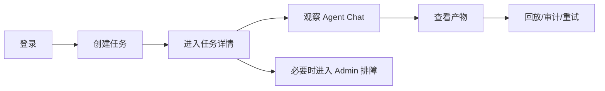
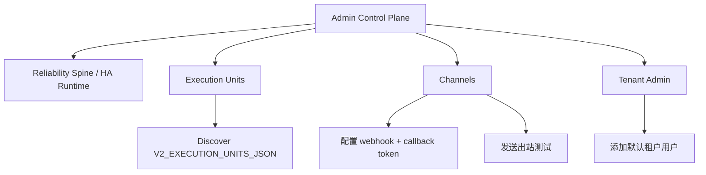

# AgentFlow 产品体验与真实用户流程审计

本审计按真实使用流程走查，而不是按模块清单罗列。结论分三种视角：产品经理、小白用户、专业用户。目标是判断当前 V2 是否能被用户理解、完成首个任务、持续观察任务，并让管理员完成基础运维配置。

## 1. 当前判断

| 维度 | 结论 | 说明 |
| --- | --- | --- |
| 首次使用 | 可用但仍偏工程化 | Client 首页能直接发任务，但部分文案仍需要更明确地告诉用户“下一步会发生什么” |
| 任务详情 | 本轮已优化 | Agent Chat / Qwen WebShell 已前置，并把 follow-up 输入合入聊天区 |
| 专业观察 | 可用 | DAG、Workflow、Artifacts、Evaluations、Replay、Canonical Events 都可见 |
| Admin 运维 | 可用但信息密度仍高 | Execution Units、Channels、Tenants、HA 都在一页，适合内测，后续应拆成二级页面 |
| 真实 qwen | 已完成单 run 验收 | `Deploy Runtime` workflow 已用 `validate_qwen=true` 跑通真实 qwen single-run acceptance |
| IM Channel | 基础闭环可用 | 出站 webhook、入站统一 webhook、审计消息可用；平台原生验签仍建议通过边缘代理承载 |

## 2. 产品经理视角

### 用户承诺是否清楚

当前产品承诺是“把复杂任务交给 AgentFlow，系统自动拆解、调度 Agent，并可观察、回放、审计”。这个方向清楚，但页面还存在两个风险：

| 风险 | 影响 | 处理 |
| --- | --- | --- |
| 首页标题 `Client Workspace` 偏内部名词 | 新用户不知道这是发任务入口 | 后续应改为更业务化的标题，例如 `任务工作台` / `Dispatch Workspace` |
| `Agent CLI`、`Mode`、`Channel` 同时出现 | 小白用户可能不知道该选什么 | 保留高级选项，但增加推荐默认和模板，本轮已增加任务模板 |
| Admin 所有能力集中在一屏 | 产品看起来强，但运维用户容易扫不出重点 | 后续拆成 Overview、Execution Units、Channels、Tenant、HA 五个 Admin 子页 |

### 核心漏斗

本轮优化后，`Detail -> Chat` 更顺：用户进入详情后第一屏就能看到 Agent Chat 和输入框。

## 3. 小白用户视角

### 正常路径

1. 登录。
2. 在首页看到任务输入框。
3. 直接输入目标，或点击一个模板。
4. 不改默认 `Auto / Web / Auto`。
5. 点击 Start。
6. 进入任务详情。
7. 在 Agent Chat 看进度，必要时继续补充要求。
8. 任务完成后看 Result 和 Artifacts。

### 小白用户仍可能卡住

| 卡点 | 原因 | 建议 |
| --- | --- | --- |
| 不知道 Auto 是什么 | Auto 是平台内部策略，不是用户语言 | 在控件旁增加短提示或默认推荐徽标 |
| 不知道 Channel 为什么有钉钉/飞书/企微 | 小白可能以为选了 Feishu 就会自动发到群 | 未配置 Channel 时应禁用或提示“需 Admin 配置” |
| 任务失败时不知道怎么办 | Retry、Replay 对小白偏技术 | 增加“重新尝试”和“查看失败原因”的用户化解释 |
| 产物为空时焦虑 | 不知道任务仍在跑还是失败 | Artifact 空状态应显示当前阶段和预计产物类型 |

## 4. 专业用户视角

专业用户关心可控性、可观测性和可复盘。当前基本面是可用的：

| 需求 | 当前状态 | 风险 |
| --- | --- | --- |
| 指定 adapter | 支持 qwen/codex/claude/opencode/fake/auto | V2 real-cli 需要显式 `V2_ENABLE_REAL_CLI_ADAPTERS=1` |
| 看 DAG | 支持 Plan DAG 和 Agent Contracts | DAG 目前是卡片，不是可缩放图 |
| 看运行细节 | Agent Chat、Canonical Events、Workflow 都有 | 还不是 SSE 实时流，主要靠轮询 |
| 看产物 | Artifacts 列表可见 | 缺少产物预览/下载的更强产品化入口 |
| 回放和重试 | Replay/Retry 已有 | 需要展示重试策略、重试次数和失败归因 |
| 管执行单元 | Admin 可 Discover 和查看 units | 注册、标签、容量调度仍需要更强表单化 |

## 5. Admin 运维流程

当前 Admin 更像“总控台”。它能覆盖内测运维，但当真实租户和执行单元变多时，需要拆页面，否则扫描成本会迅速上升。

## 6. 本轮已优化

| 优化 | 价值 |
| --- | --- |
| Client 首页增加任务模板 | 小白用户不必从空白输入框开始 |
| 任务详情前置 Agent Chat | 用户进入详情即看到对话和执行状态 |
| follow-up 输入合入 Agent Chat | 用户自然理解“这里可以继续聊” |
| 发送后同时刷新 Canonical Events 和 WebShell Events | 减少发送后聊天区延迟感 |
| WebShell 空状态说明事件来源 | 解释为什么还没有对话内容 |

## 7. 下一批建议

| 优先级 | 建议 | 原因 |
| --- | --- | --- |
| P0 | Channel 未配置时禁用对应 Client 入口或显示配置状态 | 避免用户选择 Feishu 后误以为消息已进群 |
| P0 | 任务失败页增加“失败原因摘要 + 推荐动作” | 小白用户需要明确下一步 |
| P1 | Admin 拆分为 Execution Units、Channels、Tenants、HA 子页 | 降低专业运维扫描成本 |
| P1 | Agent Chat 改为 SSE 或 WebSocket 增量流 | 当前轮询可用，但实时感不足 |
| P1 | Artifacts 支持预览/下载主入口 | 产物是最终价值，需要更突出 |
| P2 | DAG 改成可折叠/可缩放图 | 复杂任务会超出卡片布局 |
| P2 | Adapter 真实模式状态在 UI 明示 | 区分 protocol-simulated 和 real-cli，避免误解 |

## 8. 当前可上线边界

可以用于：

- 内部自托管 beta。
- 真实 qwen single-run 任务验收。
- 演示 Client/Admin 分离、任务 DAG、WebShell 事件、审计回放和部署闭环。
- 少量用户试用后迭代需求。

不建议立即用于：

- 多租户商业 SaaS。
- 大量 IM 群并发接入。
- 高并发真实 CLI 执行。
- 对强隔离、安全合规有硬要求的生产环境。

