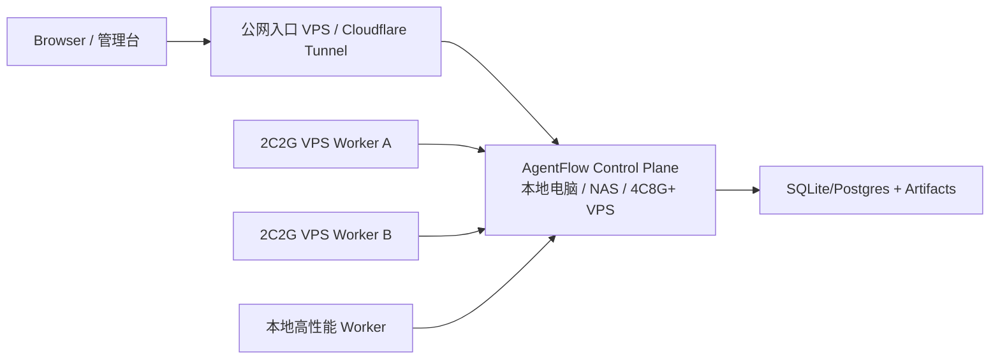

# AgentFlow 产品可用性审计

> 日期：2026-07-03
> 范围：Web 管理台、Run Detail、任务创建后的实时反馈、低资源部署体验。

## 结论

AgentFlow 当前已经具备 run、mission、worker、artifact、audit、permission、monitor 等平台能力，但任务发起后的主体验仍偏“运维控制台”：用户需要在状态卡、事件流、下载入口之间切换，才能拼出 Agent 正在做什么。这会让长任务看起来像“卡住了”，即使 SSE 和事件流实际上已经存在。

本轮产品优化的核心判断是：Run Detail 必须以 Agent Chat 为第一视图。状态、artifact、审计包和原始事件都应该服务于这条主线，而不是抢占首屏。

## 高优先级问题

| 优先级 | 问题                                       | 影响                                                | 处理                                                       |
| ------ | ------------------------------------------ | --------------------------------------------------- | ---------------------------------------------------------- |
| P0     | 运行详情页首屏先展示状态卡，再展示实时对话 | 用户发起任务后第一眼看不到模型流式输出              | 已调整：Agent Chat 作为左侧主视图首屏                      |
| P0     | 页面缺少继续追加输入的 composer            | 用户无法像 AI Chat 一样继续给 run 补充上下文        | 已接入 `POST /runs/{run_id}/input`                         |
| P1     | 权限请求与聊天主线割裂                     | 用户容易误判为 runner 卡住                          | 已完成：Chat action bubble 可直接审批，右侧保留汇总        |
| P1     | 原始事件流过于突出                         | 非工程用户会被 event schema 干扰                    | 已降低层级，保留在 Chat 下方作为审计视图                   |
| P1     | 小 VPS 资源打满时页面表现像“空白”          | 用户难以判断是前端、Nginx、runtime 还是 runner 问题 | 已补 Units 资源水位与低配风险提示；仍建议控制面/执行面分离 |
| P2     | Run/Mission 之间的语义仍偏技术             | 初次使用需要学习 run、worker、lease 等概念          | 后续用“任务、执行单元、审计包”做中文默认文案收敛           |

## 本轮已完成的体验改动

1. Run Detail 改为 Chat-first 布局：
   - 左侧首屏展示 Agent Chat。
   - 右侧展示状态、取消、artifact 和审计下载。
   - 原始 Event Stream 保留为排障和审计材料。

2. Agent Chat 增加继续输入：
   - 输入框固定在 Chat 卡片底部。
   - 提交调用 `POST /runs/{run_id}/input`。
   - 成功后刷新 run、run list 和事件列表。
   - terminal run 禁止继续输入，并给出明确提示。

3. 测试覆盖：
   - 单测覆盖创建 run 后跳转详情页并看到 Agent Chat。
   - 单测覆盖 run detail 追加输入到 `/runs/{id}/input`。
   - E2E 覆盖 Agent Chat 可见和继续输入。

4. 第二轮产品可用性补强：
   - `permission.requested` 已渲染为 Chat action bubble，可直接在对话流中批准/拒绝。
   - 新增全局活跃任务 Dock，用户离开 Run Detail 后仍可看到运行中任务并一键回到 Chat。
   - Mission Detail 新增 Mission Stream，把 task 状态、run 链接、artifact 摘要和 mission event 聚合成连续任务流。
   - Run Detail stale 提示升级为原因解释，区分等待权限、队列无 worker、容量已满、worker stale、executor failed 等常见情况。
   - Units 页面新增资源水位与低配风险提示，至少展示 capacity、声明 CPU/内存和 2C2G 运行风险；后续 worker 上报实时 metrics 后可显示 CPU/memory/disk/load 百分比。

5. 第三轮产品可用性补强：
   - 全局活跃任务 Dock 增加最近输出摘要、等待权限标记和折叠控制，避免悬浮层遮挡底部操作。
   - Permission action bubble 增加风险、目录、命令摘要和 raw payload 下载，审批时能看到更完整上下文。
   - Mission Stream 会读取子 run 的事件尾巴，展示每个 task 的最后模型输出。
   - Remote worker heartbeat 自动采集 CPU/load、内存、swap、磁盘和声明资源容量，Units 水位不再只依赖手工 metadata。

## 后续产品优化建议

### 1. Permission action bubble

状态：已完成第二版。

`permission.requested` 已渲染成聊天中的 action bubble，同时保留右侧待处理汇总和通知重试。审批按钮已在主对话流可见，并补充展示风险、作用目录、命令摘要和 raw payload 下载入口。

### 2. 全局活跃任务 Dock

在任意页面底部或右下角展示活跃 run：

- 当前状态。
- 最近一条模型输出。
- 是否等待权限。
- 一键回到 Agent Chat。

状态：已完成第二版。

当前 Dock 已展示活跃 run、状态、最近输出或 prompt 摘要、等待权限标记、折叠控制和一键回到 Chat。后续增强点是静音控制与更细粒度的通知策略。

这样用户离开 Run Detail 后也能知道任务是否仍在推进。

### 3. Mission Chat

Mission Detail 应增加一个聚合 Chat：

- supervisor 消息。
- planner/coder/tester/reviewer 子 run 摘要。
- 每个 task 的最后输出。
- reviewer gate 的结论和操作按钮。

底层仍是多个 SAEU run，但用户看到的是一个连续任务流。

状态：已完成第二版。

Mission Detail 已新增 Mission Stream，聚合 task 状态、依赖、artifact 摘要、run 链接、子 run 最后输出和最近 mission events。后续增强点是 supervisor 视角的自动总结与 reviewer gate 操作按钮。

### 4. 卡住自动解释

当 runner 事件超过阈值未更新时，页面不只提示 stale，还应解释最可能原因：

- 等待权限。
- worker 心跳 stale。
- executor failed。
- 队列没有可用 worker。
- runtime 资源压力过高。

状态：已完成第一版。

Run Detail stale 提示现在会给出最可能原因：等待权限、排队无 worker、worker 容量已满、worker 心跳 stale、executor/adapter 失败或一般无新事件。后续增强点是接入 runtime 资源压力和 executor registry 的更细粒度原因。

### 5. 资源水位可视化

Units 页面应展示最近 CPU、内存、磁盘、load average 和 swap，用于识别 2C2G 是否已不适合作为主控。

状态：已完成第二版。

Units 页面已展示 capacity 水位、声明 CPU/内存容量和低内存/满载/stale 风险提示；remote worker daemon 会定期采集并上报 `metrics.cpu_percent`、`memory_percent`、`disk_percent`、`swap_percent`、`load_average`。后续增强点是把控制面自身资源压力也接入 Overview 和卡住解释。

## 第二轮复审结论

本轮补强后，Run Detail 已从“运维事件面板”更接近“AI Chat + 审计辅助”的产品形态；Mission Detail 也从单纯 DAG 变为可读任务流。第三轮复审后，上一轮 4 个缺口中已有 3 个完成闭环，资源水位也完成 remote worker 自采集。当前仍存在的主要产品缺口：

1. Mission Stream 已展示子 run 最后输出，但还没有 supervisor 视角自动总结和 reviewer gate 快捷操作。
2. 全局 Dock 已有权限标记、最近输出和折叠控制，但还没有静音、批量取消、失败重试入口。
3. Permission action bubble 已有风险、目录、命令摘要和 payload 下载，但还没有结构化 diff 视图和风险分级样式。
4. 资源水位已有 remote worker 自采集；控制面自身的 CPU/内存/磁盘压力还未进入 Overview 与卡住自动解释。

这些缺口不阻塞当前 MVP 使用，但属于下一轮产品级打磨的优先项。

## 文档与新用户上手审计

> 日期：2026-07-03
> 视角：第一次接触 AgentFlow、希望理解产品并完成自部署的学习者。

本轮文档审计发现，旧文档的问题不是资料不够，而是入口顺序过于工程化：用户从首页直接进入方案设计、协议选型和审计记录，很难先建立“这是什么、能做什么、怎么用、怎么部署、出错怎么办”的产品心智。

本轮已处理：

1. 首页从“内部设计文档索引”改为学习路径和当前产品状态说明。
2. 新增 `认识 AgentFlow`、`核心概念`、`使用管理台`、`自我部署`、`排障手册` 五篇主线文档。
3. MkDocs 导航改为“快速开始 -> 运维与审计 -> 架构设计 -> 研究资料”，降低新用户首屏认知负担。
4. 操作手册、自部署文档和验收命令统一到新本地邮箱账户登录，旧 Basic Auth 只作为兼容背景说明。
5. 将低配 VPS、qwen 失败、running 无更新、CI 部署失败等高频问题集中到排障手册。

本轮发现的产品/文档缺口：

| 优先级 | 缺口                                                                        | 影响                                                               | 建议                                                                   |
| ------ | --------------------------------------------------------------------------- | ------------------------------------------------------------------ | ---------------------------------------------------------------------- |
| P0     | 认证已是本地邮箱账户，但还没有 SMTP 邮箱验证、找回密码、首次设置向导        | 用户会以为“邮箱认证”已经完整，实际仍需要管理员通过 secret 管理密码 | 增加 SMTP 配置、验证邮件、重置密码、首次 owner setup 流程              |
| P1     | `RUNTIME_AUTH_*` 与兼容的 `RUNTIME_BASIC_AUTH_*` 同时存在                   | 新部署用户容易混淆“浏览器 Basic Auth”和“本地邮箱账户”              | 保留兼容但在 UI/CI/文档中统一推荐 `RUNTIME_AUTH_EMAIL/PASSWORD`        |
| P1     | 公网路径存在 `/cloud-agents/`、历史 `/agentflow/`、runtime root 三种语义    | 自部署和 monitor 配置容易填错路径                                  | 将默认公开路径收敛到 `/cloud-agents/`，monitor 默认值和文档保持一致    |
| P1     | Access 页面有 token/RBAC foundation，但用户管理 UI 仍不完整                 | 管理员很难在 UI 中完成邀请、禁用、改角色、重置密码                 | 增加正式用户管理页面和 owner/admin 操作流                              |
| P2     | qwen 验收依赖 settings、机器资源、权限审批、executor 策略，入口说明仍偏技术 | 用户容易把 qwen 失败误判为整个平台失败                             | 在 Runs 创建页增加 adapter 选择提示、qwen readiness check 和失败引导   |
| P2     | 部署成功后没有产品内 onboarding                                             | 用户第一次登录后不知道应该先 fake run、再 qwen、再 worker          | 增加首次登录 checklist 或空状态引导                                    |
| P2     | 研究文档仍很有价值，但部分标题偏“方案审计”而非“用户任务”                    | 外部读者可能误以为项目仍停留在调研阶段                             | 后续可把历史研究移到 Archive/Reference，并为当前实现维护独立版本化文档 |

结论：文档主线已经可以支撑用户理解产品、使用管理台和完成自部署；下一轮最值得做的产品补强是“完整账户生命周期”和“部署/监控路径语义收敛”。

## 低资源部署判断

2C2G VPS 可以作为最小公网入口或单 worker，但不建议同时承载：

- Web 管理台。
- Runtime API。
- SQLite artifact/event store。
- Nginx/HTTPS。
- qwen serve。
- npm build、部署脚本、CI smoke。
- 多个真实 Agent run。

一旦 qwen、构建或长任务同时运行，CPU 和内存会互相挤占，表现为页面 pending、白屏、SSH 连接断开或 health 延迟。这不是单一前端问题，而是控制面和执行面混布的资源风险。

推荐拓扑是：

控制面负责调度、状态、审计和 Web；2C2G VPS 只负责 capacity=1 的执行单元，或者只做公网反向代理。

## 第四轮多视角体验审计与修复

> 日期：2026-07-03
> 方法：并行从 6 个角色视角审计 Web 控制台，包括第一次使用者、真实开发者、SRE、企业审批人/安全负责人、移动端用户、文档学习者。

### 汇总结论

各角色结论高度一致：AgentFlow 的底层能力已经覆盖 run、worker、executor、permission、artifact、audit、notification、monitor，但 Run Detail 仍像内部事件仪表盘，而不是用户完成一件任务的工作台。核心缺口不是“没有事件”，而是用户看不到实时模型输出、看不懂当前卡点、点权限按钮后不知道是否生效。

本轮产品判断：

1. Run Detail 必须变成“单次任务工作台”，首屏先回答目标、状态、下一步和证据。
2. Agent 输出必须像 Chat 一样连续可读；空 `message.delta` 不能生成空气泡。
3. 工具调用、权限请求、控制面事件要进入同一条时间线，但原始 JSON 只能作为排障材料。
4. 权限审批必须固定在主视图首屏，按钮点击后必须显示提交状态。
5. Qwen 原生 optionId 不能直接当 Runtime decision 发送；应发送标准 `approve|deny|cancel`，同时保留原始 `option_id`。

### 角色审计发现

| 视角 | P0/P1 发现 | 产品含义 |
| ---- | ---------- | -------- |
| 第一次使用者 | 权限请求在下方，任务看起来无故卡住；输出区只出现 `message.delta` 小卡片 | 用户需要“当前需要你做什么”，不是事件名称 |
| 真实开发者 | Qwen `proceed_once/cancel` 被前端当成 `decision` 发送，后端只接受 `approve/deny/cancel` | 这是权限按钮“点了没效果”的直接技术原因 |
| SRE/运维 | Run 卡住判断没有统一诊断链；按钮缺少 request accepted / waiting worker / applied 反馈 | 长任务需要可解释状态机 |
| 企业审批人 | 无法证明谁批了、批了什么范围、常驻授权是否可撤销；风险摘要不足 | 当前是 HITL 基础闭环，还不是完整企业审批台 |
| 移动端用户 | Run Detail 因未定义 helper 崩溃；聊天区过高，权限与状态不在首屏 | 移动端主链路必须先保证不崩和首屏 CTA |
| 文档学习者 | Mission/Run/Worker/Unit/Executor/Profile 混译，页面缺少概念入口 | UI 文案要用稳定术语，空状态要解释下一步 |

### 本轮已完成修复

1. Run Detail 新增 `Run 工作台`：
   - 展示本次目标、当前阶段、下一步动作、证据事件。
   - 区分执行中、排队中、等待权限审批、等待 worker 应用审批、已完成、失败、已取消。
   - 当出现权限请求时，首屏明确提示“Runner 已暂停在需要人工确认的操作前”。

2. 权限审批改为首屏阻塞卡：
   - `Permission Requests` 卡片移到实时对话上方。
   - 展示 permission id、工具名、命令、工作目录、通知状态和通知重试。
   - 点击后显示“正在提交决策”或错误信息。
   - 成功后本地立即隐藏待审批卡，等待事件流确认。

3. 修复 Qwen option 映射：
   - `proceed_once`、`proceed_always_project`、`proceed_always_user` 等 option 统一发送 `decision=approve` + `option_id=<原始 optionId>`。
   - `cancel/reject/deny` 类 option 统一发送 `decision=cancel` + `option_id=<原始 optionId>`。
   - 前端不再把 Qwen optionId 直接作为 Runtime decision。

4. 实时输出可读性修复：
   - 空 `message.delta` 不再生成空 Agent 气泡。
   - Qwen `agent_message_chunk` 聚合为连续 Agent 输出。
   - Qwen `tool_call/tool_call_update` 展示工具名、状态、命令、目录、输入和输出摘要。
   - Qwen `agent_thought_chunk` 只展示“模型正在分析并准备下一步”的进展提示，不展示内部思考文本。
   - `permission.resolve_requested`、notification、cost、event gap、executor failure 等控制面事件进入可读时间线。

5. 测试补强：
   - 覆盖 Run 工作台首屏文案。
   - 覆盖 Qwen optionId 到标准 Runtime decision 的映射。
   - 覆盖空 SSE delta、Qwen message chunk、tool update、thought chunk、permission resolve requested。
   - 覆盖 Run 工作台状态判断：排队、待审批、等待 worker 应用、完成、失败、取消。
   - Web 单测覆盖率保持 90%+ 全局阈值。

### 仍需后续治理

这些问题不是本轮 UI 修复能完全闭环，但已明确为后续产品/架构事项：

1. 审批身份：`decided_by` 仍需从真实 session/API token principal 注入，不能只由前端填写。
2. 常驻授权：`Always Allow` 需要平台级授权记录、过期时间、撤销入口和二次确认。
3. 审批应用确认：远程 worker 应在应用权限后追加 `permission.applied`，UI 才能明确区分 submitted/resolved/applied。
4. 通知闭环：log/webhook sent 不等于人已阅读，后续需要 delivered/viewed/clicked/callback_rejected。
5. 概念文案：Mission、Run、Worker、Unit、Executor、Profile、Permission、Artifact、Audit Bundle 需要全站稳定术语。
6. 移动端：需要继续把 Run Detail 的右侧信息折叠成移动端分组，并补充无横向滚动、Dock 不遮挡、触控尺寸的 E2E。

### 验收标准

本轮修复后的 Run Detail 至少应满足：

1. 用户进入单个 Run 页面，首屏能看到任务目标、当前阶段、下一步操作和最新证据。
2. 如果 Run 等待权限，首屏必须出现审批卡，按钮点击后有提交中、失败或等待应用反馈。
3. Qwen 权限按钮不再 400；审计请求体同时包含标准 decision 和原始 optionId。
4. 模型流式输出以连续文本出现；空 delta 不产生空白卡片。

## 第五轮循环审计：新用户路径、术语一致性与可操作性

> 日期：2026-07-04
> 方法：参考前四轮审计结论，按“文档 -> 方案设计 -> 源码实现 -> 产品设计 -> 产品易用性 -> 新用户视角 -> 产品体验视角”逐项复审，并把可立即落地的问题转成修复。

### 审计结论

本轮复审发现，上一轮已经把 Run Detail 从事件面板推进到 Chat-first 工作台，并补齐产物预览、权限提交状态、排队解释、执行单元和执行器术语说明。但新用户的第一步仍不够稳定：产品内没有明确“先 fake run、再 qwen、长任务再 worker”的入口路径，Runs 创建页还倾向于默认选择 `qwen`，容易让第一次部署验证直接进入最脆弱的高资源路径。

当前产品稳定性判断：

1. Run Detail 的核心任务工作台已经可用，能展示模型输出、工具调用、权限请求、artifact 和审计材料。
2. 产物预览和审计下载已经把“看结果”和“拿审计包”拆开，降低了下载文件才能确认结果的摩擦。
3. Units/Executors 的概念解释已进入页面和文档，但首次使用路径还需要在 Overview 和 Runs 创建页显性化。
4. 新用户最容易失败的路径仍是“直接 qwen run”，因此默认行为必须偏保守。

### 本轮发现与修复

| 视角 | 发现 | 风险 | 本轮处理 |
| --- | --- | --- | --- |
| 新用户视角 | 首页缺少首跑路径，新用户不知道应该先做 fake run 还是 qwen run | 把 qwen 失败误判为平台失败 | Overview 新增“首次使用路径”，引导先 fake、再 qwen、长任务再 worker |
| 产品易用性 | Runs 创建页在 qwen 可用时默认选择 qwen | 2C2G 或未配置 qwen 时首跑容易失败 | 默认 adapter 改为优先 `fake`，并增加 adapter 风险提示 |
| 产品体验 | 顶部没有文档入口，遇到 Run/Worker/Executor 概念时需要离开产品自行找文档 | 新用户概念断裂 | Header 新增文档入口，直达架构与术语文档 |
| 源码实现 | E2E 未覆盖产物预览链路和真实 worker registration 响应结构 | UI 回归时可能只测到下载，不测预览/部署命令 | E2E 增加 artifact preview、Units 概念卡和无源码部署命令断言；修正 registration mock 为嵌套 token |
| 可访问性 | Adapter 风险提示被包在 label 内，导致字段可访问名称被污染 | 自动化测试和辅助技术都可能无法稳定定位字段 | 将提示移出 label，字段名保持为稳定的 `Adapter` |
| 文档 | 架构与术语文档已补，但审计台账没有记录这轮修复 | loop 无法追踪为何修复 | 本节记录问题、处理和剩余风险 |

### 本轮已完成修复

1. Overview 新增“首次使用路径”：
   - 先创建 fake run。
   - 再尝试 qwen run。
   - 长任务或低配 VPS 场景再注册 worker。
   - 提供架构与术语文档入口。

2. Header 新增文档入口：
   - 默认跳转到公开文档的 `AgentFlow 架构与术语`。
   - 移动端保留图标入口，桌面端显示“Docs/文档”。

3. Runs 创建页默认 adapter 收敛：
   - `fake` 可用时优先默认 `fake`。
   - `qwen` 只在用户主动选择后使用。
   - adapter 下方显示当前选择的用途和资源风险。

4. E2E 与单测补强：
   - 单测覆盖 Overview 首次路径、文档入口、Runs 默认 fake、qwen 风险提示。
   - E2E 覆盖 run artifact 预览、Units 概念解释、无源码部署命令。
   - E2E mock worker registration 使用真实嵌套 token 结构，避免测试绕过 UI 运行时依赖。

5. 表单可访问性修复：
   - Adapter 的说明文案移出 `<label>`。
   - `Adapter` 字段保持稳定可检索的 accessible name。
   - 避免“提示文本变成字段名”的辅助技术噪音。

### 本轮验证结果

本轮修复后已在本地完成以下验证：

1. Web 单测：25 passed。
2. Web 覆盖率：Statements 95.99%，Branches 90.06%，Functions 91.30%，Lines 95.99%。
3. Web lint：通过，0 warning。
4. Web build：通过，已重新生成 runtime 静态资源。
5. Playwright E2E：chromium/mobile 共 4 passed，2 skipped；覆盖登录、Runs、权限、Profiles、Operations、artifact 预览、Units 说明和移动端导航。
6. Runtime style：通过。
7. Runtime 覆盖率：87 tests passed，coverage 90.37%。

### 本轮再次审计结论

按文档、方案设计、源码实现、产品设计、产品易用性、新用户视角、产品体验视角复审后，当前轮次没有发现需要阻塞部署的 P0/P1 缺陷。剩余问题主要集中在动态 readiness、复杂 artifact 预览、Mission supervisor summary 和权限 applied 闭环，适合进入下一轮 roadmap feature，而不是阻断当前控制台可用性。

### 本轮剩余风险

| 优先级 | 风险 | 后续建议 |
| --- | --- | --- |
| P1 | 首次使用路径仍是静态 checklist，没有根据部署健康状态动态打勾 | 接入 metrics/capabilities/run history，做真正的 onboarding checklist |
| P1 | qwen readiness 仍靠文案提示，不能提前检测 settings、资源和 executor strategy | Runs 创建页增加 qwen readiness check 和失败建议 |
| P1 | 产物预览只支持小型文本，无法预览图片、PDF、HTML、压缩包索引 | 增加 artifact manifest、content type、图片/PDF 安全预览 |
| P2 | 文档入口固定到 GitHub Pages，私有部署或离线部署时可能不匹配 | 支持 `VITE_DOCS_URL` 或 runtime capabilities 返回 docs_url |
| P2 | Mission Stream 仍缺 supervisor 自动总结和 reviewer gate 快捷操作 | 下一轮聚焦 Mission 视角的任务完成感 |

### 下一轮 loop 建议

下一轮优先做“动态可用性”而不是继续增加静态说明：

1. Overview onboarding checklist 根据真实状态显示完成/待处理。
2. qwen readiness check：settings、adapter 状态、worker 资源、executor strategy、最近 qwen 失败原因。
3. Run Detail 增加 artifact preview 的类型探测和更安全的大文件处理。
4. Mission Detail 补 supervisor summary，让多 run 输出形成一个最终任务视角。
5. 工具调用以可读摘要出现，原始 JSON 保留为排障材料。
6. 刷新页面后，已提交或已解决的权限请求不会继续显示为常驻待处理按钮。

## 第六轮循环审计：Qwen WebShell 投影闭环

> 日期：2026-07-04
> 方法：按 `qwen-webshell-chat-rendering.md` 的目标重新审计 Run Detail 实时对话链路，重点检查“是否能拿到完整 SSE 输出、是否保留审计事实源、是否能给后续 WebShell SDK 接入提供稳定后端”。

### 审计结论

本轮发现的核心问题是：产品层面想要的是类似 AI Chat 的实时 transcript，但后端之前只提供 canonical runtime SSE，前端还需要自己理解各种 `message.delta`、tool、permission、shell、status 事件。这样虽然“有事件”，但离可复用的 Chat 渲染协议还差一层稳定 UI contract。

本轮技术判断：

1. 不能把 Qwen `DaemonEvent` 直接作为平台事实源，否则 Codex、Claude Code、OpenCode 和自研 worker 会被 Qwen 私有 schema 绑定。
2. 必须增加独立 UI Projection Service，把 canonical `RuntimeEvent` 投影成 Qwen-compatible `DaemonEvent`。
3. Web 管理台和未来的 Qwen WebShell SDK 都应通过 BFF 的 `/session/:id/events` 消费投影事件，而不是浏览器直连 qwen serve。
4. `ui_daemon_events.jsonl` 只能作为 UI 兼容缓存，审计事实源仍是 `events.jsonl` 和 raw adapter artifact。

### 本轮已完成修复

| 问题 | 修复 | 验收 |
| --- | --- | --- |
| 缺少 WebShell-compatible SSE 输出 | 新增 `/session/:id/events`，实时输出 `DaemonEvent` SSE | Runtime 集成测试覆盖创建 session、发送 prompt、读取 session SSE、terminal event |
| 刷新或重连无法按 WebShell 语义补事件 | `/session/:id/events` 支持 `Last-Event-ID`，复用 canonical event store replay/gap | 测试覆盖 replay 和超前 Last-Event-ID 的 `stream_error` |
| Qwen raw event 质量无法复用 | `adapter.event.data.raw` 若为合法 `DaemonEvent` 则允许 passthrough | 单测覆盖 raw passthrough 和 malformed raw fallback |
| 投影事件无法审计 | `GET /session/:id/events.json` 和 terminal stream 会写 `ui_daemon_events.jsonl`；audit bundle 返回 `ui_daemon_events` | 集成测试断言 cache 文件和 audit bundle |
| 未知事件或坏数据可能打断 UI | 未知事件降级为 `session_update/status`，敏感字段脱敏，坏 timestamp 降级为 0 | 单测覆盖 redaction、long text、bad timestamp、unknown event |
| capabilities 不暴露 UI contract | `/capabilities` 增加 `daemon_event_projection`、`session_events`、`webshell_compatible_bff` 和 route map | Runtime 测试覆盖 features 与 route |

### 新用户体验判断

这轮修复后，新用户不需要理解平台内部 `RuntimeEvent` 才能接入 Chat renderer：只要按 `/session` 协议创建 session、提交 prompt、订阅 events，就能拿到更接近 Qwen WebShell 的 transcript 事件。

但当前 Web 管理台仍在使用自研 Run Detail renderer 消费 canonical/normalized 数据；这意味着“后端 WebShell-compatible BFF 已 ready”，但“前端完全切换到 Qwen WebShell transcript reducer”还未完成。不能把这两件事混为一个交付。

### 本轮验证结果

1. Runtime 单测与集成测试：92 passed。
2. Runtime 覆盖率：90.12%。
3. Runtime style：通过。
4. Web lint：通过，0 warning。
5. Web 单测：25 passed。
6. Web 覆盖率：Statements 95.99%，Branches 90.06%，Functions 91.30%，Lines 95.99%。
7. Web build：通过。

### 本轮再次审计结论

按文档、方案设计、源码实现、产品设计、产品易用性、新用户视角、产品体验视角复审后，本轮没有发现阻塞当前合并的 P0/P1 缺陷。实现边界清晰：runtime contract 仍是 AgentFlow canonical events，UI contract 增加 Qwen-compatible DaemonEvent。

下一轮应从产品体验继续推进，而不是继续只补后端接口：

1. Run Detail 切换或并行接入 `/session/:id/events`，展示 WebShell transcript blocks。
2. 固定 Qwen WebUI SDK/vendor 版本，建立前端 conformance fixture。
3. 将 tool call、shell output、permission request 作为 Chat 时间线主元素，而不是分散到多个面板。
4. 增加真实 qwen raw event 与 canonical replay 的 UI 差异检测报告。
5. 对浏览器端事件过多场景增加虚拟列表、分页 replay 或 server compaction。
