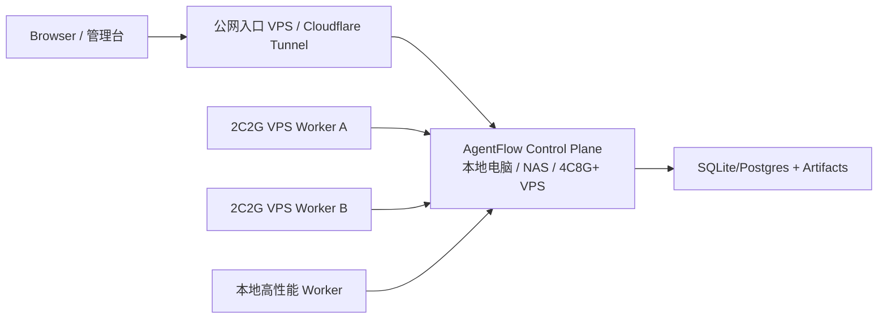

# AgentFlow 产品可用性审计

> 日期：2026-07-03  
> 范围：Web 管理台、Run Detail、任务创建后的实时反馈、低资源部署体验。

## 结论

AgentFlow 当前已经具备 run、mission、worker、artifact、audit、permission、monitor 等平台能力，但任务发起后的主体验仍偏“运维控制台”：用户需要在状态卡、事件流、下载入口之间切换，才能拼出 Agent 正在做什么。这会让长任务看起来像“卡住了”，即使 SSE 和事件流实际上已经存在。

本轮产品优化的核心判断是：Run Detail 必须以 Agent Chat 为第一视图。状态、artifact、审计包和原始事件都应该服务于这条主线，而不是抢占首屏。

## 高优先级问题

| 优先级 | 问题 | 影响 | 处理 |
| --- | --- | --- | --- |
| P0 | 运行详情页首屏先展示状态卡，再展示实时对话 | 用户发起任务后第一眼看不到模型流式输出 | 已调整：Agent Chat 作为左侧主视图首屏 |
| P0 | 页面缺少继续追加输入的 composer | 用户无法像 AI Chat 一样继续给 run 补充上下文 | 已接入 `POST /runs/{run_id}/input` |
| P1 | 权限请求与聊天主线割裂 | 用户容易误判为 runner 卡住 | 暂保留审批卡，Chat 中同步显示 permission 事件；后续可改为 action bubble |
| P1 | 原始事件流过于突出 | 非工程用户会被 event schema 干扰 | 已降低层级，保留在 Chat 下方作为审计视图 |
| P1 | 小 VPS 资源打满时页面表现像“空白” | 用户难以判断是前端、Nginx、runtime 还是 runner 问题 | 建议控制面/执行面分离，并增加外部监控 |
| P2 | Run/Mission 之间的语义仍偏技术 | 初次使用需要学习 run、worker、lease 等概念 | 后续用“任务、执行单元、审计包”做中文默认文案收敛 |

## 本轮已完成的体验改动

1. Run Detail 改为 Chat-first 布局：
   - 左侧首屏展示 Agent Chat。
   - 右侧展示状态、取消、artifact 和审计下载。
   - 原始 Event Stream 保留为排障和审计材料。

2. Agent Chat 增加继续输入：
   - 输入框固定在 Chat 卡片底部。
   - 提交调用 `POST /runs/{run_id}/input`。
   - 成功后刷新 run、run list 和事件列表。
   - terminal run 禁止继续输入，并给出明确提示。

3. 测试覆盖：
   - 单测覆盖创建 run 后跳转详情页并看到 Agent Chat。
   - 单测覆盖 run detail 追加输入到 `/runs/{id}/input`。
   - E2E 覆盖 Agent Chat 可见和继续输入。

## 后续产品优化建议

### 1. Permission action bubble

把 `permission.requested` 渲染成聊天中的 action bubble，同时保留右侧或顶部的待处理汇总。审批按钮需要明确危险等级、命令摘要、作用目录和可下载的 raw payload。

### 2. 全局活跃任务 Dock

在任意页面底部或右下角展示活跃 run：

- 当前状态。
- 最近一条模型输出。
- 是否等待权限。
- 一键回到 Agent Chat。

这样用户离开 Run Detail 后也能知道任务是否仍在推进。

### 3. Mission Chat

Mission Detail 应增加一个聚合 Chat：

- supervisor 消息。
- planner/coder/tester/reviewer 子 run 摘要。
- 每个 task 的最后输出。
- reviewer gate 的结论和操作按钮。

底层仍是多个 SAEU run，但用户看到的是一个连续任务流。

### 4. 卡住自动解释

当 runner 事件超过阈值未更新时，页面不只提示 stale，还应解释最可能原因：

- 等待权限。
- worker 心跳 stale。
- executor failed。
- 队列没有可用 worker。
- runtime 资源压力过高。

### 5. 资源水位可视化

Units 页面应展示最近 CPU、内存、磁盘、load average 和 swap，用于识别 2C2G 是否已不适合作为主控。

## 低资源部署判断

2C2G VPS 可以作为最小公网入口或单 worker，但不建议同时承载：

- Web 管理台。
- Runtime API。
- SQLite artifact/event store。
- Nginx/HTTPS。
- qwen serve。
- npm build、部署脚本、CI smoke。
- 多个真实 Agent run。

一旦 qwen、构建或长任务同时运行，CPU 和内存会互相挤占，表现为页面 pending、白屏、SSH 连接断开或 health 延迟。这不是单一前端问题，而是控制面和执行面混布的资源风险。

推荐拓扑是：

控制面负责调度、状态、审计和 Web；2C2G VPS 只负责 capacity=1 的执行单元，或者只做公网反向代理。
