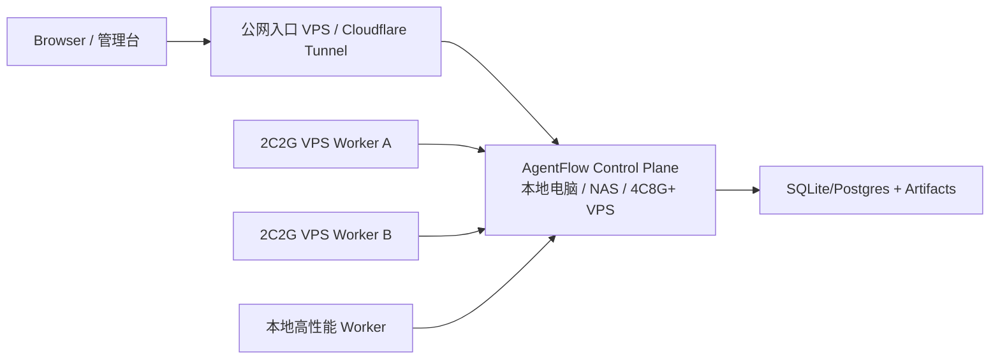

# AgentFlow 产品可用性审计

> 日期：2026-07-03
> 范围：Web 管理台、Run Detail、任务创建后的实时反馈、低资源部署体验。

## 结论

AgentFlow 当前已经具备 run、mission、worker、artifact、audit、permission、monitor 等平台能力，但任务发起后的主体验仍偏“运维控制台”：用户需要在状态卡、事件流、下载入口之间切换，才能拼出 Agent 正在做什么。这会让长任务看起来像“卡住了”，即使 SSE 和事件流实际上已经存在。

本轮产品优化的核心判断是：Run Detail 必须以 Agent Chat 为第一视图。状态、artifact、审计包和原始事件都应该服务于这条主线，而不是抢占首屏。

## 高优先级问题

| 优先级 | 问题                                       | 影响                                                | 处理                                                       |
| ------ | ------------------------------------------ | --------------------------------------------------- | ---------------------------------------------------------- |
| P0     | 运行详情页首屏先展示状态卡，再展示实时对话 | 用户发起任务后第一眼看不到模型流式输出              | 已调整：Agent Chat 作为左侧主视图首屏                      |
| P0     | 页面缺少继续追加输入的 composer            | 用户无法像 AI Chat 一样继续给 run 补充上下文        | 已接入 `POST /runs/{run_id}/input`                         |
| P1     | 权限请求与聊天主线割裂                     | 用户容易误判为 runner 卡住                          | 已完成：Chat action bubble 可直接审批，右侧保留汇总        |
| P1     | 原始事件流过于突出                         | 非工程用户会被 event schema 干扰                    | 已降低层级，保留在 Chat 下方作为审计视图                   |
| P1     | 小 VPS 资源打满时页面表现像“空白”          | 用户难以判断是前端、Nginx、runtime 还是 runner 问题 | 已补 Units 资源水位与低配风险提示；仍建议控制面/执行面分离 |
| P2     | Run/Mission 之间的语义仍偏技术             | 初次使用需要学习 run、worker、lease 等概念          | 后续用“任务、执行单元、审计包”做中文默认文案收敛           |

## 本轮已完成的体验改动

1. Run Detail 改为 Chat-first 布局：
   - 左侧首屏展示 Agent Chat。
   - 右侧展示状态、取消、artifact 和审计下载。
   - 原始 Event Stream 保留为排障和审计材料。

2. Agent Chat 增加继续输入：
   - 输入框固定在 Chat 卡片底部。
   - 提交调用 `POST /runs/{run_id}/input`。
   - 成功后刷新 run、run list 和事件列表。
   - terminal run 禁止继续输入，并给出明确提示。

3. 测试覆盖：
   - 单测覆盖创建 run 后跳转详情页并看到 Agent Chat。
   - 单测覆盖 run detail 追加输入到 `/runs/{id}/input`。
   - E2E 覆盖 Agent Chat 可见和继续输入。

4. 第二轮产品可用性补强：
   - `permission.requested` 已渲染为 Chat action bubble，可直接在对话流中批准/拒绝。
   - 新增全局活跃任务 Dock，用户离开 Run Detail 后仍可看到运行中任务并一键回到 Chat。
   - Mission Detail 新增 Mission Stream，把 task 状态、run 链接、artifact 摘要和 mission event 聚合成连续任务流。
   - Run Detail stale 提示升级为原因解释，区分等待权限、队列无 worker、容量已满、worker stale、executor failed 等常见情况。
   - Units 页面新增资源水位与低配风险提示，至少展示 capacity、声明 CPU/内存和 2C2G 运行风险；后续 worker 上报实时 metrics 后可显示 CPU/memory/disk/load 百分比。

5. 第三轮产品可用性补强：
   - 全局活跃任务 Dock 增加最近输出摘要、等待权限标记和折叠控制，避免悬浮层遮挡底部操作。
   - Permission action bubble 增加风险、目录、命令摘要和 raw payload 下载，审批时能看到更完整上下文。
   - Mission Stream 会读取子 run 的事件尾巴，展示每个 task 的最后模型输出。
   - Remote worker heartbeat 自动采集 CPU/load、内存、swap、磁盘和声明资源容量，Units 水位不再只依赖手工 metadata。

## 后续产品优化建议

### 1. Permission action bubble

状态：已完成第二版。

`permission.requested` 已渲染成聊天中的 action bubble，同时保留右侧待处理汇总和通知重试。审批按钮已在主对话流可见，并补充展示风险、作用目录、命令摘要和 raw payload 下载入口。

### 2. 全局活跃任务 Dock

在任意页面底部或右下角展示活跃 run：

- 当前状态。
- 最近一条模型输出。
- 是否等待权限。
- 一键回到 Agent Chat。

状态：已完成第二版。

当前 Dock 已展示活跃 run、状态、最近输出或 prompt 摘要、等待权限标记、折叠控制和一键回到 Chat。后续增强点是静音控制与更细粒度的通知策略。

这样用户离开 Run Detail 后也能知道任务是否仍在推进。

### 3. Mission Chat

Mission Detail 应增加一个聚合 Chat：

- supervisor 消息。
- planner/coder/tester/reviewer 子 run 摘要。
- 每个 task 的最后输出。
- reviewer gate 的结论和操作按钮。

底层仍是多个 SAEU run，但用户看到的是一个连续任务流。

状态：已完成第二版。

Mission Detail 已新增 Mission Stream，聚合 task 状态、依赖、artifact 摘要、run 链接、子 run 最后输出和最近 mission events。后续增强点是 supervisor 视角的自动总结与 reviewer gate 操作按钮。

### 4. 卡住自动解释

当 runner 事件超过阈值未更新时，页面不只提示 stale，还应解释最可能原因：

- 等待权限。
- worker 心跳 stale。
- executor failed。
- 队列没有可用 worker。
- runtime 资源压力过高。

状态：已完成第一版。

Run Detail stale 提示现在会给出最可能原因：等待权限、排队无 worker、worker 容量已满、worker 心跳 stale、executor/adapter 失败或一般无新事件。后续增强点是接入 runtime 资源压力和 executor registry 的更细粒度原因。

### 5. 资源水位可视化

Units 页面应展示最近 CPU、内存、磁盘、load average 和 swap，用于识别 2C2G 是否已不适合作为主控。

状态：已完成第二版。

Units 页面已展示 capacity 水位、声明 CPU/内存容量和低内存/满载/stale 风险提示；remote worker daemon 会定期采集并上报 `metrics.cpu_percent`、`memory_percent`、`disk_percent`、`swap_percent`、`load_average`。后续增强点是把控制面自身资源压力也接入 Overview 和卡住解释。

## 第二轮复审结论

本轮补强后，Run Detail 已从“运维事件面板”更接近“AI Chat + 审计辅助”的产品形态；Mission Detail 也从单纯 DAG 变为可读任务流。第三轮复审后，上一轮 4 个缺口中已有 3 个完成闭环，资源水位也完成 remote worker 自采集。当前仍存在的主要产品缺口：

1. Mission Stream 已展示子 run 最后输出，但还没有 supervisor 视角自动总结和 reviewer gate 快捷操作。
2. 全局 Dock 已有权限标记、最近输出和折叠控制，但还没有静音、批量取消、失败重试入口。
3. Permission action bubble 已有风险、目录、命令摘要和 payload 下载，但还没有结构化 diff 视图和风险分级样式。
4. 资源水位已有 remote worker 自采集；控制面自身的 CPU/内存/磁盘压力还未进入 Overview 与卡住自动解释。

这些缺口不阻塞当前 MVP 使用，但属于下一轮产品级打磨的优先项。

## 文档与新用户上手审计

> 日期：2026-07-03  
> 视角：第一次接触 AgentFlow、希望理解产品并完成自部署的学习者。

本轮文档审计发现，旧文档的问题不是资料不够，而是入口顺序过于工程化：用户从首页直接进入方案设计、协议选型和审计记录，很难先建立“这是什么、能做什么、怎么用、怎么部署、出错怎么办”的产品心智。

本轮已处理：

1. 首页从“内部设计文档索引”改为学习路径和当前产品状态说明。
2. 新增 `认识 AgentFlow`、`核心概念`、`使用管理台`、`自我部署`、`排障手册` 五篇主线文档。
3. MkDocs 导航改为“快速开始 -> 运维与审计 -> 架构设计 -> 研究资料”，降低新用户首屏认知负担。
4. 操作手册、自部署文档和验收命令统一到新本地邮箱账户登录，旧 Basic Auth 只作为兼容背景说明。
5. 将低配 VPS、qwen 失败、running 无更新、CI 部署失败等高频问题集中到排障手册。

本轮发现的产品/文档缺口：

| 优先级 | 缺口 | 影响 | 建议 |
| --- | --- | --- | --- |
| P0 | 认证已是本地邮箱账户，但还没有 SMTP 邮箱验证、找回密码、首次设置向导 | 用户会以为“邮箱认证”已经完整，实际仍需要管理员通过 secret 管理密码 | 增加 SMTP 配置、验证邮件、重置密码、首次 owner setup 流程 |
| P1 | `RUNTIME_AUTH_*` 与兼容的 `RUNTIME_BASIC_AUTH_*` 同时存在 | 新部署用户容易混淆“浏览器 Basic Auth”和“本地邮箱账户” | 保留兼容但在 UI/CI/文档中统一推荐 `RUNTIME_AUTH_EMAIL/PASSWORD` |
| P1 | 公网路径存在 `/cloud-agents/`、历史 `/agentflow/`、runtime root 三种语义 | 自部署和 monitor 配置容易填错路径 | 将默认公开路径收敛到 `/cloud-agents/`，monitor 默认值和文档保持一致 |
| P1 | Access 页面有 token/RBAC foundation，但用户管理 UI 仍不完整 | 管理员很难在 UI 中完成邀请、禁用、改角色、重置密码 | 增加正式用户管理页面和 owner/admin 操作流 |
| P2 | qwen 验收依赖 settings、机器资源、权限审批、executor 策略，入口说明仍偏技术 | 用户容易把 qwen 失败误判为整个平台失败 | 在 Runs 创建页增加 adapter 选择提示、qwen readiness check 和失败引导 |
| P2 | 部署成功后没有产品内 onboarding | 用户第一次登录后不知道应该先 fake run、再 qwen、再 worker | 增加首次登录 checklist 或空状态引导 |
| P2 | 研究文档仍很有价值，但部分标题偏“方案审计”而非“用户任务” | 外部读者可能误以为项目仍停留在调研阶段 | 后续可把历史研究移到 Archive/Reference，并为当前实现维护独立版本化文档 |

结论：文档主线已经可以支撑用户理解产品、使用管理台和完成自部署；下一轮最值得做的产品补强是“完整账户生命周期”和“部署/监控路径语义收敛”。

## 低资源部署判断

2C2G VPS 可以作为最小公网入口或单 worker，但不建议同时承载：

- Web 管理台。
- Runtime API。
- SQLite artifact/event store。
- Nginx/HTTPS。
- qwen serve。
- npm build、部署脚本、CI smoke。
- 多个真实 Agent run。

一旦 qwen、构建或长任务同时运行，CPU 和内存会互相挤占，表现为页面 pending、白屏、SSH 连接断开或 health 延迟。这不是单一前端问题，而是控制面和执行面混布的资源风险。

推荐拓扑是：

控制面负责调度、状态、审计和 Web；2C2G VPS 只负责 capacity=1 的执行单元，或者只做公网反向代理。
