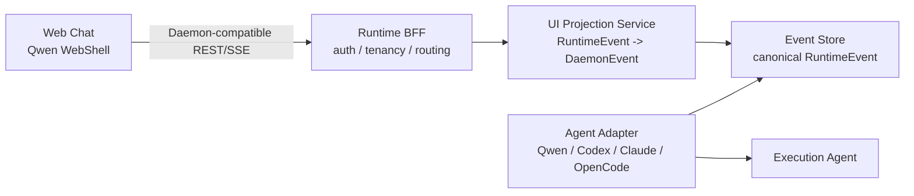

# 基于 Qwen WebShell 的 Chat 渲染方案

> 结论：可以把 Qwen Code 的 WebShell / daemon WebUI transcript 层作为本项目的第一版 Chat 渲染组件标准。
>
> 但平台内部事件源仍应保持 SAEU canonical events，不应把所有运行时状态直接等同于 Qwen 私有事件。正确边界是：每个执行 Agent 先进入统一 Run Event Store，再由 UI Projection Service 转换为 Qwen-compatible `DaemonEvent`，供 WebShell 直接消费和渲染。

## 背景判断

本地 Qwen Code 代码中，面向 Web Chat 的可复用边界主要是：

| 边界 | 位置 | 作用 |
| --- | --- | --- |
| React provider/hooks | `packages/webui/src/daemon-react-sdk.ts` | 导出 `DaemonSessionProvider`、`useDaemonTranscriptBlocks`、`useDaemonActions` 等 |
| Session provider | `packages/webui/src/daemon/session/DaemonSessionProvider.tsx` | 创建/加载 session、订阅 SSE、处理 reconnect、把 `DaemonEvent` normalize 成 transcript |
| UI normalizer/reducer | `packages/sdk-typescript/src/daemon/ui/*` | `normalizeDaemonEvent`、`createDaemonTranscriptStore`、`daemonBlockToMarkdown/Html/PlainText` |
| Daemon event type | `packages/sdk-typescript/src/daemon/types.ts` | `DaemonEvent { id?, v: 1, type, data, _meta?, originatorClientId? }` |
| Daemon REST/SSE client | `@qwen-code/sdk/daemon` | `DaemonClient`、`DaemonSessionClient`、REST/SSE transport |

严格说，本地源码里公开包边界更多叫 `daemon-react-sdk`、`DaemonSessionProvider`、transcript reducer 和 WebUI 组件，而不是只有一个名为 `WebShell` 的单文件组件。本文把“WebShell”定义为这组可消费 Qwen daemon event stream 的 React Chat/Terminal 渲染层。

## 架构决策

采用 Qwen WebShell 作为 Chat 渲染组件，但不把 Run Manager 的内部事件模型改成 Qwen daemon event。

推荐分层：



这个决策带来三条约束：

1. WebShell 只消费 `DaemonEvent`，不直接消费本项目现有 `RuntimeEvent`。
2. 所有执行 Agent 都必须提供到 `DaemonEvent` 的 UI projection。
3. 原始 runtime event 和 canonical runtime event 都必须保留，避免 UI 渲染格式反向污染审计、恢复和多 Agent 编排。

## 为什么这个方向合理

### 复用收益

Qwen WebUI 已经覆盖 coding agent chat 最难的几个渲染点：

- assistant/user streaming delta。
- thought/reasoning block。
- tool call lifecycle。
- shell stdout/stderr。
- permission request / resolved。
- todo list、subagent nesting、tool provenance。
- session reconnect、Last-Event-ID、replay、ring eviction。
- model/approval mode/session metadata update。

如果自研 Chat 渲染层，需要重新处理这些细节，尤其是 tool call、permission、shell output 和 replay。复用 WebShell 可以把前端主要精力放在产品结构、权限审批、任务列表和 artifact 面板上。

### 兼容收益

把 `DaemonEvent` 作为 UI ingress，不代表执行器必须是 Qwen Code。Claude Code、Codex、OpenCode 或自研 worker 的输出都可以先映射成 canonical events，再投影成 `DaemonEvent`。

这会形成一个清晰的兼容目标：

```text
Agent native event -> RuntimeEvent -> DaemonEvent -> Qwen WebShell transcript blocks
```

对前端而言，不需要知道底层 Agent 是谁；对后端而言，可以继续保留可审计、可恢复的统一事件模型。

## 必须避免的错误路径

| 错误路径 | 风险 | 处理 |
| --- | --- | --- |
| 直接把 Qwen `DaemonEvent` 当内部事件表 | 后续接入非 Qwen Agent 会被 Qwen schema 锁死 | 内部仍使用 `RuntimeEvent`，`DaemonEvent` 只做 UI projection |
| 浏览器直接拿 qwen serve token 访问 daemon | token 泄漏、workspace 越权、CORS/Origin 风险 | 生产环境必须走 BFF |
| 只保存投影后的 `DaemonEvent` | 审计无法还原原始 runtime 行为 | raw event、RuntimeEvent、DaemonEvent projection 三份分层保存 |
| 所有事件都强行渲染为 chat block | 状态、审计、artifact、成本等信息会污染对话 | Chat 只接 UI projection，其他面板读取 canonical API |
| 依赖 Qwen experimental REST/SSE 私有细节不设版本闸 | 升级 qwen-code 时前端可能断 | capabilities/version pin + conformance tests |

## 目标接口

### 前端看到的接口

前端尽量复用 Qwen daemon SDK 所期望的形状：

```text
POST /session
POST /session/:id/prompt
GET  /session/:id/events
POST /session/:id/cancel
POST /session/:id/permission/:requestId
GET  /capabilities
```

在本项目中，这组接口可以由 Runtime BFF 实现，不一定直连 qwen serve。

### BFF 到 Run Manager

BFF 做三件事：

1. 鉴权、租户隔离、workspace/run 路由。
2. 把 WebShell 的 session/prompt/cancel/permission 操作映射到 Run Manager。
3. 把 Run Manager SSE 转换成 Qwen-compatible SSE。

建议路由：

| BFF route | 内部映射 |
| --- | --- |
| `POST /session` | create or attach `run/thread` |
| `POST /session/:id/prompt` | `POST /runs/:id/input` |
| `GET /session/:id/events` | subscribe `/runs/:id/events` then project |
| `POST /session/:id/cancel` | `POST /runs/:id/cancel` |
| `POST /session/:id/permission/:requestId` | `POST /runs/:id/permissions/:requestId` |
| `GET /capabilities` | merge Runtime capabilities + UI projection version |

### DaemonEvent envelope

UI projection 输出的事件 envelope 必须满足：

```json
{
  "id": 17,
  "v": 1,
  "type": "session_update",
  "data": {
    "update": {
      "sessionUpdate": "agent_message_chunk",
      "content": { "type": "text", "text": "..." }
    }
  },
  "_meta": {
    "serverTimestamp": 1780000000000,
    "runtimeRunId": "run_x",
    "sourceAdapter": "codex"
  }
}
```

`id` 应该使用 UI session 内单调递增序号，支持 `Last-Event-ID`。不要直接复用某个底层 Agent 的私有 event id。

## 事件映射规范

### 基础映射

| RuntimeEvent | DaemonEvent |
| --- | --- |
| `input.accepted` | `session_update` + `user_message_chunk` |
| `message.delta` | `session_update` + `agent_message_chunk` |
| `reasoning.delta` | `session_update` + `agent_thought_chunk` |
| `tool.started` | `session_update` + `tool_call` |
| `tool.updated` | `session_update` + `tool_call_update` |
| `tool.completed` | `session_update` + `tool_call_update` status `completed` |
| `shell.output` | top-level `shell_output` or `session_update` + `shell_output` |
| `permission.requested` | top-level `permission_request` |
| `permission.resolved` | top-level `permission_resolved` |
| `run.completed` | top-level `turn_complete`，用于 WebUI session/prompt 状态结算，不作为可见 transcript block |
| `run.failed` | top-level `turn_error` or `session_died` |
| `run.cancelled` | top-level `prompt_cancelled` |
| `stream.warning` | top-level `slow_client_warning` or `stream_error` |

### Non-Qwen Agent 映射

不同 Agent 只需要实现到 canonical event 的 adapter，不要各自直接写 WebShell projection。

| Agent | Native output | Adapter 输出 | UI projection |
| --- | --- | --- | --- |
| Qwen Code | daemon REST/SSE `DaemonEvent` | 原样保存 raw，并转换必要 canonical event | 可直接透传或重放投影 |
| Codex | run transcript、tool events、diff/artifact | `message.delta`、`tool.*`、`artifact.*`、`permission.*` | 标准 `DaemonEvent` |
| Claude Code | stream text、tool use、permission/approval | canonical runtime events | 标准 `DaemonEvent` |
| OpenCode | structured session events | canonical runtime events | 标准 `DaemonEvent` |
| 自研 worker | 原生 internal event | canonical runtime events | 标准 `DaemonEvent` |

Qwen adapter 可以作为黄金样本：它的 raw `DaemonEvent` 一方面进入 raw artifact，另一方面映射到 canonical `RuntimeEvent`。投影服务可以优先使用 raw Qwen event 透传，但必须保证可从 canonical event 重放出同等 UI。

## 数据持久化

每个 run 建议保存：

```text
run_spec.json
events.jsonl                 # canonical RuntimeEvent
raw_events.jsonl             # source adapter raw events
ui_daemon_events.jsonl       # projected DaemonEvent, 可重建
diagnostics.json
artifacts/
```

`ui_daemon_events.jsonl` 是缓存，不是事实源。重放时优先从 `events.jsonl` 重建，只有在排查 UI 兼容问题时对比缓存。

## 实施计划

### Phase 0：锁定依赖和接口

目标：明确第一版只消费 Qwen daemon WebUI SDK 的稳定子集。

任务：

1. 在前端依赖中引入 `@qwen-code/webui` 或从 qwen-code monorepo vendor 一版固定包。
2. 记录 qwen-code commit/version，作为 WebShell 兼容基线。
3. 建立 `DaemonEvent` JSON Schema 或 TypeScript fixture，覆盖 `session_update`、permission、tool、shell、turn terminal。
4. BFF 暴露 `/capabilities`，返回 `features: ["daemon_event_projection", "permission_vote", "session_events"]`。

验收：

- 一个静态 fixture 能被 `normalizeDaemonEvent` 和 transcript reducer 正常消费。
- 前端能渲染 user、assistant、tool、shell、permission、error 六类 block。

### Phase 1：UI Projection Service

目标：把现有 Run Manager SSE 转换成 `DaemonEvent`。

任务：

1. 新增 `runtime/cloud_agents_runtime/ui_projection.py`。
2. 为每个 `RuntimeEvent` 生成 UI session 内单调 `id`。
3. 输出 `v: 1`、`type`、`data`、`_meta.serverTimestamp`。
4. 保留 `_meta.runtimeEventId`、`_meta.runtimeSequence`、`_meta.sourceAdapter`。
5. 对无法渲染的事件输出 `debug` 或 `status`，不要丢弃。

验收：

- `POST /runs` + `POST /runs/:id/input` 后，BFF 的 `/session/:id/events` 可以被 WebShell 消费。
- 刷新页面后 `Last-Event-ID` 能补齐缺失 UI event。
- `events.jsonl` 可重新投影出相同 UI event 序列。

### Phase 2：Qwen raw passthrough + canonical replay

目标：Qwen Code 作为最小闭环 Agent 时，利用原生事件质量。

任务：

1. Qwen adapter 保存 raw daemon SSE。
2. 若 raw event 已是合法 `DaemonEvent`，投影层允许 passthrough。
3. 同时继续生成 canonical `RuntimeEvent`，供审计、恢复、多 Agent 编排使用。
4. 增加 raw passthrough 与 canonical replay 的差异检测。

验收：

- Qwen 原生 tool/permission/shell 渲染不降级。
- 断开 BFF 后重连，能够从 Event Store 恢复 WebShell transcript。
- raw 和 canonical replay 的关键 block 数量一致：user、assistant、tool、permission、terminal。

### Phase 3：非 Qwen Agent adapter

目标：让 Codex/Claude/OpenCode 的输出也进入同一个 Chat 渲染组件。

任务：

1. 为每个 Agent 建 native-to-canonical adapter。
2. adapter 不直接输出 `DaemonEvent`，只输出 `RuntimeEvent`。
3. 用统一 projection 生成 `DaemonEvent`。
4. 对不支持 permission 的 Agent，映射为 `status` 或外部审批 URL。

验收：

- 同一个 WebShell 页面可切换 `adapter=qwen` 和 `adapter=fake/codex-like`。
- 前端不包含 `if adapter === "qwen"` 这种渲染分支。
- 所有 adapter 通过同一组 projection conformance tests。

### Phase 4：生产化 BFF

目标：浏览器不直连 daemon，不持有 worker token。

任务：

1. BFF 维护 user/session/run 权限。
2. BFF 给每个浏览器生成稳定 `clientId`，映射到 daemon `originatorClientId`。
3. BFF 代理 permission vote，写入审计事件。
4. BFF 限制 event payload 大小，过滤敏感字段。
5. BFF 支持 session release、heartbeat、idle timeout。

验收：

- 浏览器网络请求中不出现 qwen daemon bearer token。
- 越权访问其他 run/session 返回 403。
- permission 决策有 actor、requestId、outcome、timestamp。

## 测试策略

### Projection 单元测试

fixture：

1. user prompt。
2. assistant streaming text。
3. tool started/updated/completed。
4. shell stdout/stderr。
5. permission request/resolved。
6. run completed/failed/cancelled。
7. malformed runtime event。

断言：

- 每个输出都是合法 `DaemonEvent`。
- `id` 单调递增。
- `v === 1`。
- `normalizeDaemonEvent` 不抛错。
- transcript reducer 生成预期 block kind。

### 前端集成测试

使用 WebShell + fake daemon BFF：

- 初次加载能创建 session。
- 输入 prompt 后出现 user block。
- assistant delta 流式追加到同一 assistant block。
- tool block 状态从 running 到 completed。
- permission block 出现后提交审批，状态更新。
- 刷新页面后 transcript 可恢复。

### 审计测试

- raw event 与 canonical event 都落盘。
- projection 缓存可删除并重建。
- `Last-Event-ID` 大于当前最大 id 时产生 gap/resync event。
- 敏感字段不会进入 UI `debug` 文本。

## 风险审计

| 风险 | 等级 | 说明 | 缓解 |
| --- | --- | --- | --- |
| Qwen WebUI SDK 仍在快速演进 | 高 | event shape 或导出名可能变化 | 固定版本，建立 conformance fixtures，升级先跑兼容测试 |
| 非 Qwen Agent 无法表达完整 tool/permission | 中 | 不同 Agent 事件语义不同 | canonical event 允许降级为 status/debug，同时保留 raw artifact |
| UI projection 变成事实源 | 高 | 审计和恢复被渲染格式绑架 | 明确 `ui_daemon_events.jsonl` 可重建，事实源只认 `events.jsonl` |
| 浏览器直连 daemon | 高 | token 和 workspace 泄漏 | 生产环境只允许 BFF，同源本地 POC 单独标记 |
| 大 transcript 性能 | 中 | WebShell 默认保留大量 blocks | 虚拟列表、分页 replay、maxBlocks 配置、server-side compaction |
| permission 多客户端语义 | 中 | voter、originator、审批 actor 容易混淆 | BFF 统一 clientId，permission event 写 actor 审计 |
| event id 对齐错误 | 中 | Last-Event-ID 可能跳号或重复 | UI session 独立序列，不复用 native id |

## 推荐落地顺序

第一步不要重做整套前端。先做一个“WebShell 兼容 BFF”小闭环：

```text
Browser WebShell
  -> Runtime BFF /session/:id/events
  -> UI Projection
  -> Run Manager /runs/:id/events
  -> fake adapter 或 qwen adapter
```

最小可交付：

1. fake adapter 产生完整事件 fixture。
2. projection 输出 `DaemonEvent`。
3. WebShell 渲染完整 transcript。
4. qwen adapter raw passthrough 接入。
5. 加入 projection conformance tests。

完成后再接 Codex/Claude/OpenCode adapter。这样能最大化复用 Qwen WebShell，又不牺牲执行器可替换性。

## 2026-07-04 实施记录

本轮已按本文方案完成第一条可执行闭环：后端提供 WebShell-compatible BFF 和 `RuntimeEvent -> DaemonEvent` 投影层，前端或外部 WebShell 客户端可以通过 `/session` 系列接口消费同一条运行时事件流。

### 已落地能力

1. 新增 `runtime/cloud_agents_runtime/ui_projection.py`：
   - 平台内部继续以 `RuntimeEvent` 作为事实源。
   - 对 UI 输出 Qwen-compatible `DaemonEvent`，字段包含 `id`、`v: 1`、`type`、`data` 和 `_meta`。
   - `_meta` 固定带上 `serverTimestamp`、`runtimeRunId`、`runtimeEventId`、`runtimeSequence`、`runtimeEventType`、`sourceAdapter`。
   - `id` 当前使用 canonical event sequence，满足同一 run/session 内单调递增和 `Last-Event-ID` replay。
   - 对未知事件降级为 `session_update + status`，不丢事件。
   - 对 UI debug/status 载荷做敏感字段脱敏，覆盖 token、authorization、cookie、password、secret、private_key、api_key 等字段。

2. 新增 WebShell-compatible BFF routes：

| Route | 状态 | 内部映射 |
| --- | --- | --- |
| `POST /session` | done | 创建 run，或根据 `run_id/session_id` attach 已存在 run |
| `POST /session/:id/prompt` | done | `RunManager.send_input` |
| `GET /session/:id/events` | done | 从 canonical Event Store 读取并实时投影为 DaemonEvent SSE |
| `GET /session/:id/events.json` | done | 返回当前投影序列，并写入 `ui_daemon_events.jsonl` 缓存 |
| `POST /session/:id/cancel` | done | `RunManager.cancel` |
| `POST /session/:id/permission/:requestId` | done | `RunManager.resolve_permission` |
| `GET /capabilities` | done | 新增 `daemon_event_projection`、`session_events`、`webshell_compatible_bff` 和 `ui_projection.routes` |

3. 已实现事件映射：

| RuntimeEvent | DaemonEvent |
| --- | --- |
| `input.accepted` | `session_update/user_message_chunk` |
| `message.delta` | `session_update/agent_message_chunk` |
| `reasoning.delta` | `session_update/agent_thought_chunk` |
| `tool.started` | `session_update/tool_call` |
| `tool.updated` | `session_update/tool_call_update` |
| `tool.completed` | `session_update/tool_call_update` + `completed` |
| `shell.output` | `shell_output` |
| `permission.requested` | `permission_request` |
| `permission.resolved` | `permission_resolved` |
| `run.completed` | `turn_complete` |
| `run.failed` | `turn_error` |
| `run.cancelled` | `prompt_cancelled` |
| `stream.warning`、`event.gap_detected` | `stream_error` |
| unknown event | `session_update/status` |

4. Qwen raw passthrough：
   - 当 canonical event 为 `adapter.event` 且 `data.raw` 已经是合法 `DaemonEvent` 形状时，投影层允许透传。
   - 透传时仍会覆盖 `id`、`v`，并追加平台 `_meta`，保证 UI replay 和审计链仍由 AgentFlow 控制。
   - raw event 只作为 UI 质量优化，不会替代 canonical event store。

5. 审计产物：
   - `events.jsonl` 仍是事实源。
   - `raw_events.jsonl` 仍保存 adapter 原始事件。
   - `ui_daemon_events.jsonl` 是可重建缓存。
   - `GET /runs/:id/audit.json` 已包含 `ui_daemon_events`，便于排查 WebShell 兼容问题。

### 多轮审计结论

| 审计视角 | 结论 | 处理 |
| --- | --- | --- |
| 架构边界 | 未把 Qwen `DaemonEvent` 反向变成 runtime contract，边界正确 | 保留 `RuntimeEvent` 事实源和独立 projection module |
| 安全 | 浏览器不需要 qwen daemon token；session route 走现有 auth/scope | BFF route 复用 `required_scope_for`，events/cancel/permission 分别映射到对应 scope |
| 审计与恢复 | projection 可从 `events.jsonl` 重建；缓存不是事实源 | audit bundle 和 terminal session cache 都包含投影结果 |
| 实时性 | `/session/:id/events` 支持 SSE 和 `Last-Event-ID` | 复用 canonical event store 的 wait/replay/gap 机制 |
| 兼容性 | Qwen raw event 可透传，非 Qwen adapter 也可统一投影 | conformance tests 覆盖 raw passthrough 和 canonical replay |
| 稳定性 | malformed raw event、未知事件、坏 timestamp 不会导致 stream 崩溃 | 降级到 status/0 timestamp，并补单测 |
| 产品边界 | 本轮完成 BFF/projection，不等同于前端已完全替换为 Qwen WebShell SDK | 下一轮再接 `DaemonSessionProvider` 或 vendor 的 transcript reducer |

### 验证结果

本轮本地验证：

1. Runtime 单测与集成测试：92 passed。
2. Runtime 覆盖率：90.12%。
3. Runtime style：通过。
4. Web lint：通过，0 warning。
5. Web 单测：25 passed。
6. Web 覆盖率：Statements 95.99%，Branches 90.06%，Functions 91.30%，Lines 95.99%。
7. Web build：通过，已重新生成 runtime static assets。

### 当前未完成边界

本轮完成的是“WebShell-compatible BFF 小闭环”，不是完整前端 SDK 替换。仍需在下一轮处理：

1. 前端引入或 vendor 固定版本的 Qwen WebUI transcript reducer / `DaemonSessionProvider`。
2. 将 Run Detail 的现有 Chat 渲染器切换为消费 `/session/:id/events` 的 DaemonEvent stream。
3. 增加 WebShell transcript fixture 的浏览器端 E2E，覆盖 user、assistant、tool、shell、permission、error 六类 block。
4. 对真实 qwen raw event 与 canonical replay 做 block 数量和关键字段差异检测。

## 最终判断

采用 Qwen WebShell 是推荐方案，但它应该是 UI contract，不是 runtime contract。

本项目的长期边界应当是：

```text
Runtime contract: SAEU canonical events
UI contract: Qwen-compatible DaemonEvent
Renderer: Qwen WebShell / daemon WebUI transcript blocks
Audit source: Event Store + raw adapter artifacts
```

只要坚持这条边界，未来无论执行 Agent 是 Qwen Code、Codex、Claude Code、OpenCode 还是自研 worker，前端 Chat 都可以共享同一套渲染组件。

## 2026-07-04 前端替换记录

本轮已完成 Run Detail 的前端替换：管理台的主 Chat 工作台不再从 `/runs/:id/events` 推导实时 transcript，而是消费 WebShell-compatible BFF 的 `/session/:id/events.json` 和 `/session/:id/events`。

### 已替换链路

| 场景 | 替换前 | 替换后 |
| --- | --- | --- |
| 初始 transcript | `/runs/:id/events.json` | `/session/:id/events.json` |
| 实时 SSE | `/runs/:id/events` | `/session/:id/events` |
| 继续对话 | `POST /runs/:id/input` | `POST /session/:id/prompt` |
| 权限处理 | `POST /runs/:id/permissions/:permissionId` | `POST /session/:id/permission/:permissionId` |
| Chat reducer | RuntimeEvent reducer | DaemonEvent reducer |
| 审计事件列表 | RuntimeEvent | 保留 RuntimeEvent 事实源 |

这意味着用户在运行详情页看到的 Agent 输出、工具调用、shell 输出、权限卡片和 runner 状态，已经来自 DaemonEvent UI contract。`/runs/:id/events` 仍然保留，但用途收敛为 canonical audit、事件列表、历史兼容和自动化排障，不再承担主 Chat 渲染职责。

### 前端 DaemonEvent reducer

本轮新增前端 DaemonEvent reducer，当前支持：

1. `session_update/user_message_chunk`：渲染用户输入。
2. `session_update/agent_message_chunk`：连续合并为 Agent output。
3. `session_update/agent_thought_chunk`：只显示进度信号，不暴露内部思考文本。
4. `session_update/tool_call` 和 `tool_call_update`：渲染工具名称、状态、输入和输出摘要。
5. `shell_output`：渲染 stdout/stderr。
6. `permission_request`：渲染可操作权限卡片。
7. `permission_resolved`：隐藏已解决权限并记录结果。
8. `turn_complete`、`turn_error`、`prompt_cancelled`、`stream_error`：渲染终态或恢复提示。

### 边界说明

本轮不是把平台事实源替换为 Qwen schema。正确边界仍然是：

```text
Runtime contract: AgentFlow canonical RuntimeEvent
UI contract: Qwen-compatible DaemonEvent
Run Detail Chat: /session/:id/events
Audit and replay source: /runs/:id/events.json + artifacts/events.jsonl
```

这样可以同时满足两个目标：

1. 管理台具备类似 AI Chat/WebShell 的实时体验。
2. 后端仍能兼容 Codex、Claude Code、Qwen Code、OpenCode 和远程 worker。

### 验证结果

本轮本地验证已完成：

1. Web lint：通过，0 warning。
2. Web 单测：25 passed。
3. Web 覆盖率：Statements 96.12%，Branches 90.26%，Functions 91.79%，Lines 96.12%。
4. Web build：通过，已重新生成 runtime static assets。
5. Playwright E2E：chromium/mobile 共 4 passed，2 skipped；覆盖 Run Detail 读取 session JSON、接收 session SSE chunk、发送 session prompt、提交 session permission。
6. Runtime style：通过。
7. Runtime 单测与集成测试：92 passed。
8. Runtime 覆盖率：90.12%。

### 后续建议

下一步不再是“是否切换到 session BFF”，而是继续提升 WebShell 渲染质量：

1. 将 DaemonEvent transcript block 抽成独立组件，降低 Run Detail 复杂度。
2. 对长输出启用虚拟列表或服务端 compaction。
3. 增加 tool call 的结构化展开/收起。
4. 接入更多真实 qwen raw event fixture，持续做前端 conformance 检测。
