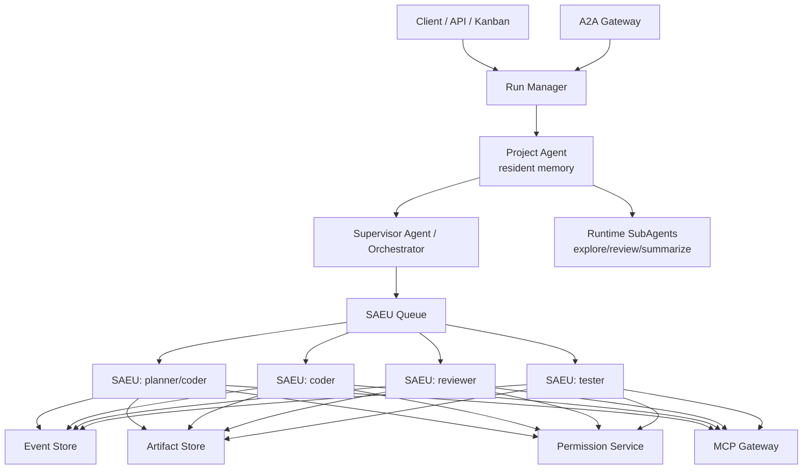

# 从单 Agent 执行单元到多 Agent 编排

> 结论：多 Agent 系统不应该直接编排“模型角色”，也不应该把所有内部 SubAgent 都强行升级成独立进程。更准确的分层是：常驻 Project/Supervisor Agent 负责长期目标和上下文，Agent runtime 内部可以使用 SubAgent 做轻量并行；只有需要平台治理、隔离、审计、恢复和跨客户端托管的子任务，才升级为 SAEU run。

## 总体路线

```text
Phase 1: 单 SAEU 稳定
Phase 2: 多 SAEU 并发
Phase 3: Supervisor 拆分任务
Phase 4: 子任务 artifact 合并
Phase 5: A2A Gateway 对外互操作
Phase 6: Temporal 或 durable workflow 接管长流程
```

关键原则：

- 先让一个执行单元可靠，再让多个执行单元并发。
- SubAgent 用于主 Agent 内部探索、评审、总结；SAEU 用于平台级执行边界。
- 独立 SAEU 之间不共享可写 workspace。
- Agent 间通信优先通过 artifact 和事件，不直接互相读写不受控内存。
- Supervisor 负责规划、派发、合并、失败处理和人机协同。
- 外部协议可以是 A2A，内部执行器控制优先 ACP-compatible SAEU。

## 多 Agent 目标架构



## 编排对象

多 Agent 编排层只认识以下对象：

| 对象 | 含义 |
| --- | --- |
| `mission` | 用户的宏观目标 |
| `task` | 可交给 SubAgent 或 SAEU 的子任务 |
| `run` | 某个 SAEU 的一次执行 |
| `dependency` | 子任务之间的依赖 |
| `artifact` | 子任务输出 |
| `review` | 对 artifact 或 diff 的审查 |
| `decision` | Supervisor 或人类的决策 |
| `merge_plan` | 多个子任务结果的合并策略 |

不要把 Agent 之间的聊天记录当成唯一状态。生产系统的状态必须在 DB 中显式建模。

## Supervisor 职责

Supervisor 可以先是规则系统，后续再变成 Agent。它负责：

- 将 mission 拆成 tasks。
- 给每个 task 选择 agent profile。
- 判断任务留在 runtime SubAgent 内部执行，还是升级为 SAEU run。
- 决定串行、并行或 fan-out/fan-in。
- 为需要平台治理的 task 创建 SAEU run。
- 监听子 run 事件。
- 处理失败、超时、取消和权限升级。
- 收集 artifact。
- 触发 review/test。
- 生成最终报告或 merge plan。

Supervisor 不负责：

- 直接执行 shell。
- 直接修改所有子 workspace。
- 绕过 permission service。
- 直接读取 qwen serve 私有 session 状态。
- 把所有轻量子任务都强制拆成独立 daemon。

## Agent profile

第一版建议定义这些 profile：

| Profile | 工具权限 | 适用 |
| --- | --- | --- |
| `planner` | 只读文件、grep、web fetch、无写入 | 拆任务、读代码、设计方案 |
| `coder` | 读写 workspace、测试命令需审批 | 实现代码 |
| `reviewer` | 只读 diff、运行轻量检查 | 代码审查、风险识别 |
| `tester` | 运行测试、读写临时文件 | 验证和复现 |
| `doc-writer` | 文档目录写入 | 文档输出 |

每个 profile 映射到：

- tool allowlist。
- approval mode。
- model。
- max turns。
- timeout。
- workspace 策略。
- artifact 要求。

## Workspace 策略

多 Agent 最大风险之一是并发写冲突。建议：

| 场景 | 策略 |
| --- | --- |
| planner/reviewer | 共享只读 base workspace |
| coder 并行 | 每个 coder 一个独立 git worktree/branch |
| tester | 基于 coder artifact 创建临时 workspace |
| merge | 由 Supervisor 或 merge agent 独立执行 |

不要让多个 coder 同时写同一个目录。合并只通过 patch/artifact。

## 子任务通信

子 Agent 之间不直接聊天，默认通过 artifact 通信：

```text
planner -> plan.md
coder   -> diff.patch + implementation-notes.md
tester  -> test-report.md
reviewer-> review-findings.md
supervisor -> final-report.md
```

如果确实需要交互，走 Supervisor 中继：

```text
coder question -> supervisor decision -> reviewer/tester/coder input
```

这样所有跨 Agent 决策都有事件和审计。

## 失败处理

| 失败 | 处理 |
| --- | --- |
| 子 Agent 超时 | cancel run，保存 artifact，允许 retry |
| 权限超时 | deny/cancel，Supervisor 决定是否换策略 |
| coder 生成冲突 patch | reviewer/merge agent 处理，或重新分派 |
| tester 失败 | 把失败报告作为 coder follow-up input |
| reviewer 高风险 finding | 阻塞合并，进入人工审批 |
| Supervisor 崩溃 | 从 mission/task/run/event 表重建状态 |

每个子任务必须有终止原因：

- `succeeded`
- `failed`
- `cancelled`
- `timed_out`
- `blocked_permission`
- `blocked_conflict`
- `blocked_human`

## A2A Gateway 位置

A2A 适合系统边界，而不是内部所有调用都必须 A2A。

```text
External A2A Client
  -> A2A Gateway
  -> mission/task/run
  -> SAEU
```

A2A Gateway 负责：

- 暴露 Agent Card。
- 把外部 task 映射为内部 mission/run。
- 把内部 run status 映射为 A2A task status。
- 把 artifacts 映射为 A2A artifacts。
- 把 internal streaming event 映射为 A2A streaming update。
- 把 push notification 映射为 webhook。

权限请求建议：

- 内部仍使用 Permission Service。
- A2A 侧可用 task state、message、metadata 或 extension 表达“需要用户输入/审批”。
- 不要假设所有 A2A 客户端都理解 coding-agent permission schema。

## 数据库表草案

```sql
create table missions (
  id text primary key,
  tenant_id text not null,
  created_by text not null,
  objective text not null,
  status text not null,
  created_at timestamptz not null default now(),
  updated_at timestamptz not null default now()
);

create table tasks (
  id text primary key,
  mission_id text not null references missions(id),
  parent_task_id text,
  profile text not null,
  objective text not null,
  status text not null,
  priority int not null default 0,
  created_at timestamptz not null default now()
);

create table task_dependencies (
  task_id text not null references tasks(id),
  depends_on_task_id text not null references tasks(id),
  primary key (task_id, depends_on_task_id)
);

create table runs (
  id text primary key,
  task_id text references tasks(id),
  unit_id text,
  status text not null,
  failure_kind text,
  started_at timestamptz,
  ended_at timestamptz
);
```

run events、permissions、artifacts 沿用单 Agent 事件模型。

## Phase 1：单 SAEU 稳定

目标：

- 一个 qwen serve 单元可以稳定执行任务。
- 支持审计、重放、恢复、权限、diagnostics。

验收：

- 单 run 生命周期完整。
- run 失败后能定位原因。
- 客户端断线可追事件。
- qwen daemon 崩溃可恢复或清晰失败。

## Phase 2：多 SAEU 并发

目标：

- 同一台 VPS 允许 1-2 个 SAEU 并发。
- 第二台 VPS 可作为 sandbox worker。

新增能力：

- worker capacity。
- run queue。
- lease/heartbeat。
- per-tenant quota。
- artifact 聚合页。

验收：

- 两个 run 并发不会污染 workspace。
- 一个 run 死掉不影响另一个。
- 资源超限会被限流而不是拖垮宿主机。

## Phase 3：Supervisor 拆分任务

目标：

- 从用户 mission 生成 tasks。
- tasks 可以串行或并行执行。

第一版可以用规则：

```text
if task_type == code_change:
  planner -> coder -> tester -> reviewer
if task_type == research:
  researcher -> reviewer -> doc-writer
```

后续再用 supervisor agent 生成 DAG，但 DAG 需要人工确认或策略约束。

验收：

- 子任务可以独立失败和重试。
- mission 状态可从 task/run 状态推导。
- final report 能引用每个子任务 artifact。

## Phase 4：合并与评审

目标：

- 多个 coder 的 patch 可以被审查和合并。

策略：

- 每个 coder 输出 patch。
- merge agent 在单独 workspace 应用 patch。
- tester 在 merge workspace 运行测试。
- reviewer 对最终 diff 做风险检查。
- 人类批准后才 push/merge。

验收：

- 冲突不会破坏 base workspace。
- 所有 merge 决策可审计。
- 测试失败能反馈给对应 coder。

## Phase 5：A2A Gateway

目标：

- 让外部系统以 A2A 调用本系统。
- 或让本系统调用外部 A2A agent。

实现：

- `/.well-known/agent-card.json` 或等效 Agent Card。
- `send task` -> `mission/run`。
- `task status` -> mission/task/run 状态聚合。
- `streaming` -> Event Store SSE bridge。
- `artifact` -> Artifact Store signed URL 或引用。
- `cancel` -> mission/run cancel。

验收：

- Gemini CLI remote subagent 能把本系统当远程 Agent 调用。
- 外部 task 能映射到内部 mission。
- 内部权限请求不会丢失，至少能反馈为“需要审批/用户输入”状态。

## Phase 6：Durable workflow

当 mission 可能跨天、多轮人工审批、多个 worker 节点时，引入 Temporal：

- `MissionWorkflow` 管 tasks DAG。
- `AgentRunWorkflow` 管单个 SAEU run。
- Activity 负责启动容器、投递 prompt、收集 artifact。
- 事件详情仍写 Event Store。

在此之前，Postgres queue + lease 足够。

## 最小可实施版本

第一版不要追求全自动多 Agent。建议最小范围：

1. 一个常驻 Project/Supervisor Agent 产出任务计划。
2. 人类确认计划。
3. 轻量探索、阅读和 review 可先用 SubAgent。
4. 一个 coder SAEU 执行实现。
5. 一个 tester SAEU 运行测试。
6. Supervisor 汇总 final report。

这已经具备多 Agent 的核心闭环，同时风险可控。

## 决策

多 Agent 编排的稳定性来自三个约束：

- SubAgent 只承担主 Agent 内部的轻量协作。
- SAEU 承担平台级治理边界，有独立状态、事件、权限、artifact、workspace。
- Agent 之间只通过 Supervisor 和 artifact 协作，不直接共享不受控状态。

这条路线比“多个 Agent 在一个大对话里互相聊天”更慢一点，但可审计、可恢复、可逐步上线。
