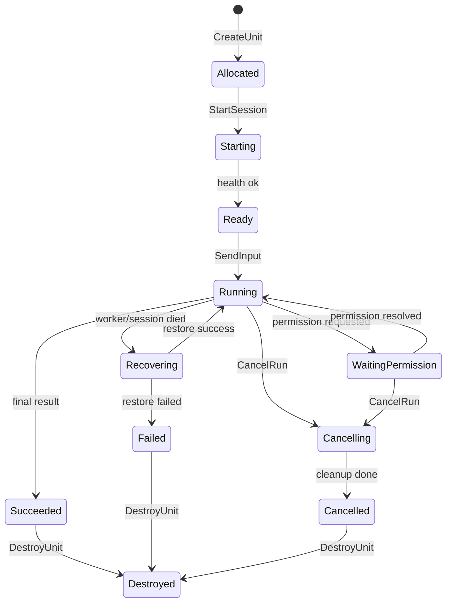

# 稳定 Agent 执行单元

> 结论：SAEU 不应该被理解为在 `qwen serve` 外面再造一层新的 Agent worker。更准确地说，稳定 Agent 执行单元（Stable Agent Execution Unit，简称 SAEU）是云端控制面对“一个可管理 Agent 运行边界”的统一契约。  
> 在 Qwen Code 路线下，一个受 Supervisor 管理的 `qwen serve` daemon 就是 SAEU 的第一版实现；未来 Claude Code、Codex、OpenCode、Gemini CLI、自研 Agent 只要实现同一通信契约，也可以成为 SAEU。

## 定义

SAEU 是一个可被云端控制面调度、观察、取消、恢复、审计和计费的 Agent 执行边界。它不是模型调用，也不必然是一个独立 CLI 进程；它可以映射到：

- 一个 `qwen serve` daemon。
- 一个 `qwen serve` daemon 内的 thread-scoped session。
- 一个 Claude Code / Codex / OpenCode / Gemini CLI 的 headless server。
- 一个实现 ACP Streamable HTTP / WebSocket transport 的第三方 Agent server。
- 一个容器、远程 worker、microVM 或托管 sandbox 中的 Agent runtime。

SAEU 必须提供这些能力：

- workspace 或 project boundary。
- Agent runtime。
- 受控工具集合。
- session / run 控制接口。
- 实时事件流。
- 权限请求通道。
- artifact 输出面。
- 健康检查、诊断和恢复面。
- 审计与回放面。

外部多 Agent 编排、任务调度、Kanban 控制面、A2A Gateway、Web UI 都只把 SAEU 当作基础执行单元，而不直接绑定某个 Agent 项目的私有 API。

## 与 qwen serve 的关系

Qwen Code 的 `qwen serve` 已经天然覆盖 SAEU 的大部分 worker 语义：

| SAEU 能力 | qwen serve 对应能力 |
| --- | --- |
| workspace boundary | 一个 daemon 绑定一个 workspace |
| Agent runtime | daemon 内部启动一个 `qwen --acp` child process |
| 多客户端连接 | HTTP + SSE，多客户端共享或附着 session |
| session 控制 | `POST /session`、`sessionScope: single/thread` |
| prompt/input | `POST /session/:id/prompt` |
| 实时事件 | `GET /session/:id/events`，支持 `Last-Event-ID` |
| 权限请求 | `permission_request`、`permission_resolved`、多客户端 mediation |
| 健康诊断 | `/health`、`/capabilities`、`/daemon/status`、`/session/:id/status` |
| 恢复 | `/session/:id/load`、`/session/:id/resume` |
| runtime control | approval mode、tool toggle、MCP restart、workspace memory/agents |

因此在 Qwen Code 路线下，不需要再设计一个替代 `qwen serve` 的 worker。第一版应当是：

```text
Run Manager
  -> Worker Supervisor
  -> qwen serve daemon
  -> qwen --acp child
```

平台需要补的是 `qwen serve` 外层的云端运行时能力：

- daemon registry：记录哪些 workspace / tenant / run 绑定到哪些 daemon。
- daemon lifecycle：启动、停止、重启、租约、心跳、容量、端口/token 管理。
- multi-daemon orchestration：同机或跨机器启动多个 daemon。
- durable event store：把 qwen SSE ring 转成持久事件。
- external audit sink：权限、工具、文件、模型调用全部落库。
- artifact store：diff、transcript、logs、diagnostics、final report。
- sandbox isolation：Docker/rootless Docker、cgroup、网络、密钥和 model proxy。
- identity mapping：用户、租户、client、审批者与 Agent 内部事件关联。

一句话：**qwen serve 是 SAEU 的 Qwen 实现；SAEU contract 是平台调度它和替换它的抽象层。**

## 执行边界选择

执行单元不总是等于“一个进程”。边界要按任务隔离需求选择：

| 场景 | 推荐边界 | 原因 |
| --- | --- | --- |
| 同一项目长期任务，需要连续上下文 | 一个常驻 `qwen serve` daemon + single session | memory、上下文、试错信息连续 |
| 同一 workspace 内多条独立任务线 | 同一 daemon + thread-scoped sessions | 共享 workspace/runtime，但隔离对话线 |
| 不同 repo 或不同 workspace | 多个 `qwen serve` daemon | qwen serve 本身是一 daemon 一 workspace |
| 高风险代码执行或强资源隔离 | daemon 跑在独立容器 / worker 节点 | 独立 CPU/mem/network/FS 边界 |
| 多框架执行器并存 | 多种 ACP-compatible SAEU adapter | Qwen、Claude、Codex、OpenCode 可共存 |
| 外部团队或供应商 Agent | A2A Gateway | Agent-to-Agent 互操作，不直接暴露内部控制面 |

所以“启动多个 qwen serve daemon”不是 SAEU 之外的另一件事，而是 SAEU 在 Qwen 路线下的主要部署形态。

## 开源兼容原则

这个项目如果要成为开源系统，不能把执行器写死成 Qwen Code。推荐的原则是：

1. **ACP-first**：内部 Agent 执行器优先实现 Agent Client Protocol。
2. **Transport pluggable**：本地可用 stdio，远程优先 ACP Streamable HTTP / WebSocket。
3. **Adapter thin**：对 Qwen/Claude/Codex/OpenCode 的适配只做协议和事件映射，不重写 Agent harness。
4. **Canonical events**：平台内部只消费统一事件，不把 qwen SSE、Claude event、OpenCode session event 当作数据库事实源。
5. **Capability negotiation**：执行器必须声明 capabilities，控制面按能力决定 UI 和调度策略。
6. **No private lock-in**：Run Manager、Supervisor、A2A Gateway、Web UI 不直接依赖某个 Agent 的私有对象模型。

推荐执行器接口：

```text
Agent Runtime Adapter
  expose: capabilities / create-session / send-input / stream-events / cancel / restore / status
  translate: native events -> canonical events
  delegate: native permission -> platform permission service
```

## ACP 兼容目标

ACP 适合作为 Client-to-Agent 的核心协议。对本项目而言，ACP 负责控制 SAEU：

- initialize / capabilities。
- session new / load / resume / close。
- session prompt / cancel。
- session update streaming。
- permission request / response。
- filesystem read/write request。
- terminal/tool request。

远程执行器应优先支持 ACP Streamable HTTP / WebSocket transport。它的价值是让 Zed、Web 控制台、Run Manager、CLI、IDE 插件和第三方 Agent server 使用同一套 JSON-RPC 生命周期，而不是每个项目都发明一套 HTTP + SSE API。

对于暂时没有 ACP server 的 Agent，可以通过 adapter 兼容：

| Agent | 接入方式 |
| --- | --- |
| Qwen Code | 原生 `qwen serve` REST/SSE；优先演进到 `/acp` Streamable HTTP |
| Claude Code | 通过 headless/SDK wrapper 暴露 ACP-compatible server |
| Codex | 通过 CLI/API wrapper 暴露 ACP-compatible server |
| OpenCode | 通过 session event adapter 暴露 ACP-compatible server |
| 自研 Agent | 直接实现 ACP server |

## 与 SubAgent 的边界

SubAgent 是 Agent runtime 内部的协作机制，SAEU 是平台外部的治理边界。二者可以共存。

| 问题 | SubAgent | SAEU |
| --- | --- | --- |
| 谁调度 | 主 Agent 内部 | Run Manager / Supervisor |
| 生命周期 | 依附主 Agent 或主 session | 平台独立管理 |
| 状态可见性 | 主要在 Agent 内部 | 平台可查询、可审计 |
| memory/context | 天然共享主上下文或项目上下文 | 通过 thread、summary、artifact、memory store 显式注入 |
| 并行能力 | 支持内部并行 | 支持跨 daemon / 跨机器 / 跨框架并行 |
| 权限与审计 | 依赖 Agent 实现 | 平台强制记录 |
| 适合 | 探索、研究、review、短中任务 | 长任务、高风险执行、企业审计、跨客户端托管 |

推荐组合不是“只用 SubAgent”或“只用 SAEU”，而是：

```text
常驻 Project/Supervisor Agent
  -> 内部使用 SubAgent 做快速并行探索
  -> 对长任务/高风险/可审计任务分配 SAEU run
  -> 汇总 artifacts、diff、报告和验证结果
```

## SAEU 接口契约

最小控制面接口：

| 接口 | 语义 | 幂等要求 |
| --- | --- | --- |
| `CreateUnit` | 创建或分配一个执行边界，可映射到 daemon、session 或远程 worker | `run_id` 幂等 |
| `StartSession` | 启动或附着到 Agent session | `session_key` 幂等 |
| `SendInput` | 向 Agent 发送 prompt 或后续用户输入 | `input_id` 幂等 |
| `StreamEvents` | 订阅执行单元事件 | 支持 `last_event_id` |
| `ResolvePermission` | 对权限请求作出 allow/deny/cancel | `permission_id` 幂等 |
| `CancelRun` | 取消当前 run | 可重复调用 |
| `GetStatus` | 查询 unit/session/run 当前状态 | 只读 |
| `GetDiagnostics` | 查询排障快照 | 只读 |
| `CollectArtifacts` | 收集产物 | 可重复调用 |
| `RestoreUnit` | 从 checkpoint/transcript/session 恢复 | `run_id` 幂等 |
| `DestroyUnit` | 释放容器、workspace、端口、session 或 daemon | 可重复调用 |

最小数据契约：

```json
{
  "unit_id": "unit_run_123",
  "run_id": "run_123",
  "workspace_id": "ws_abc",
  "agent_type": "qwen-code",
  "runtime": {
    "kind": "qwen-serve-daemon",
    "endpoint": "http://127.0.0.1:4170",
    "protocol": "rest-sse",
    "preferred_protocol": "acp-streamable-http"
  },
  "status": "running",
  "capabilities": {
    "streaming": true,
    "permission_requests": true,
    "resume": true,
    "artifacts": true,
    "diagnostics": true,
    "subagents": true
  }
}
```

## 生命周期状态



状态必须满足：

- 终态只有 `succeeded`、`failed`、`cancelled`、`timed_out`。
- 每次状态变化写入 append-only event。
- 恢复必须记录 `recovering -> running` 或 `recovering -> failed`。
- 外部调度器不得只看进程 PID 判断状态。

## 事件标准

SAEU 输出统一事件，具体 Agent 的事件由 adapter 转换。

| SAEU 事件 | 含义 | qwen serve 对应 |
| --- | --- | --- |
| `unit.created` | 执行单元创建 | Supervisor event |
| `unit.ready` | daemon/session ready | `/health`、`/capabilities`、`POST /session` |
| `run.started` | prompt 被接收 | `POST /session/:id/prompt` 返回 202 |
| `agent.message.delta` | 模型流式文本 | `session_update` chunk |
| `tool.call.started` | 工具调用开始 | `session_update` tool call |
| `tool.call.output` | 工具输出增量 | `session_update` tool output |
| `tool.call.completed` | 工具调用完成 | `session_update` tool result |
| `permission.requested` | 权限请求 | `permission_request` |
| `permission.resolved` | 权限完成 | `permission_resolved` |
| `permission.partial_vote` | 多客户端投票进展 | `permission_partial_vote` |
| `run.heartbeat` | 活性心跳 | SSE heartbeat + Supervisor heartbeat |
| `run.completed` | turn/run 成功 | `turn_complete` 或 adapter 判定 |
| `run.failed` | turn/run 失败 | `turn_error`、`session_died` |
| `unit.diagnostics` | 排障快照 | `/daemon/status`、`/session/:id/status` |
| `artifact.created` | 产物落盘 | Artifact Collector |

内部事件应当带上：

- `event_id`：执行单元内单调递增。
- `run_id`。
- `unit_id`。
- `source`：`qwen_sse`、`acp_http`、`supervisor`、`model_proxy`、`artifact_collector` 等。
- `occurred_at`。
- `payload_ref`：大对象引用。
- `correlation_id`：关联 prompt、tool call 或 permission。

## 权限请求

权限请求必须是一等能力。SAEU 的权限事件需要包含：

```json
{
  "permission_id": "perm_123",
  "run_id": "run_123",
  "tool_call_id": "tool_456",
  "tool_name": "run_shell_command",
  "risk": "high",
  "options": [
    {"id": "allow_once", "label": "Allow once"},
    {"id": "deny", "label": "Deny"}
  ],
  "timeout_at": "2026-06-30T12:10:00Z"
}
```

策略：

- 所有 permission request 必须进入 event store。
- `ResolvePermission` 必须幂等。
- 超时视为 cancel 或 deny，不能无限挂起。
- 多客户端审批要记录投票人和策略。
- 权限请求与工具调用必须能互相关联。

Qwen serve 已经具备 `first-responder`、`designated`、`consensus`、`local-only` 等 permission mediation 策略，适合直接映射到 SAEU 的权限面。对其他 Agent，adapter 必须把其原生权限事件转换成同一 schema。

## 健康检查

SAEU 至少提供四级健康：

| 层级 | 检查 | 失败处理 |
| --- | --- | --- |
| Process | daemon/worker 进程是否存在 | Supervisor 重启或标记 failed |
| Transport | ACP/HTTP/SSE/WebSocket 是否可达 | 重试、重连、降级 |
| Runtime | `/daemon/status` 或 protocol status 是否可读 | 降级为 degraded |
| Session | session status、event heartbeat | 尝试 resume/load |

健康状态：

- `healthy`：可接收输入。
- `degraded`：仍可读状态，但不建议接新任务。
- `recovering`：正在恢复。
- `unhealthy`：不可用，需要重建或失败转移。

## 可恢复性

SAEU 的恢复能力分为三档：

| 等级 | 能力 | 要求 |
| --- | --- | --- |
| R0 | 不恢复，只保留审计 | 事件和 artifact 完整 |
| R1 | session 恢复 | Agent transcript/session 可 load/resume |
| R2 | run 级恢复 | workspace、transcript、权限、tool 状态都可恢复 |

基于 qwen serve 的第一版目标是 R1+：

- 使用 `/session/:id/load` 或 `/session/:id/resume` 恢复 session。
- 用外部 Event Store 补足 qwen serve event ring 的持久性。
- 对工具和权限事件做外部幂等记录。
- workspace 用 git commit/worktree snapshot 保证现场可恢复。

## 与 A2A / MCP 的关系

SAEU 是内部执行契约，不等同于 A2A 或 MCP。

| 层 | 协议建议 |
| --- | --- |
| Run Manager -> SAEU | ACP Streamable HTTP / WebSocket 优先；兼容 qwen serve REST/SSE |
| 外部 Agent -> 本系统 | A2A Gateway |
| Agent -> 工具 | MCP Gateway |
| UI/CLI -> Run Manager | REST/SSE/WebSocket；长期可直接 ACP |

A2A 可以表达 Agent Card、task、status、artifact、streaming 和 push notification；但 coding agent 的权限请求、workspace 诊断、tool stdout、session resume 等执行细节应由 ACP/SAEU contract 管。MCP 只负责工具和数据接入，不负责 Agent 生命周期。

## 验收标准

一个 SAEU 合格的最低标准：

- 能用统一接口创建、启动、输入、订阅、取消、销毁。
- 所有状态变化和权限请求都有事件。
- 客户端断线后能用 `last_event_id` 追事件。
- qwen serve event ring 或其他 runtime buffer 丢失窗口时，外部 Event Store 仍有完整事件。
- 权限请求能被审批、拒绝、超时和审计。
- 每次运行都有 transcript、events、diff、final report 和 diagnostics。
- 进程崩溃后能判断是否恢复、重试或终止。
- 不把模型 key、SSH key、Docker socket 暴露给 Agent 容器。
- Adapter 可以替换：同一 Run Manager 能接入 Qwen Code 和至少一个非 Qwen 执行器。

## 决策

后续多 Agent 编排应当调度 SAEU，而不是直接调度“某个 qwen serve 进程”或“某个 SubAgent”。第一版 SAEU adapter 直接采用 Qwen Code `qwen serve`；但项目的开放接口必须面向 ACP-compatible Agent runtime 设计，允许 Claude Code、Codex、OpenCode、Gemini CLI 或自研 worker 接入。

参考：

- [Agent Client Protocol Introduction](https://agentclientprotocol.com/get-started/introduction)
- [Agent Client Protocol Overview](https://agentclientprotocol.com/protocol/v1/overview)
- [ACP Streamable HTTP & WebSocket Transport RFD](https://agentclientprotocol.com/rfds/streamable-http-websocket-transport)
- `/Users/chigao/Documents/codebase/github/qwen-code/docs/users/qwen-serve.md`
- `/Users/chigao/Documents/codebase/github/qwen-code/docs/developers/daemon/01-architecture.md`
- `/Users/chigao/Documents/codebase/github/qwen-code/docs/design/daemon-acp-http/README.md`
