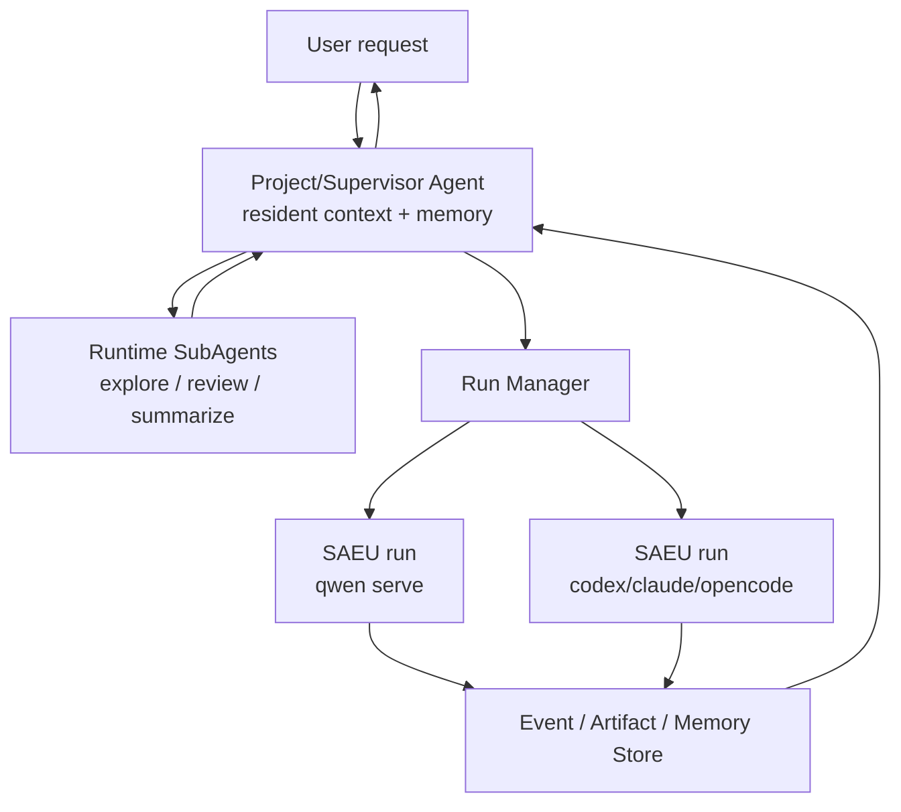

# SubAgent 与独立执行单元边界

> 结论：SubAgent 和 SAEU 不是竞争关系。SubAgent 是 Agent runtime 内部的协作机制；SAEU 是云端平台外部的治理、调度和审计边界。  
> 最合适的形态是：常驻 Project/Supervisor Agent 负责理解长期目标和维护上下文；它可以用 SubAgent 做轻量并行探索；当任务需要长运行、高风险、可审计、可恢复或跨机器调度时，再分配 SAEU run。

## 为什么这个问题重要

Qwen Code、Claude Code、Codex、OpenCode 这类 coding agent 本身已经支持 subagent、background task、worktree、session、permission、resume 等能力。直接把每个子任务都拆成独立进程或独立 daemon，可能会损失上下文连续性，并增加调度复杂度。

因此不能简单说“多 Agent = 多个独立执行单元”。更准确的判断是：

```text
Agent 内部协作：SubAgent
平台外部治理：SAEU
长期目标控制：Project/Supervisor Agent
```

## SubAgent 什么时候够

SubAgent 更适合这些任务：

- 在同一个主 Agent 的认知闭环里完成。
- 子任务短周期，例如搜索、阅读、review、测试建议、方案比较。
- 共享同一个项目上下文、memory、workspace 和安全边界。
- 失败后由主 Agent 自己重试或换策略即可。
- 不需要平台级独立取消、恢复、计费和审计。
- 结果主要以总结、建议、局部 patch 或中间发现回到主 Agent。

典型例子：

- 主 Agent 让一个 SubAgent 读数据库模块。
- 主 Agent 让三个 SubAgent 并行评审不同文件。
- 主 Agent 让 tester SubAgent 只读分析测试失败原因。
- 主 Agent 让 researcher SubAgent 查外部文档并返回摘要。

这类任务不需要平台启动一个新 daemon；让 Agent runtime 自己管理更自然。

## SAEU 什么时候必要

SAEU 更适合这些任务：

- 任务可能运行很久，客户端断开也要继续。
- 需要独立 workspace、container、network、resource quota。
- 需要平台能取消、恢复、重试、诊断。
- 需要审计谁触发了什么工具、谁批准了什么权限。
- 需要把任务挂到 Web、IM、API、Kanban 多客户端。
- 需要跨机器或跨执行器调度，例如 Qwen + Codex + Claude 混用。
- 需要对企业用户提供 SLA、成本统计、权限策略和 artifact。

典型例子：

- 为一个 GitHub issue 自动实现、测试、生成 PR。
- 跑一个 90 分钟的重构任务。
- 在不可信仓库中执行构建和测试。
- 多个用户同时观察同一个长任务。
- 一个任务需要在 worker 节点上隔离执行。

这类任务必须进入平台控制面，否则无法可靠运营。

## 常驻 Agent 的价值

用户提出的长期复杂需求，最好由一个常驻 Project/Supervisor Agent 承接。它负责：

- 维护项目记忆。
- 理解用户长期目标。
- 保存试错经验和上下文摘要。
- 拆分任务。
- 决定用 SubAgent 还是 SAEU。
- 汇总结果、产物和最终报告。

这可以避免每次启动独立执行单元都“失忆”。但 memory 不应只存在进程上下文里。关键事实必须沉淀到平台：

- thread summary。
- run events。
- artifacts。
- workspace snapshot。
- failure notes。
- permission history。
- project memory。

新的 SAEU run 启动时，由 Project/Supervisor Agent 或 Run Manager 显式注入这些上下文。

## 推荐调度策略



决策规则：

| 问题 | 选 SubAgent | 选 SAEU |
| --- | --- | --- |
| 是否需要独立审计 | 否 | 是 |
| 是否需要独立资源限制 | 否 | 是 |
| 是否可能长时间运行 | 通常否 | 是 |
| 是否需要跨客户端观察 | 否 | 是 |
| 是否共享主 Agent 上下文更重要 | 是 | 否 |
| 是否高风险工具执行 | 否 | 是 |
| 是否只是探索/评审/总结 | 是 | 否 |
| 是否要跨框架执行器 | 否 | 是 |

## 对本项目的修正

之前文档里“每个子 Agent 都是 SAEU”的表述过强，容易导致过度拆分。更准确的设计是：

- 用户面对的是长期 Project/Supervisor Agent。
- Supervisor 内部可以使用 runtime subagents。
- 平台只把需要治理的任务升级为 SAEU run。
- Qwen Code 路线中，一个 `qwen serve` daemon 可以承载常驻项目 Agent，也可以在 thread scope 中承载多条任务线。
- 多 workspace、多租户、高风险执行才启动多个 daemon 或多个 worker。

因此，目标系统不是“多个独立 Agent 进程并行跑”，而是：

> 一个长期目标控制面，按需在 Agent 内部 SubAgent 与平台级 SAEU 之间切换。

