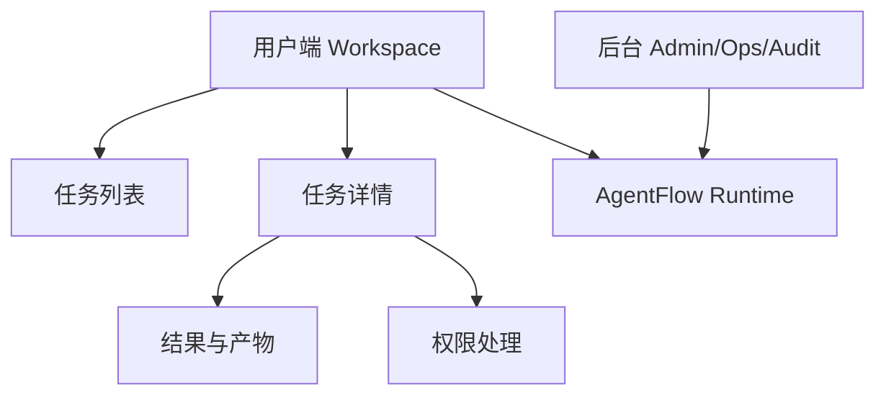
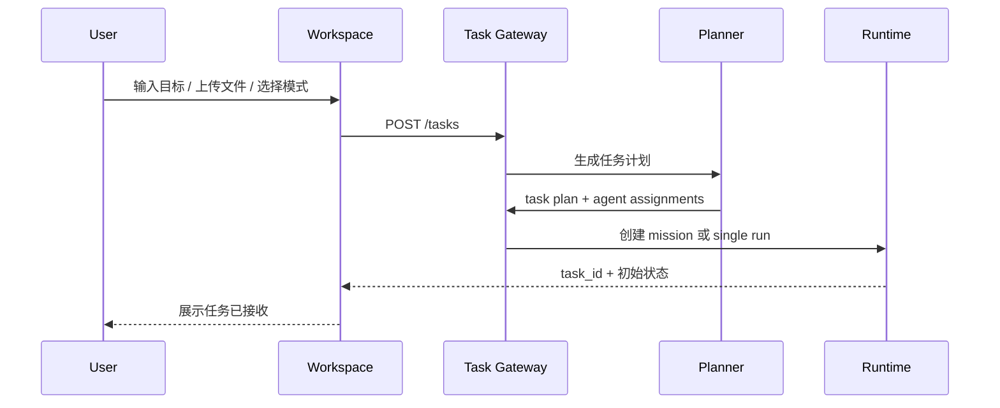
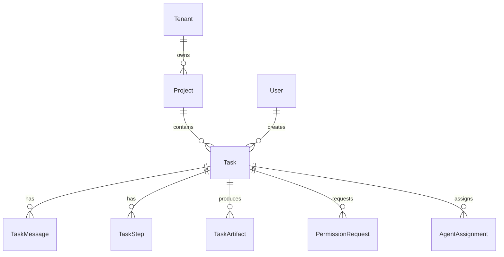
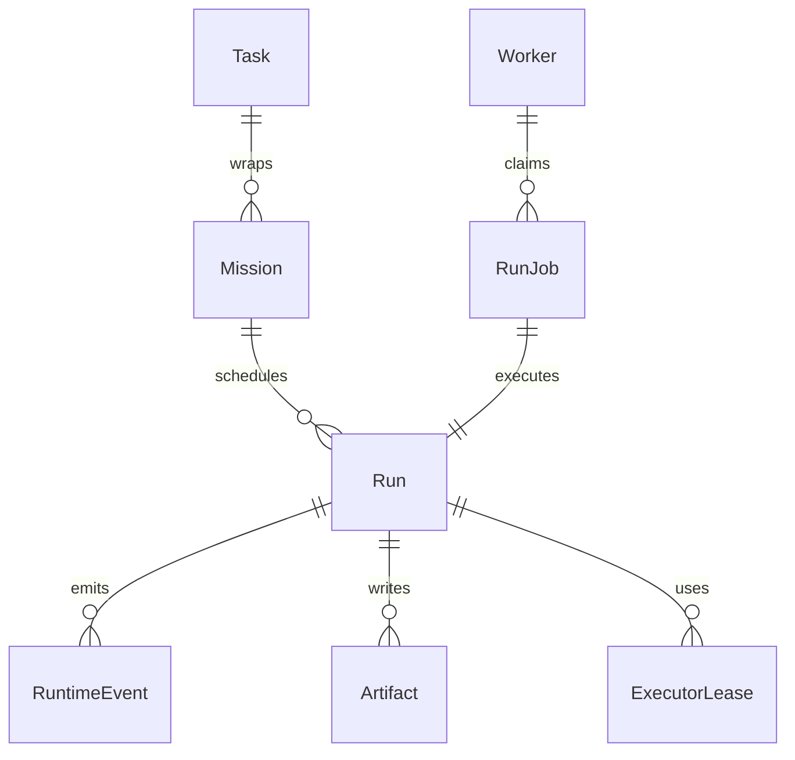

# AgentFlow V2 产品与架构整体方案

> 日期：2026-07-04  
> 状态：`in_progress`，V2-P1 Task Workspace foundation 已落地
> 目标：把 AgentFlow 从“面向运行时管理的控制台”升级为“面向最终用户的云端长期运行 Agent 工作台”，同时保留并强化后台审计、稳定性、安全、隔离和可恢复能力。  
> 设计原则：用户端简单，后台端可控，runtime 底座可靠。

配套审计记录：[AgentFlow V2 多轮审计记录](v2-product-architecture-audit.md)。

实现进展：

- 2026-07-04：新增用户端 Workspace 和 Task Detail，默认首页从后台 Overview 切换为任务工作台。
- 2026-07-04：新增 `/tasks` BFF，把底层 run/mission 投影成统一的用户任务模型，支持创建、列表、详情、事件、结果、产物、追加消息和取消。
- 2026-07-04：保留 `/overview`、`/runs`、`/missions`、`/units`、`/executors`、`/access`、`/operations` 作为后台 Admin/Ops/Audit 入口。
- 2026-07-04：启动 V2-P2a，`/tasks` 写入 `created_by/project_id/visibility`，普通 session 用户只能看到自己的任务，`member` 角色默认隐藏后台导航。
- 2026-07-04：完成 V2-P2b foundation，owner 可在 Access 页面创建默认 `member` 用户、改角色、禁用/启用用户、重置密码。

当前边界：V2-P1 解决“用户默认入口”和“任务投影”问题；V2-P2a/P2b 开始保护用户端 task 访问边界并补齐 owner 用户管理闭环。完整项目成员关系、CSRF、用户自助改密码、token_version、自动规划器、文件上传、Skills registry、IM/移动端入口仍属于后续 V2 阶段。

## 0. 一句话定义

AgentFlow V2 是一个始终在线的云端 Agent 系统。用户可以通过 Web、移动端、App 或 IM 机器人发起任务；系统自动理解目标、规划任务、分配 Agent、初始化隔离环境、排队执行、实时展示进度、请求必要权限、汇总最终结果，并在后台保留完整审计与恢复证据。

V2 的产品表达不再是“Run Manager 控制台”，而是：

```text
用户端：我提交目标，AgentFlow 帮我完成任务。
后台端：管理员确保任务安全、稳定、可审计、可恢复。
底层：runtime 自动调度 worker/executor，并隐藏技术细节。
```

## 1. 核心判断

### 1.1 产品方向校准

当前 AgentFlow 已经具备很多 runtime 底座能力：

- Run / Mission / Profile。
- Queue / Lease / Worker / Remote Worker。
- Executor Registry。
- Qwen shared / per-run / container executor foundation。
- Permission / Artifact / Audit Bundle。
- Access / RBAC / API Token。
- CI 自动部署、VPS smoke、Runtime Monitor。

这些能力非常重要，但它们不应该是最终用户的默认入口。最终用户不关心 worker、executor、lease、heartbeat、stdout/stderr、event schema。最终用户关心的是：

- 我的任务有没有被接住？
- 当前做到哪一步？
- 哪个 Agent 正在处理？
- 是否需要我授权？
- 最终产物在哪里？
- 结果是否可靠、完整、可追溯？

因此 V2 的方向是：**把 runtime 能力产品化成任务工作台，把技术细节移到后台审计和运维控制台。**

### 1.2 DeerFlow 对我们的启发

DeerFlow 的产品形态更接近用户期望：

- 默认入口是 Chat / Workspace。
- 用户通过自然语言、文件、技能和模式发起任务。
- 过程在对话和 artifact 中呈现。
- Skills、Memory、Sandbox、Subagents 都是帮助用户完成任务的能力，而不是先暴露底层运行参数。

AgentFlow 不应照搬 DeerFlow 的内部架构，但应吸收它的用户体验方向：

```text
DeerFlow-like Workspace
  Chat / Upload / Skill / Artifact / Settings / Mobile-friendly

AgentFlow Runtime
  Task / Mission / Worker / Executor / Queue / Permission / Audit / Deploy
```

### 1.3 用户端和审计端必须分离

V2 必须明确双端产品：

| 端 | 面向对象 | 默认任务 |
| --- | --- | --- |
| 用户端 Workspace | 普通用户、知识工作者、开发者、业务人员 | 发起任务、看进度、处理权限、拿结果 |
| 管理端 Admin/Ops/Audit | owner、operator、auditor、SRE、安全负责人 | 管理用户、项目、worker、executor、队列、审计、成本、部署 |

这不是两个系统，而是同一个系统的两个视图。用户端使用简化投影，后台端使用事实源和控制面。

## 2. 外部调研摘要

本轮方案参考了本地 DeerFlow 源码与公开产品/框架设计。核心不是复制某一个项目，而是抽取共性趋势。

### 2.1 调研对象

| 方案 | 产品形态 | 可借鉴点 | 对 AgentFlow 的启发 |
| --- | --- | --- | --- |
| DeerFlow | Agent 工作台 / super agent harness | Workspace、Skills、Memory、Sandbox、Artifact、Auth | 用户端应该是工作台，runtime 作为底座 |
| OpenHands | AI 软件开发 Agent 产品与平台 | Agent Canvas、Cloud/Enterprise、多用户、RBAC、集成、预算 | coding agent 产品需要用户端体验和企业治理两层 |
| LangSmith Deployment / LangGraph | Agent runtime / deployment platform | durable execution、streaming、horizontal scaling、assistants/threads/runs | runtime 应保留可靠执行模型，但 UI 可独立 |
| CrewAI | multi-agent crew/flow 框架和企业自动化 | agents、crews、flows、guardrails、memory、observability、HITL | Agent 编排需要面向任务角色，而不是暴露底层执行器 |
| n8n | workflow automation + AI nodes | workflow、trigger、credentials、RBAC、execution history、integrations | 企业用户需要连接 IM/邮件/SaaS，并保留执行历史 |
| AutoGen | multi-agent 编程框架 | agent chat、teams、tool use、human-in-the-loop | 内部多 agent 协作可以借鉴，但不替代产品层 task |

参考资料：

- DeerFlow 本地仓库：`/Users/chigao/Documents/codebase/github/deer-flow`
- OpenHands Docs: https://docs.openhands.dev/
- LangSmith Deployment Docs: https://docs.langchain.com/langsmith/deployment
- CrewAI Docs: https://docs.crewai.com/
- n8n Advanced AI Docs: https://docs.n8n.io/advanced-ai/
- Microsoft AutoGen: https://github.com/microsoft/autogen

### 2.2 竞品共性趋势

这些方案的优秀设计大多收敛到同一件事：

1. **用户入口是任务/对话/工作流，不是运行时参数。**
2. **后台保留强治理能力，但不压迫用户主流程。**
3. **Agent 编排被包装为角色、技能、团队、流程。**
4. **实时反馈是核心体验，等待黑盒执行不可接受。**
5. **文件、artifact、最终报告是用户价值的载体。**
6. **企业或多人使用必须有 RBAC、凭据隔离、审计和成本控制。**
7. **长期运行任务需要 durable execution、streaming、retry、resume。**

### 2.3 AgentFlow 的差异化

AgentFlow 不应只做另一个 DeerFlow。它的差异化是：

- 云端长期运行。
- 远程 worker 和多执行单元。
- 每个 Agent 执行环境可隔离。
- qwen/codex/claude/opencode 等执行器可替换。
- 任务排队、租约、恢复、drain/resume。
- Permission 和审计是底层强约束。
- CI 自动部署和公网监控。

V2 要做的是：**把这些差异化包装成最终用户可理解的任务完成体验。**

## 3. V2 目标用户

### 3.1 个人用户

个人用户希望有一个长期在线的 Agent 帮手：

- 研究一个主题并输出报告。
- 阅读一组文档并总结。
- 修改一个代码仓库。
- 监控一个任务进展。
- 通过 IM 发起任务并收到结果。

他们需要简单、直接、低配置：

- 一个输入框。
- 可以上传文件。
- 可以看任务进度。
- 需要授权时点一下。
- 最后拿到结果。

### 3.2 小企业团队

小企业团队需要多人协作：

- 员工发起任务。
- owner 配置模型、worker、预算、权限。
- operator 处理运行失败和权限。
- auditor 查看任务是否按要求完成。
- 任务结果和审计记录可以留档。

他们需要：

- 项目空间。
- 用户角色。
- 成本与限额。
- 任务历史。
- IM/邮件/Slack/飞书/企业微信入口。

### 3.3 大租户 / 企业

企业租户需要治理能力：

- 多项目、多用户、多角色。
- 数据和执行环境隔离。
- 审计、保留策略、合规导出。
- worker pool 与资源配额。
- 密钥管理和外部身份集成。
- 私有部署和高可用。

他们需要：

- Tenant / Project / Role / Policy。
- 审计端和运维端。
- 可替换 executor。
- 可接入企业 IAM、Secrets、日志系统。

## 4. V2 产品信息架构

### 4.1 总体结构



### 4.2 用户端导航

用户端只保留和任务完成有关的入口：

| 页面 | 目的 | 主要内容 |
| --- | --- | --- |
| Home / Workspace | 发起任务 | 输入框、上传、模式选择、最近任务 |
| Tasks | 管理任务 | 进行中、等待我处理、已完成、失败 |
| Task Detail | 看过程和互动 | Chat、timeline、权限卡片、Agent 状态 |
| Results | 消费结果 | final summary、报告、文件、代码 diff、下载 |
| Project | 项目上下文 | 项目文件、历史任务、团队成员 |
| Settings | 个人设置 | 通知、语言、连接的 IM、API token 可选 |

### 4.3 后台端导航

后台端保留 runtime 和治理细节：

| 页面 | 目的 | 主要内容 |
| --- | --- | --- |
| Admin Overview | 系统健康 | worker、队列、失败率、成本、最近告警 |
| Workers / Units | 执行单元 | active/draining/stale、capacity、资源水位 |
| Executors | 执行器 | strategy、PID、端口、workspace、stdout/stderr |
| Queue | 调度 | queued/running/retry、lease、卡住原因 |
| Access | 用户和权限 | users、roles、projects、tokens |
| Audit | 审计查询 | task/run/event/permission/artifact |
| Cost | 成本预算 | 项目预算、run 成本、模型用量 |
| Ops | 运维 | backups、drills、doctor、deploy revision |

### 4.4 普通用户不应看到的技术细节

以下内容默认只在后台端显示：

- worker_id。
- executor_id。
- lease_ttl。
- heartbeat。
- qwen port。
- qwen stdout/stderr。
- raw canonical events。
- run_jobs。
- drain/resume/retry 控制。
- resource policy 原始 JSON。

用户端只显示语义化状态：

| 内部状态 | 用户端文案 |
| --- | --- |
| queued | 正在排队，等待可用执行环境 |
| lease.claimed | 已分配执行环境 |
| workspace.prepared | 正在准备工作区 |
| executor.starting | 正在启动 Agent |
| run.started | Agent 已开始执行 |
| permission.requested | 需要你的确认 |
| run.completed | 任务已完成 |
| run.failed | 任务失败，需要查看原因或重试 |

## 5. 核心用户流程

### 5.1 发起任务



用户只提交目标。系统决定：

- 是否需要规划。
- 是否用单 Agent。
- 是否拆成多个 Agent。
- 是否需要文件工作区。
- 是否排队。
- 是否需要权限策略。

### 5.2 实时监控任务

Task Detail 是用户端核心页面。

它应该显示：

- 顶部：任务目标、状态、预计进度、取消/暂停按钮。
- 主区：Chat / Agent 更新流。
- 右侧或底部：计划步骤、当前 Agent、产物、权限卡片。
- 底部：继续补充输入。

实时事件不是 raw event，而是 UI projection：

```json
{
  "type": "progress",
  "task_id": "task_x",
  "title": "正在分析仓库结构",
  "body": "Code Agent 正在读取 README 和 package 配置",
  "agent": "Code Agent",
  "status": "running",
  "created_at": "..."
}
```

### 5.3 权限处理

权限请求要像产品消息，而不是 JSON 表单。

示例：

```text
Code Agent 想执行命令：
npm test

原因：
验证修改是否破坏现有测试。

风险：
读取项目文件并运行本地测试，不会访问外网。

[批准一次] [拒绝] [查看更多]
```

权限处理入口必须支持：

- Web。
- 移动端。
- IM 机器人。
- 邮件通知可选。

### 5.4 结果输出

完成页必须是“结果消费页”，不是 artifact 文件夹。

它包含：

1. 最终总结。
2. 完成了什么。
3. 没完成什么。
4. 关键证据和链接。
5. 产物列表。
6. 后续建议。
7. 下载完整报告。
8. 审计入口。

普通用户默认看最终结果；审计员可以展开完整事件链。

## 6. V2 核心领域模型

### 6.1 用户可见模型



| 实体 | 用户含义 | 内部映射 |
| --- | --- | --- |
| Tenant | 个人空间或企业租户 | access/project/billing 边界 |
| Project | 项目空间 | project_id、secrets、files、skills |
| Task | 用户任务 | mission 或 single run 的产品包装 |
| TaskStep | 可读计划步骤 | mission task / projected events |
| AgentAssignment | 被分配的 Agent | profile + run |
| TaskMessage | 用户和系统消息 | session event / projected event |
| TaskArtifact | 产物 | artifact refs |
| PermissionRequest | 权限卡片 | permission event |

### 6.2 Runtime 内部模型



V2 不删除现有 Run/Mission。它在上面增加 Task 产品层。

| 产品层 | Runtime 层 |
| --- | --- |
| Task | Mission 或 Run wrapper |
| TaskStep | MissionTask 或 event projection |
| Agent | Profile + Adapter |
| Environment | Workspace + ExecutorLease |
| Progress | RuntimeEvent projection |
| Result | Final artifact + summary |
| Audit | canonical events + raw events + artifacts |

### 6.3 为什么 Task 是必要的

直接把 Run 暴露给用户会有几个问题：

- Run 太技术化，无法表达“一个用户目标可能包含多个 Agent 执行”。
- Mission 太编排化，简单任务也不一定需要 DAG。
- Task 可以统一 single-run 和 multi-run。
- Task 可以承载用户端标题、摘要、状态、通知、项目、权限聚合。

因此 V2 推荐：

```text
用户永远创建 Task。
Task 可以退化为 single run，也可以展开为 mission。
后台仍可查看 run/mission。
```

## 7. Agent 编排模型

### 7.1 默认任务承接

用户提交任务后，系统选择三种路径：

| 路径 | 场景 | 行为 |
| --- | --- | --- |
| Direct | 简单问答或小任务 | 创建 single run |
| Planned | 多步骤任务 | planner 生成 steps，再创建 mission |
| Template | 明确任务类型 | 使用预定义 Task Template |

### 7.2 Agent Team

用户端可以看到“Agent 团队”，但不需要配置底层 profile。

| 用户端 Agent | 内部 Profile | 作用 |
| --- | --- | --- |
| Planner | planner | 拆解目标、定义步骤 |
| Research Agent | researcher / planner | 搜集资料、阅读文件 |
| Code Agent | coder | 修改代码、执行命令 |
| Test Agent | tester | 验证、回归、报告 |
| Review Agent | reviewer | 审查结果、发现风险 |
| Writer Agent | doc-writer | 汇总最终报告 |

### 7.3 Profile 与 Skill

V2 应采用 Profile + Skill 双层设计：

| 概念 | 作用 | 示例 |
| --- | --- | --- |
| Profile | 执行角色和安全边界 | coder、reviewer、tester |
| Skill | 领域能力包 | data-analysis、github-research、ppt-generation |
| Template | 用户任务模板 | “分析仓库并提出改进建议” |

有效工具权限：

```text
effective_tools = profile.allowed_tools ∩ skill.allowed_tools ∩ project_policy.allowed_tools
```

### 7.4 自动规划需要可控

V2 不能让 planner 无限自由。Planner 输出必须是结构化计划：

```json
{
  "task_type": "code_change",
  "steps": [
    {
      "id": "inspect",
      "title": "检查项目结构",
      "agent": "researcher",
      "requires_permission": false
    },
    {
      "id": "implement",
      "title": "实现修改",
      "agent": "coder",
      "requires_permission": true
    },
    {
      "id": "verify",
      "title": "运行测试",
      "agent": "tester",
      "requires_permission": true
    }
  ]
}
```

计划进入执行前要通过 policy：

- 步骤数上限。
- 预计成本上限。
- 工具权限上限。
- 是否需要用户确认计划。
- 是否允许写文件、联网、执行命令、git push。

## 8. 调度与隔离

### 8.1 调度原则

调度是后台能力，用户端只展示语义状态。

调度规则：

1. 每个 Task 进入队列。
2. Scheduler 根据 tenant/project quota、priority、worker capacity、agent type 选择执行单元。
3. 每个 Run 拿到 lease 后才启动 executor。
4. Worker 心跳失联时 lease 过期，任务可恢复或标记失败。
5. 多任务并发受租户、项目、worker 和 executor 策略限制。

### 8.2 隔离等级

V2 必须支持多种隔离等级。

| 等级 | 场景 | 实现 |
| --- | --- | --- |
| shared | 低风险只读任务 | shared qwen serve / shared worker |
| per-run process | 默认 coding task | 每个 run 独立 qwen process |
| container | 高风险执行 | 每个 run 容器 |
| remote worker | 更强隔离 | 单独 VPS/NAS worker |
| tenant worker pool | 企业租户 | 租户专属 worker |

用户端不需要看到这些词。用户只看到：

- 正在准备环境。
- 已进入隔离执行环境。
- 当前任务需要更高权限。

### 8.3 环境初始化

环境初始化包含：

- 选择 workspace。
- 下载或复制 repo。
- 挂载上传文件。
- 注入 project secrets。
- 选择 executor strategy。
- 记录环境 metadata。
- 生成 rollback / cleanup policy。

所有环境初始化事件进入 audit，但用户端只展示：

```text
正在准备工作区
已加载上传文件
已启动 Code Agent
```

## 9. 实时进展展示

### 9.1 事实源与投影

V2 必须分清两种事件：

| 类型 | 用途 | 用户 |
| --- | --- | --- |
| canonical events | 审计事实源 | 后台、审计 |
| task projection events | 用户进度展示 | 普通用户 |

canonical events 不应直接驱动用户端 UI。用户端应消费 BFF 投影：

```text
RuntimeEvent -> TaskTimelineEvent -> UI
```

### 9.2 进度事件类型

用户端至少需要：

| 类型 | 含义 |
| --- | --- |
| `task.accepted` | 任务已接收 |
| `task.planning` | 正在规划 |
| `task.plan_ready` | 计划已生成 |
| `task.queued` | 正在排队 |
| `environment.preparing` | 正在准备环境 |
| `agent.started` | Agent 开始执行 |
| `agent.progress` | Agent 进展 |
| `permission.required` | 等待用户授权 |
| `artifact.created` | 产物已生成 |
| `task.reviewing` | 正在审查 |
| `task.completed` | 任务完成 |
| `task.failed` | 任务失败 |

### 9.3 Timeline UI

Task Detail 推荐三层：

```text
顶部：任务状态与操作
中间：Chat / Progress feed
侧边：Plan / Agents / Artifacts / Permissions
```

移动端：

```text
顶部状态
Chat feed
底部 tabs：计划 / 产物 / 权限 / 详情
```

## 10. 权限与审批

### 10.1 权限请求产品化

权限请求必须同时满足：

- 用户看得懂。
- 安全负责人可审计。
- Runtime 可执行决策。

字段建议：

| 字段 | 用途 |
| --- | --- |
| title | 用户可读标题 |
| action | 具体动作 |
| reason | Agent 为什么需要 |
| risk_level | low/medium/high |
| scope | 本次/本任务/本项目 |
| command_preview | 命令或操作摘要 |
| policy | 触发的策略 |
| timeout | 超时时间 |
| options | approve/deny/approve_once/approve_task |

### 10.2 权限入口

权限处理应该支持：

- Web Task Detail。
- 移动端。
- IM 卡片。
- 邮件 fallback。
- Admin Console。

### 10.3 默认策略

| 操作 | 默认策略 |
| --- | --- |
| 读取上传文件 | allow |
| 写入任务 workspace | allow 或 ask，按 project policy |
| 执行测试命令 | ask |
| 外部网络访问 | ask |
| 读取 secret | ask + 最小范围 |
| git push / deploy | high risk ask |
| 删除文件 | ask |
| 访问宿主机路径 | deny |

## 11. 结果与审计

### 11.1 用户结果页

结果页必须回答：

1. 任务是否完成？
2. 完成了哪些目标？
3. 输出了哪些文件或报告？
4. 还有哪些风险或未完成项？
5. 下一步建议是什么？

### 11.2 审计页

审计页面向 auditor/admin，包含：

- canonical event stream。
- raw adapter events。
- permission decisions。
- executor metadata。
- workspace metadata。
- artifacts checksum。
- actor attribution。
- model/tool usage。
- replay package。

### 11.3 “完成”的定义

V2 必须避免只要 run 结束就叫完成。完成必须至少包含：

- 所有 required steps terminal。
- required artifacts 存在。
- reviewer 或 finalizer 给出结论。
- 未处理 permission 为 0。
- final summary 已生成。
- 失败/跳过项被明确记录。

## 12. API 与 BFF 设计

### 12.1 用户端 API

建议新增 Task BFF：

| API | 用途 |
| --- | --- |
| `POST /tasks` | 创建用户任务 |
| `GET /tasks` | 列任务 |
| `GET /tasks/{task_id}` | 任务摘要 |
| `GET /tasks/{task_id}/events` | 用户端 SSE 投影 |
| `POST /tasks/{task_id}/messages` | 补充输入 |
| `POST /tasks/{task_id}/cancel` | 取消任务 |
| `GET /tasks/{task_id}/artifacts` | 用户产物 |
| `GET /tasks/{task_id}/result` | 最终结果 |
| `POST /tasks/{task_id}/permissions/{id}` | 处理权限 |

### 12.2 后台 API

现有 API 继续保留：

- `/runs`
- `/missions`
- `/workers`
- `/executors`
- `/access`
- `/cost`
- `/ops`

但后台端应移动到 `/admin` 或 `/console`。

### 12.3 IM / App Gateway

新增 Channel Gateway：

| 入口 | 映射 |
| --- | --- |
| IM 文本消息 | `POST /tasks` |
| IM 文件 | task input artifact |
| IM 卡片按钮 | permission decision |
| App push | task notification |
| Webhook | external task trigger |

## 13. 认证、租户与角色

### 13.1 租户模型

V2 建议引入 Tenant：

```text
Tenant
  Project
    Task
      Mission/Run
```

个人用户也是单人 tenant。

### 13.2 角色模型

保留并扩展当前角色：

| 角色 | 用户端能力 | 后台能力 |
| --- | --- | --- |
| owner | 全部任务和项目 | 用户、角色、worker、billing、secrets |
| operator | 创建和处理任务 | 查看队列、处理权限、重试任务 |
| auditor | 查看任务结果 | 查看审计、导出报告 |
| member | 创建自己的任务 | 无后台能力 |
| guest | 查看被分享结果 | 无后台能力 |

### 13.3 安全要求

V2 正式认证必须包含：

- `/setup` 创建首个 owner。
- 邮箱/密码登录。
- HttpOnly session cookie。
- CSRF。
- 登录限速。
- 改密码。
- reset owner。
- session token_version。
- API token hash 存储。
- 用户/项目/租户隔离。

## 14. 数据与存储

### 14.1 MVP 存储

当前 SQLite 可以继续作为单实例 MVP 存储，但 schema 需要扩展：

| 表 | 作用 |
| --- | --- |
| tenants | 租户 |
| users | 用户 |
| projects | 项目 |
| tasks | 用户任务 |
| task_messages | 用户端消息 |
| task_events | 投影事件缓存 |
| task_artifacts | 用户端 artifact 索引 |
| runs | runtime run |
| missions | mission |
| run_events | canonical events |
| permissions | 权限 |
| workers | worker |
| executor_leases | executor |

### 14.2 企业存储

企业版或多实例建议：

- Postgres 作为 canonical store。
- Object storage 保存 artifact。
- Redis 或 Postgres queue。
- OpenTelemetry / external logs。
- Secrets manager。

## 15. 实施路线

### V2-P0：设计定稿与文档发布

状态：`design_ready_for_review`

产物：

- 本文档。
- DeerFlow 对比报告。
- 产品可用性审计补充。

退出标准：

- owner review 通过。
- 明确 V2 MVP 范围。
- Roadmap 更新。

### V2-P1：用户端 Task Workspace

目标：让用户不接触 worker/executor 也能创建和查看任务。

任务：

| 任务 | 验收 |
| --- | --- |
| 新增 `/workspace` 首页 | 默认显示任务输入和最近任务 |
| 新增 Task 数据模型 | Task 可 wrapper single run/mission |
| `POST /tasks` | 创建 task，并落到现有 mission/run |
| Task list | 进行中/等待我处理/已完成/失败 |
| Task Detail | Chat + progress + result + permission |
| 用户端事件投影 | 不直接展示 raw event |

### V2-P2：正式认证与用户隔离

目标：让产品适合个人和小团队自部署。

任务：

| 任务 | 验收 |
| --- | --- |
| `/setup` 首次 owner | 无 owner 时引导创建 |
| 改密码/reset | session token_version 生效 |
| CSRF | 状态变更请求受保护 |
| 登录限速 | 错误登录被限制 |
| Task/Run user_id/project_id | 用户只能看到授权任务 |
| Role gating | Workspace/Admin 能力按角色显示 |

### V2-P3：默认 Agent 编排

目标：用户提交复杂任务后自动规划和执行。

任务：

| 任务 | 验收 |
| --- | --- |
| Task Planner | 输出结构化计划 |
| Task Template | 研究/代码/文档/运维基础模板 |
| Agent Team projection | 用户看到 Planner/Code/Review 等语义 Agent |
| Mission 默认化 | 复杂 task 自动创建 mission |
| Finalizer | 生成 final result |

### V2-P4：文件、Skills 与结果页

目标：让任务能处理真实输入并输出可消费结果。

任务：

| 任务 | 验收 |
| --- | --- |
| 文件上传 | 上传文件成为 task input artifact |
| Result page | 最终总结和产物可读 |
| Skill registry | 支持 `SKILL.md` |
| Skill activation | task 可指定 skill |
| Artifact preview | 常见文本/报告直接预览 |

### V2-P5：IM / 移动端入口

目标：用户可从常用入口发起和处理任务。

任务：

| 任务 | 验收 |
| --- | --- |
| Channel Gateway | IM message -> task |
| Permission card | IM 内审批 |
| Task status notification | 完成/失败/等待权限通知 |
| Mobile responsive | Task detail 移动端可用 |

### V2-P6：后台端重构

目标：把当前 console 收敛为 Admin/Ops/Audit。

任务：

| 任务 | 验收 |
| --- | --- |
| `/admin` 信息架构 | Workers/Executors/Access/Cost/Ops/Audit |
| Audit search | 按 task/run/user/project 查询 |
| Queue explain | 后台可诊断排队原因 |
| Doctor | 部署/worker/qwen/public ingress 检查 |
| Support bundle | 脱敏诊断包 |

## 16. 多轮审计

完整审计台账见：[AgentFlow V2 多轮审计记录](v2-product-architecture-audit.md)。本节保留摘要，便于快速理解方案经过哪些方向的复核。

### 16.1 第一轮：产品审计

问题：

- 当前 AgentFlow 默认入口偏技术控制台。
- Run/Worker/Executor 术语对最终用户过重。
- 用户缺少“任务已被承接”的产品反馈。

修正：

- V2 默认入口改为 Workspace。
- 用户概念统一为 Task。
- 后台 runtime 概念移动到 Admin/Ops/Audit。

结论：通过。产品方向符合最初需求。

### 16.2 第二轮：架构审计

问题：

- 如果直接照搬 DeerFlow，可能丢失 AgentFlow 的 runtime 优势。
- 如果只做 UI 包装，复杂任务仍无法自动编排。

修正：

- 保留 Run/Mission/Worker/Executor 作为底层。
- 新增 Task 产品层。
- Mission 作为复杂任务默认执行模型，single run 作为退化路径。

结论：通过。分层后可以逐步实施，不需要推翻现有系统。

### 16.3 第三轮：安全审计

问题：

- 用户端简单化不能削弱权限和审计。
- 多用户使用必须有隔离。
- IM 入口可能绕过 Web session。

修正：

- 用户端权限卡片只是投影，canonical permission 仍在 runtime。
- Task/Run/Artifact 必须绑定 user/project/tenant。
- Channel Gateway 使用 scoped token 和映射身份。
- Admin/Audit 端保留完整事件链。

结论：通过，但 V2-P2 是上线前硬门槛。

### 16.4 第四轮：运维审计

问题：

- 后台细节隐藏后，用户可能不知道任务为何慢。
- operator 仍需要诊断 worker/executor。

修正：

- 用户端展示语义化排队原因。
- Admin/Ops 保留 Queue/Worker/Executor/Doctor。
- Deploy Runtime 和 Runtime Monitor 继续作为生产门禁。

结论：通过。用户端隐藏复杂度，后台端不丢可观测性。

### 16.5 第五轮：竞品审计

问题：

- DeerFlow 强在工作台，但 runtime ops 弱。
- OpenHands / CrewAI / LangGraph / n8n 都强调用户任务或工作流入口。
- AgentFlow 如果继续以控制台为主，会偏离市场成熟方向。

修正：

- V2 采用用户端 Task Workspace。
- 后台保留 AgentFlow runtime 差异化。
- Skills、文件、IM、结果页列入路线图。

结论：通过。方案吸收外部优秀设计，同时保留自身优势。

### 16.6 第六轮：实施审计

问题：

- V2 范围很大，容易失控。
- 需要避免一开始就做 App、IM、企业多租户全部能力。

修正：

- V2-P1 只做 Web Workspace + Task wrapper。
- V2-P2 做正式 auth 和隔离。
- V2-P3 再做默认编排。
- IM/App/企业能力后置。

结论：通过。路线可拆、可验收、可渐进上线。

## 17. V2 MVP 范围

V2 MVP 建议只包含：

1. `/workspace` 用户首页。
2. Task 创建和列表。
3. Task Detail：Chat + progress + permissions + result。
4. Task wrapper single run/mission。
5. 用户端事件投影。
6. Admin Console 保留现有能力。
7. `/setup` owner 初始化。
8. 基础用户隔离。

暂不包含：

- 原生移动 App。
- 完整 IM bot。
- 多租户计费。
- 企业 OIDC/SAML。
- 完整 Skill marketplace。
- 多控制面 HA。

这些作为 V2.1/V2.2。

## 18. 验收标准

### 用户端验收

- 新用户登录后默认进入 Workspace。
- 用户输入一个任务，不需要理解 run/worker/executor。
- 用户能看到任务排队、执行、权限、完成。
- 用户能拿到最终结果和产物。
- 用户能在移动端处理权限。

### 后台端验收

- owner/operator 可以看到 worker/executor/queue。
- auditor 可以按 task 查看完整审计。
- 技术事件不影响用户端主流程。
- 任务失败可以定位到 planner、worker、executor、permission、resource、adapter 或 user input。

### Runtime 验收

- Task -> Mission/Run 映射稳定。
- canonical event 与 task projection 一致。
- permission 决策全链路可审计。
- worker/executor 隔离不退化。
- CI 部署和 Runtime Monitor 继续全绿。

## 19. 关键设计决策

| 决策 | 结论 |
| --- | --- |
| 默认入口 | Workspace，不是 Admin Console |
| 用户概念 | Task，不是 Run |
| 复杂任务 | 默认 Mission，简单任务 single Run |
| 技术细节 | 默认隐藏到 Admin/Ops/Audit |
| 审计事实源 | canonical RuntimeEvent，不是 UI projection |
| 外部参照 | DeerFlow 做用户体验参照，不直接替换 runtime |
| Skills | 引入，但与 Profile 分层 |
| IM/App | 作为 Channel Gateway，不绕过权限和审计 |
| 多租户 | 数据模型预留，MVP 先个人/小团队 |

## 20. 最终建议

AgentFlow V2 应正式把产品目标改为：

> 面向个人、小团队和租户的云端长期运行 Agent 工作台。用户通过自然语言、文件、App 或 IM 发起任务，AgentFlow 自动规划、调度、隔离执行、实时展示进展、处理权限并输出最终结果；后台提供完整审计、治理、恢复和运维能力。

实现上不推翻现有系统，而是在现有 runtime 上增加产品层：

```text
Task Workspace
  ↓
Task Gateway / Projection BFF
  ↓
Mission / Run / Permission / Artifact
  ↓
Worker / Executor / Store / Audit
```

这条路线既吸收 DeerFlow、OpenHands、CrewAI、LangGraph、n8n 等方案的优秀设计，也保留 AgentFlow 目前最有价值的 runtime 能力。它可分阶段实施，适合当前代码库继续演进。
